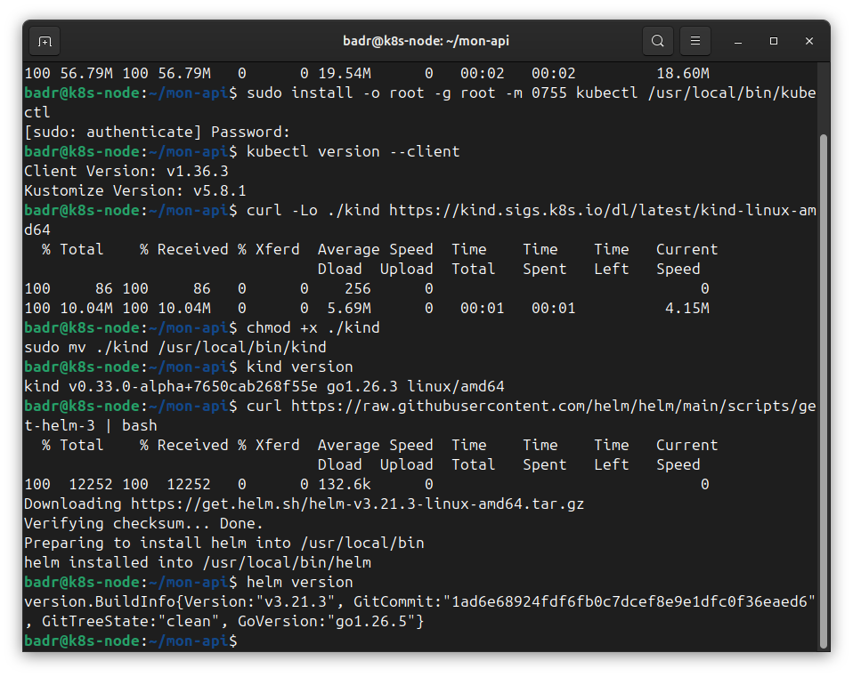
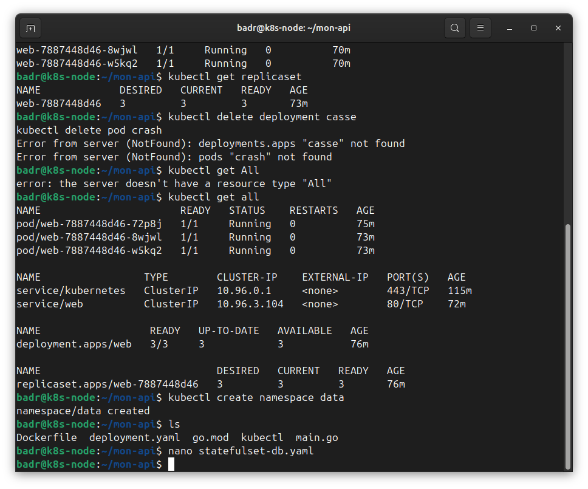
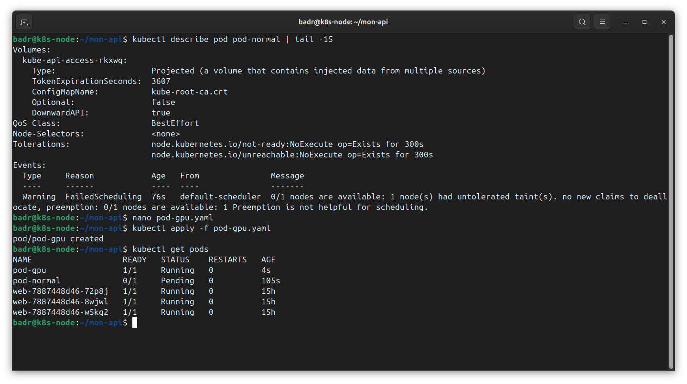

# Mes notes — Partie 4 : Kubernetes, les fondamentaux

> Notes perso, rédigées après avoir fait la partie sur mon cluster **kind** (`lab`),
> sur la VM `k8s-node` (Ubuntu, NAT, Docker déjà installé).
> But de ces notes : pouvoir tout réexpliquer à voix haute, écran vide (le "test de
> sortie" du manuel). Si je bloque, c'est que je dois relire.

---

## 4.0 — Le modèle mental (le truc à comprendre AVANT tout)

**L'idée qui commande tout le reste :**
Kubernetes ne fait PAS ce que je lui dis. Il fait en sorte que **l'état réel du monde
corresponde à l'état que j'ai déclaré**. Je ne dis pas « démarre 3 pods », je dis « il DOIT
y avoir 3 pods », et une boucle de contrôle observe l'écart en permanence et le corrige.

C'est **déclaratif** (je décris l'état voulu) + **réconciliation** (il boucle pour l'atteindre
et le maintenir). Tout découle de là :
- l'auto-réparation (un pod supprimé revient),
- le rolling update,
- et les "surprises" — *« pourquoi mon pod revient après que je l'ai supprimé ?! »* →
  parce que j'ai supprimé **le pod**, pas **la déclaration** (le Deployment).

**Docker vs Kubernetes :** Docker lance UN conteneur sur UNE machine. Kubernetes
**orchestre** des conteneurs sur potentiellement plusieurs machines : redémarrage auto,
montée en charge, réseau entre eux, etc.

**Corollaire sécurité (à ressortir en entretien) :** l'**API server** est le seul point
d'entrée vers l'état déclaré. **Qui peut écrire dans l'API contrôle le cluster.** C'est
pour ça que le RBAC (Partie 7) est le contrôle le plus important de K8s, avant les
NetworkPolicies et avant Falco.

### Le vocabulaire de base (à poser une fois pour toutes)
- **Pod** = la plus petite unité déployable = 1 (ou +) conteneur(s) qui tournent ensemble.
- **Deployment** = gère des répliques de pods, les recrée s'ils meurent.
- **Service** = une adresse réseau + un nom DNS **stables** pour joindre des pods (qui, eux,
  sont éphémères).
- **Node** = une machine du cluster.
- **ReplicaSet** = le "moule" intermédiaire créé par le Deployment (je le vois via le hash
  dans le nom des pods).
- **kubectl** = l'outil en ligne de commande pour parler au cluster.

---

## 4.1 — Installer les outils

Sur `k8s-node`, j'ai installé et vérifié :

```bash
kubectl version --client
kind version
helm version
```



Règle que je me suis fixée : **ne pas enchaîner si une install échoue.** Vérifier après
chaque étape.

---

## 4.2 — Monter le premier cluster kind

`kind` = **Kubernetes in Docker** : un cluster jetable qui tourne dans mon Docker déjà
installé. Parfait pour apprendre / casser / recommencer.

```bash
kind create cluster --name lab
kubectl get nodes
docker ps
```

**Le déclic :** `docker ps` montre que mon cluster est en réalité un **conteneur Docker**
(`lab-control-plane`). kind = un vrai K8s, mais qui tourne dans Docker. C'est pour ça qu'il
est jetable (`kind delete cluster` sans état d'âme).

> Note pour plus tard : kind sert aux parties "apprendre/casser" (4, 6, 7, 8, 9). k3s
> viendra pour l'intégration réseau réelle (cluster persistant, sur le réseau 10.10.40.x).

---

## 4.3 — Mon premier Deployment (nginx)

```bash
kubectl create deployment web --image=nginx
kubectl get deployments
kubectl get pods
kubectl get pods -o wide
```

Ce que j'ai vu :
```text
web    1/1   1   1   12s                          (deployment)
web-7887448d46-gbxvw   1/1   Running   0   19s    (pod)
```
Le nom du pod = `web` + `7887448d46` (**hash du ReplicaSet = le "moule"**) + suffixe
aléatoire (`gbxvw`). Le pod a une IP interne (ex. `10.244.0.5`) sur le node
`lab-control-plane`.

Commandes pour ausculter :
```bash
kubectl describe pod <nom>
kubectl logs <nom>
```

---

## 4.4 — La démo RÉCONCILIATION (le cœur de K8s, vu en direct)

J'ai **tué un pod à la main** et il **renaît tout seul** :

```bash
kubectl delete pod web-7887448d46-gbxvw
kubectl get pod
```

**Ce qui se passe :** le Deployment a déclaré « je veux 1 réplique vivante ». Je tue le pod
→ il n'y en a plus que 0 → K8s **réconcilie** → il en recrée un. Je n'ai rien fait.

Détail que j'ai remarqué : le nouveau pod **garde le même préfixe** `web-7887448d46`
(= même moule / même ReplicaSet), seul le suffixe change (`gbxvw` → `72p8j`). Le hash ne
change que si je change le **template** du pod (ex. l'image).

**Phrase à retenir pour l'entretien :** *« Je ne commande pas Kubernetes, je lui décris un
état voulu et il travaille en boucle pour que le réel y corresponde. »*

### Scaler (changer le nombre de répliques)

```bash
kubectl scale deployment web --replicas=3
kubectl get pod
```

Changer une **quantité** ne touche PAS aux pods existants : K8s a juste **ajouté** 2 pods.

> ⚠️ **Mes typos à surveiller** (j'ai fait les 3 !) :
> - `kubectl scal ...` → "unknown command scal" (c'est `scale`)
> - `kubectl scale deplyment ...` → "no resource type deplyment" (c'est `deployment`)
> - `kubctl get pod` → command not found (c'est `kubectl`)
>
> **Solution : la touche Tab (autocomplétion).** Je tape `kubectl scale deploy` + Tab,
> ça complète tout seul et ça m'apprend les noms de ressources. Copier-coller via SSH aussi.

---

## 4.5 — Exposer avec un Service

**Pourquoi :** les pods ont des IP **éphémères** (ils meurent/renaissent, l'IP change). Le
Service donne une **adresse stable + un nom DNS** qui répartit vers les pods vivants.

```bash
kubectl expose deployment web --port=80 --type=ClusterIP
kubectl get services
```

`ClusterIP` = accessible **à l'intérieur** du cluster seulement (c'est le défaut, et le bon
choix par défaut).

### Tester depuis l'intérieur du cluster

```bash
kubectl run test --rm -it --restart=Never --image=busybox:1.36 -- wget -qO- http://web
```

→ ça m'a renvoyé la page **"Welcome to nginx!"**. Le point IMPORTANT : j'ai joint nginx par
son **nom `web`**, pas par une IP. Même si les pods meurent/renaissent avec des IP qui
changent, le nom `web` reste stable. **C'est TOUT l'intérêt du Service.**

> Note : le conteneur `test` fait sa commande (`wget`) puis s'arrête aussitôt. Le `-it`
> essaie de s'attacher à un conteneur déjà mort → message "couldn't attach... container
> EXITED" + la page s'affiche 2 fois. Pas une erreur. Pour un test one-shot je peux enlever
> le `-it`.

### Voir tout d'un coup

```bash
kubectl get all
```



---

## 4.6 — Le déclaratif : passer de l'impératif au YAML (LA vraie façon de bosser)

Jusque-là j'ai tout fait en **impératif** (`create`, `scale`, `expose` = des ordres un par
un). Problème : l'état du cluster ne vit que dans ma mémoire / mon historique bash. Pas
reproductible, pas versionnable, pas relisible en équipe.

En **déclaratif** : j'écris un fichier YAML qui décrit l'état voulu, je le range dans **Git**
→ ça devient **la source de vérité**. Reproductible, versionné, review-able.

### Lire le YAML généré par K8s

```bash
kubectl get deployment web -o yaml
```

**La grande idée du YAML :**
- `spec:` = l'état **DÉSIRÉ** (ce que J'écris, mon intention).
- `status:` = l'état **RÉEL** (ce que K8s CONSTATE — lecture seule, je n'y touche JAMAIS).

C'est la réconciliation écrite noir sur blanc : j'écris `spec`, K8s remplit `status` en
bossant pour que l'un rejoigne l'autre.

**Le tri dans le YAML généré (60 lignes → ~15 lignes utiles) :**
- Les 4 lignes vitales de TOUT objet : `apiVersion`, `kind`, `metadata.name`.
  - `kind` = c'est quoi ? · `metadata.name` = il s'appelle comment ? · `apiVersion` = quel
    "bureau" interne le gère (Pod = `v1`, Deployment = `apps/v1`).
- Dans `metadata` : je garde `name` (+ `labels`), le reste (`uid`, `creationTimestamp`,
  `resourceVersion`, `annotations`, `generation`) = généré par K8s, poubelle.
- Tout le bloc `status:` = poubelle (K8s le remplit seul).
- Les défauts explicités (`strategy`, `progressDeadlineSeconds`, `imagePullPolicy`,
  `terminationMessagePath`...) = inutiles à écrire, K8s les remet seul.

**Le lien selector ↔ labels (PIÈGE + question d'entretien) :**
- `spec.selector.matchLabels: app=web` → "les pods qui m'appartiennent portent `app=web`".
- `spec.template.metadata.labels: app=web` → "chaque pod que je fabrique, je lui colle
  `app=web`".
- **Les deux DOIVENT correspondre**, sinon le Deployment fabrique des pods qu'il ne
  reconnaît pas → il en refait à l'infini.

### Mon deployment.yaml propre (écrit à la main)

```yaml
apiVersion: apps/v1
kind: Deployment
metadata:
  name: web
  labels:
    app: web
spec:
  replicas: 3
  selector:
    matchLabels:
      app: web
  template:
    metadata:
      labels:
        app: web
    spec:
      containers:
        - name: nginx
          image: nginx
```

> ⚠️ YAML = indentation aux **ESPACES** (jamais de tab), 2 espaces par niveau, aligné pile.
> C'est le seul truc qui me plante.

### Appliquer

```bash
kubectl apply -f deployment.yaml
```

Les 3 réponses possibles d'`apply` (vocabulaire quotidien) :
- `created` → l'objet n'existait pas, K8s le fabrique.
- `configured` → il existait, `apply` a modifié qqch.
- `unchanged` → il existait, rien à changer.

**Ce qui m'est arrivé :** j'ai eu un gros **warning** *"missing last-applied-configuration
annotation"* + `configured`. Explication : mon `web` était né en **impératif**, donc l'annotation
cachée qu'`apply` utilise pour comparer n'existait pas. K8s prévient puis la crée tout seul
("patched automatically"). **À partir de là mon objet est "adopté" par le déclaratif**, plus
de warning. J'ai eu `configured` (et pas `unchanged`) juste parce qu'`apply` a ajouté cette
annotation → ça compte comme une modif.

**Idempotence (à retenir) :** réappliquer le même fichier sans rien changer → `unchanged`,
et **mes 3 pods sont restés intacts** (mêmes noms, 0 restart). Je peux réappliquer 50 fois,
rien ne casse tant que l'état voulu = l'état réel. C'est ce qui rend le déclaratif SÛR.

### Modifier via le fichier

- **Modif "quantité"** (`replicas: 3 → 5`) : K8s **ajoute** 2 pods, ne touche pas aux 3
  existants.
- **Modif "nature"** (`image: nginx → nginx:1.27-alpine`) : déclenche un **RollingUpdate** →
  il crée un nouveau pod, attend qu'il soit Running, supprime un ancien, recommence.
  Un par un, **sans coupure**. Je le vois avec `kubectl get pods -w`.
  - Après un changement d'image → **nouveau ReplicaSet** (nouveau hash), l'ancien tombe à 0.
    `kubectl get replicaset` montre les deux (ancien 0, nouveau 3).

> Bonne pratique apprise : **jamais `image: nginx` tout court** (= `nginx:latest`, ça bouge
> dans le temps). En prod on **épingle** une version exacte (`nginx:1.27-alpine`).

---

## 4.7 — TEST DE SORTIE : diagnostiquer un pod qui ne démarre pas

**La question du manuel (à savoir réciter écran vide) :**
> *« Un pod ne démarre pas. Énumère ta séquence de diagnostic complète, dans l'ordre, sans
> hésiter. »*

**La réponse en 3 temps : `get` → `describe` → `logs`.**

1. **`kubectl get pods`** = le symptôme / la famille de panne.
   Statuts à reconnaître : `Pending`, `ImagePullBackOff`, `CrashLoopBackOff`, `OOMKilled`.
2. **`kubectl describe pod <nom>`** = la cause racine. → **lire la section `Events` en bas**,
   90 % des réponses sont là.
3. **`kubectl logs <nom>`** = ce que l'appli elle-même a dit (seulement si le conteneur a
   réussi à démarrer puis a parlé).



**Quand chaque outil sert (la vraie leçon) :**
- `describe` = problèmes **AUTOUR** du conteneur (image introuvable, montage, ressources,
  scheduling) → avant même qu'il tourne.
- `logs` = problèmes **DEDANS** le conteneur (l'appli plante, mauvaise config) → une fois
  qu'il a démarré.

**Les 2 pannes classiques (à provoquer exprès pour s'entraîner) :**
- `ImagePullBackOff` = image qui n'existe pas → `describe` dit "Failed to pull... not found".
  `logs` échoue (le conteneur n'a jamais tourné) → NORMAL, c'est la leçon.
- `CrashLoopBackOff` = image OK, le conteneur démarre PUIS meurt aussitôt (ex. `exit 1`) →
  `RESTARTS` grimpe (à cause de `restartPolicy: Always`), `describe` dit "Back-off
  restarting failed container", et cette fois **`logs` FONCTIONNE** (le conteneur a parlé
  avant de mourir).

> ⭐ **Astuce en or (piège CrashLoopBackOff) :** `kubectl logs <pod>` sur un pod qui vient de
> redémarrer renvoie souvent du **vide**. L'option **`--previous`** donne les logs de
> l'instance qui a **planté** :
> ```bash
> kubectl logs <pod> --previous
> ```
> C'est la commande la plus sous-utilisée, elle résout la moitié des CrashLoopBackOff.

**resources : `requests` vs `limits` (le piège qui cause des Pending) :**
- `requests` = ce que le pod réserve → sert au **scheduling** (où le placer).
- `limits` = le plafond → sert à la **contention** (quand le nœud sature).
- Sans `requests` → le scheduler place à l'aveugle et sature un nœud.
- Sans `limits` mémoire → un pod qui fuit fait tomber ses voisins (OOMKilled).
- `limit` CPU trop basse → **throttling silencieux** (appli lente, aucune erreur nulle part).
- → **Toujours mettre les deux.** Sur mon nœud unique, additionner les `requests` de tous
  mes déploiements et comparer à la capa réelle :
  `kubectl describe node | grep -A8 Allocated`.

---

## Ce que je maîtrise à la fin de la Partie 4 (checkpoint)

- Je monte un cluster (kind) et je comprends que c'est un conteneur Docker.
- Je déploie des applis **déclaratives auto-réparantes** (Deployment + YAML + Git).
- Je comprends la **réconciliation** (état voulu → état réel, en boucle) et je l'ai vue en
  direct (pod qui renaît, rolling update, idempotence de `apply`).
- J'expose avec un **Service** (nom DNS stable > IP éphémère).
- Je débogue **méthodiquement** : `get → describe → logs` (+ `--previous`).
- Je connais le piège **selector ↔ labels** et le piège **requests/limits**.

## Vocabulaire flash (auto-test)
- **Déclaratif** : je décris l'état voulu, pas les étapes.
- **Réconciliation** : la boucle qui corrige l'écart voulu/réel en permanence.
- **Pod / Deployment / ReplicaSet / Service / Node** : unité / gestionnaire de répliques /
  moule intermédiaire / adresse stable / machine.
- **ClusterIP** : Service interne au cluster (défaut).
- **spec vs status** : mon intention (j'écris) vs le constat de K8s (lecture seule).
- **get → describe (Events) → logs (--previous)** : ma séquence de diag, par cœur.

---

## À faire plus tard (noté pour ne pas oublier)
- Exercices 4.7 : provoquer volontairement `ImagePullBackOff`, `CrashLoopBackOff`,
  `OOMKilled`, `Pending` et diagnostiquer chacun jusqu'à la cause.
- `kubectl explain deployment.spec.template.spec.containers.securityContext --recursive`
  (explorer sans doc externe).
- Version "réseau réel" (reportée en Partie 6) : Gateway API + HTTPRoute, exposition via
  MetalLB derrière le WAF, cert de ma PKI, logs → SIEM.
