# Mes notes — Partie 5 : Kubernetes niveau production

Notes prises après avoir fait toute la partie sur mon cluster kind `lab` (VM `k8s-node`, mono-nœud). L'idée c'est de pouvoir tout réexpliquer sans le manuel. Les trucs "prod réelle" (LUKS, vraie CA du Module 10, WAF, multi-nœuds) sont reportés en Partie 6 quand je rallume mes VMs — je les note quand même en passant.

Trois idées qui reviennent partout dans cette partie : la réconciliation (je déclare un état, K8s boucle pour l'atteindre), les labels/selectors (tout se connecte par étiquettes, y compris les nœuds), et mon réflexe de diag `get → describe → logs`.

---

## 5.1 — StatefulSet

Le point de départ : en Partie 4 mes pods `web` étaient interchangeables. Pour une base de données c'est différent — chaque instance a une identité, un disque à elle, un ordre de démarrage. C'est exactement ce qu'un StatefulSet apporte en plus d'un Deployment : nom stable (`db-0` et pas un hash aléatoire), disque persistant attaché à ce nom, démarrage ordonné.

Le champ qui fait toute la différence dans le YAML c'est `volumeClaimTemplates` : "fabrique automatiquement un disque perso par pod". Un Deployment n'a pas ça.

Namespace dédié d'abord :

```bash
kubectl create namespace data
```

Le fichier `statefulset-db.yaml` avait trois trucs à retenir : `POSTGRES_PASSWORD` (sinon postgres démarre pas et part en CrashLoopBackOff), `volumeClaimTemplates` (le disque auto), et `subPath: pgdata` (postgres veut un sous-dossier vide, pas la racine du volume).

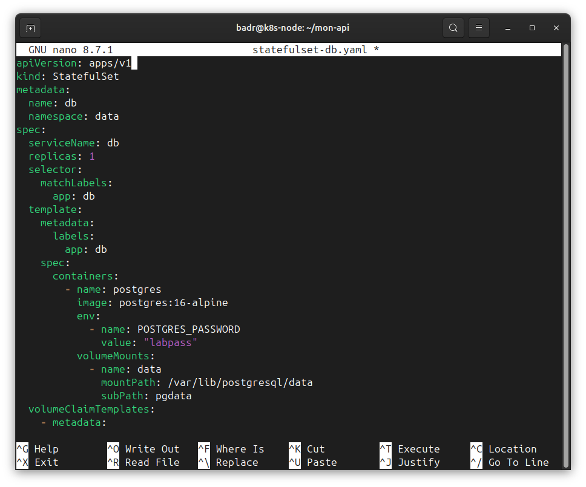

```bash
kubectl apply -f statefulset-db.yaml
kubectl get pods -n data -w
```

Le pod s'appelle `db-0`. Nom stable, prévisible. C'est la première garantie.

Le disque créé tout seul :

```bash
kubectl get pvc -n data
kubectl get pv
```

Le PVC s'appelle `data-db-0` (le nom du template `data` + le nom du pod). Rappel de vocabulaire : le PVC c'est le ticket de vestiaire (ma demande de stockage), le PV c'est le casier (le vrai disque). La StorageClass c'est ce qui fabrique le casier automatiquement.

La démo qui prouve que le volume survit au pod — c'est LE truc de cette section. J'écris une donnée, je tue le pod, il renaît avec le même nom, la donnée est toujours là :

```bash
kubectl exec -it db-0 -n data -- psql -U postgres -c \
  "CREATE TABLE preuve (msg text); INSERT INTO preuve VALUES ('je survis au pod');"
kubectl delete pod db-0 -n data
kubectl get pods -n data -w
kubectl exec -it db-0 -n data -- psql -U postgres -c "SELECT * FROM preuve;"
```

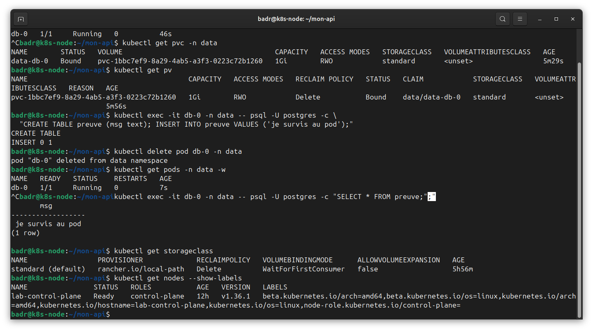

La donnée est revenue. Le pod est mort, un nouveau est né, et il s'est rebranché sur le même disque via son identité `db-0`. Avec un Deployment j'aurais tout perdu. C'est toujours la réconciliation (je veux 1 réplique, K8s la recrée), mais avec la continuité du disque en plus.

Le point sécu à la fin, la reclaimPolicy :

```bash
kubectl get storageclass
```

Elle décide du sort du disque quand je supprime le PVC. `Delete` = données détruites direct (un delete malheureux = incident). `Retain` = disque conservé, l'accident devient une corvée. Pour une base de prod je veux `Retain`. C'est un choix de plateforme, pas un truc laissé à chaque équipe.

**Résumé :** StatefulSet = Deployment + nom stable + disque qui survit + démarrage ordonné. Champ magique `volumeClaimTemplates`. Preuve vécue = donnée retrouvée après kill du pod. Piège sécu = reclaimPolicy (`Retain` pour une base).

---

## 5.2 — Placement des pods

Concept de base : le scheduler. Quand je crée un pod, c'est lui (le "maître d'hôtel") qui choisit sur quel nœud le poser. Il filtre (élimine les nœuds impossibles) puis score (choisit le meilleur). Les trois leviers ci-dessous servent à influencer ce choix. Sur mon mono-nœud le choix est trivial mais le mécanisme est le même qu'avec 300 nœuds.

### Levier 1 : nodeSelector (attirer)

Les nœuds portent des labels. Je dis "ce pod n'accepte que les nœuds avec telle étiquette".

```bash
kubectl get nodes --show-labels
```

J'ai fait un `pod-ssd.yaml` avec `nodeSelector: disktype: ssd` alors que le nœud n'avait pas ce label. Résultat : Pending.

```bash
kubectl apply -f pod-ssd.yaml
kubectl get pods
kubectl describe pod pod-ssd | tail -15
```

Les Events disent "didn't match node affinity/selector". La réparation qui fait tilt : je touche pas au pod, je colle le label manquant sur le nœud, et le pod se pose tout seul.

```bash
kubectl label node lab-control-plane disktype=ssd
kubectl get pods -w
```

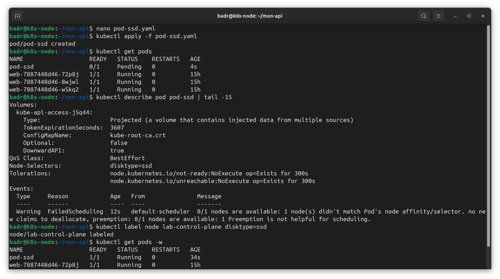

Le scheduler réessaie en boucle les pods Pending, dès qu'un nœud matche il place. Encore de la réconciliation. Nettoyage :

```bash
kubectl delete pod pod-ssd
kubectl label node lab-control-plane disktype-
```

Le tiret à la fin du label = "retire ce label".

### Levier 2 : taints & tolerations (repousser)

L'inverse du nodeSelector. Un taint c'est un repoussoir posé sur le nœud ("dégagez sauf invitation"). Une toleration c'est le laissez-passer posé sur le pod.

```bash
kubectl describe node lab-control-plane | grep -i taint
kubectl taint node lab-control-plane dedicated=gpu:NoSchedule
```

Syntaxe clé=valeur:effet. `NoSchedule` = pas de nouveau pod ici sauf s'il tolère. Un pod normal (`pod-normal.yaml`, sans toleration) reste Pending :

```bash
kubectl apply -f pod-normal.yaml
kubectl describe pod pod-normal | tail -15
```

Events : "had untolerated taint". Un pod avec le bon bloc `tolerations` (qui matche exactement clé/valeur/effet) passe Running (`pod-gpu.yaml`).

```bash
kubectl apply -f pod-gpu.yaml
kubectl get pods
```


Le piège important : une toleration n'attire pas, elle autorise juste. Sur un cluster multi-nœuds, un pod qui tolère le taint pourrait très bien aller ailleurs. Pour forcer un pod sur des nœuds précis je combine taint (repousse les autres) + nodeSelector (attire les bons). Nettoyage obligatoire sinon le nœud reste réservé :

```bash
kubectl delete pod pod-normal pod-gpu
kubectl taint node lab-control-plane dedicated=gpu:NoSchedule-
```

### Levier 3 : anti-affinité (disperser)

Les deux premiers raisonnent pod↔nœud. L'anti-affinité raisonne pod↔pod : "ne mets pas mes répliques au même endroit". But = haute dispo, si un nœud tombe je perds pas toutes mes copies.

Le `anti-affinity.yaml` (Deployment 3 répliques) avait :

```yaml
      affinity:
        podAntiAffinity:
          requiredDuringSchedulingIgnoredDuringExecution:
            - labelSelector:
                matchLabels:
                  app: spread
              topologyKey: kubernetes.io/hostname
```

Deux mots à retenir : `required` = règle dure (si impossible → Pending), `preferred` serait juste un souhait. Et `topologyKey` = l'échelle de la règle : `kubernetes.io/hostname` = "pas deux sur la même machine".

```bash
kubectl apply -f anti-affinity.yaml
kubectl get pods -l app=spread
kubectl delete -f anti-affinity.yaml
```

Résultat : 1 Running, 2 Pending pour toujours. Règle "un par machine" + une seule machine = impossible de placer les 2 autres. C'est pas un bug, c'est la contrainte qui marche. En Partie 6 avec 3 nœuds ça donnera 3 pods répartis.

**Résumé :** scheduler = filtre puis score. nodeSelector (attirer par label), taints (repousser sauf invitation), anti-affinité (disperser, échelle = topologyKey). required = dur, preferred = souhait. Une toleration autorise mais n'attire pas.

---

## 5.3 — Autoscaling (HPA)

Jusque-là je fixais replicas à la main. Le HPA le fait selon la charge, entre un min et un max. Horizontal = plus de copies (pas des pods plus gros).

Le truc sécu à jamais oublier : un autoscaler sans plafond = une faille. Un attaquant injecte de la charge → scale à l'infini → facture qui explose (Denial of Wallet) ou mon nœud qui tombe (Denial of Lab). Toujours un max.

metrics-server d'abord, parce que le HPA a besoin de mesurer la charge CPU et kind ne l'installe pas de base. Et il y a un piège kind : metrics-server refuse de parler au kubelet à cause des certifs auto-signés de kind, d'où le patch `--kubelet-insecure-tls` (ok en labo, jamais en prod).

```bash
kubectl apply -f https://github.com/kubernetes-sigs/metrics-server/releases/latest/download/components.yaml
kubectl patch deployment metrics-server -n kube-system --type='json' \
  -p='[{"op":"add","path":"/spec/template/spec/containers/0/args/-","value":"--kubelet-insecure-tls"}]'
kubectl top nodes
```

Si `top nodes` affiche du CPU/RAM, c'est bon. Ensuite une appli qui bouffe du CPU, avec une requests.cpu obligatoire (le HPA calcule un pourcentage par rapport à elle, sans requests pas d'autoscaling) :

```bash
kubectl create deployment php --image=registry.k8s.io/hpa-example
kubectl set resources deployment php --requests=cpu=200m --limits=cpu=500m
kubectl expose deployment php --port=80
```

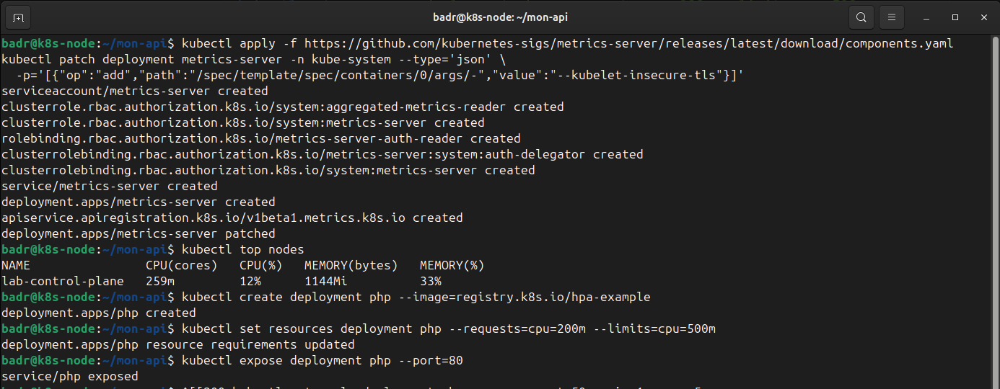

Le HPA avec le plafond :

```bash
kubectl autoscale deployment php --cpu-percent=50 --min=1 --max=5
kubectl get hpa
```

Vise 50% de CPU, entre 1 et 5 pods. Puis générer la charge dans un terminal et regarder dans un autre. Terminal 1 :

```bash
kubectl run charge --rm -it --restart=Never --image=busybox:1.36 -- \
  /bin/sh -c "while true; do wget -q -O- http://php; done"
```

Terminal 2 (autre session SSH) :

```bash
kubectl get hpa -w
```

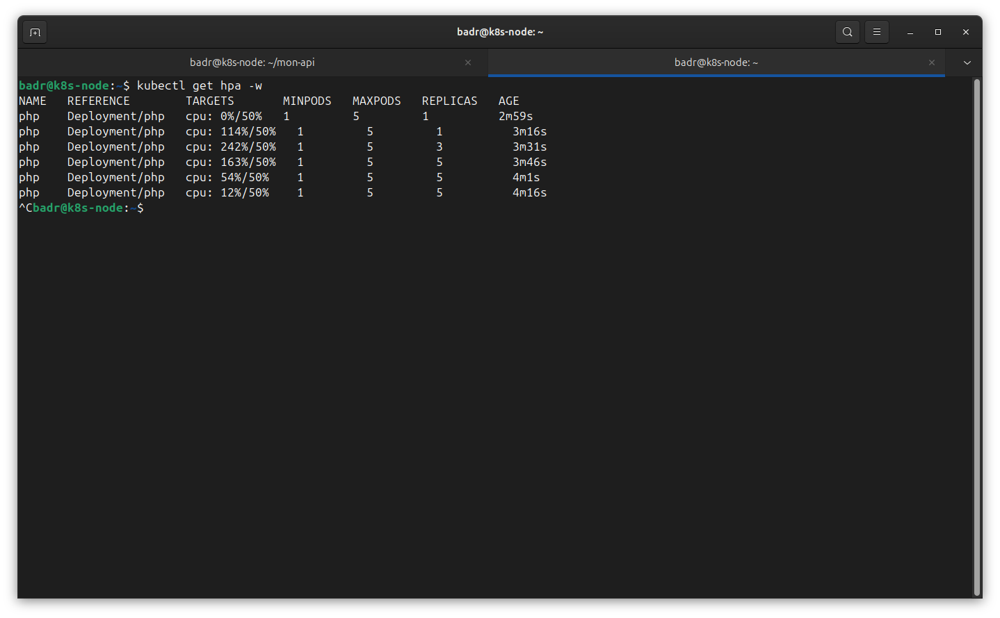

Ma vraie courbe : CPU 0% → 114% → 242% → 163% → 54% → 12%, et REPLICAS 1 → 1 → 3 → 5 → 5 → 5. Deux trucs compris là-dessus : à 114% j'étais encore à 1 pod (le HPA échantillonne toutes les ~15s puis décide, il réagit pas à un pic d'une seconde), et à 12% j'étais encore à 5 pods (fenêtre de stabilisation ~5 min avant de réduire, pour éviter le yo-yo).

Nettoyage :

```bash
kubectl delete deployment php
kubectl delete service php
kubectl delete hpa php
```

**Résumé :** HPA = pods qui montent/descendent selon la charge, entre min et max. Prérequis metrics-server (kind l'a pas) + requests.cpu. Toujours un max. Montée pas instantanée, descente lente.

---

## 5.4 — Résilience : probes & PDB

K8s doit savoir si mon conteneur va bien. Trois sondes à pas confondre : readiness ("prêt à recevoir du trafic ?" — sinon le Service m'envoie plus rien mais me tue pas), liveness ("figé/mort ?" — si oui K8s me tue et me redémarre), startup ("fini de démarrer ?" — retient la liveness le temps du boot).

La leçon centrale : une liveness mal réglée crée de fausses pannes, elle tue un conteneur en pleine forme.

Premier essai raté à noter : j'avais fait une sonde soi-disant agressive (initialDelay 1, failureThreshold 1) et ça a PAS cassé, le pod est resté Running. Parce que nginx:1.27-alpine démarre en moins d'une seconde, il répondait 200 avant que la sonde échoue. La démo marche sur une appli lente, pas sur un nginx rapide.

La version qui casse pour de vrai : on se fie plus au timing, on pointe un port qui n'existe pas (nginx écoute sur 80, on sonde 9999).

```yaml
          livenessProbe:
            httpGet:
              path: /
              port: 9999
            initialDelaySeconds: 2
            periodSeconds: 3
            failureThreshold: 1
```

```bash
kubectl apply -f probe-casse.yaml
kubectl get pods -l app=probe-demo -w
kubectl describe pod <nom> | grep -A8 Events
```

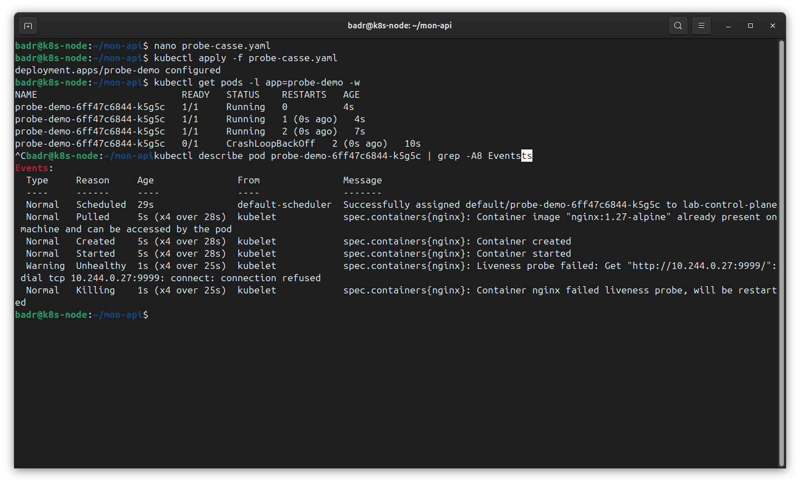

RESTARTS grimpe (0 → 1 → 2, avec des "0s ago" = redémarrages en rafale) puis CrashLoopBackOff. Les Events disent "Liveness probe failed: connection refused" sur le 9999 puis "Container failed liveness probe, will be restarted". Le point clé : nginx était 1/1 Running juste avant chaque kill, il tournait parfaitement. C'est pas l'appli qui plante, c'est la sonde qui la déclare morte à tort.

La réparation avec startupProbe (`probe-ok.yaml`) : sonde sur le bon port 80 + une startupProbe qui couvre le démarrage (30×2s de marge) et retient la liveness tant que le boot est pas validé.

```bash
kubectl apply -f probe-ok.yaml
kubectl get pods -l app=probe-demo -w
```

RESTARTS reste à 0, stable.

Le PDB (PodDisruptionBudget) : garde au moins N pods vivants pendant une maintenance (quand un admin draine un nœud).

```yaml
apiVersion: policy/v1
kind: PodDisruptionBudget
metadata:
  name: probe-demo
spec:
  minAvailable: 1
  selector:
    matchLabels:
      app: probe-demo
```

```bash
kubectl apply -f pdb.yaml
kubectl get pdb
```

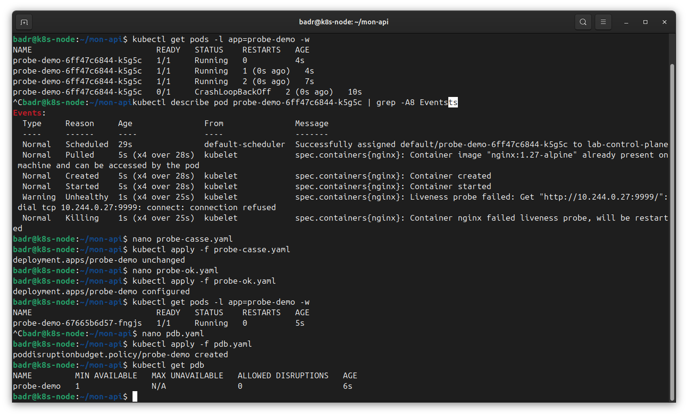

Le piège d'entretien : si minAvailable = nombre de répliques, un drain reste bloqué pour toujours (impossible d'évacuer un pod sans violer le budget). Règle : minAvailable < replicas. Le drain réel c'est du multi-nœuds, reporté Partie 6.

Nettoyage :

```bash
kubectl delete -f pdb.yaml
kubectl delete deployment probe-demo
```

**Résumé :** readiness (trafic on/off), liveness (tue + redémarre), startup (protège le boot). La fausse panne = liveness sur le mauvais port → nginx sain en CrashLoopBackOff. Réparé par startupProbe. PDB avec minAvailable < replicas.

---

## 5.5 — Gouvernance : ResourceQuota & LimitRange

Sur un cluster partagé, rien n'empêche par défaut une équipe de bouffer tout le CPU/RAM. Deux garde-fous : ResourceQuota (plafond global par namespace) et LimitRange (valeurs par défaut pour les pods qui n'en déclarent pas).

La subtilité qui est le cœur de la démo : avec un quota seul, un pod sans requests est refusé. Avec un LimitRange en plus, il reçoit des défauts et passe. C'est "sécuriser sans bloquer".

Namespace + quota :

```bash
kubectl create namespace gouv
kubectl apply -f quota.yaml
kubectl describe resourcequota quota -n gouv
```

Le quota.yaml avait un bloc `hard` : requests.cpu 1, requests.memory 1Gi, limits.cpu 2, limits.memory 2Gi, count/pods 10. Le describe me donne un tableau Used/Hard, mon tableau de bord de conso.

Prouver le refus (quota seul) :

```bash
kubectl run test-refuse --image=nginx:1.27-alpine -n gouv
```

Résultat : `Error from server (Forbidden): must specify limits.cpu, limits.memory, requests.cpu, requests.memory`. Le quota impose que chaque pod annonce sa conso, celui-là déclare rien, porte fermée. C'est le point de friction dev.

Le LimitRange qui débloque :

```bash
kubectl apply -f limitrange.yaml
kubectl run test-ok --image=nginx:1.27-alpine -n gouv
kubectl get pod test-ok -n gouv -o jsonpath='{.spec.containers[0].resources}' ; echo
```

Cette fois le pod passe, et le jsonpath montre qu'il a hérité automatiquement limits {cpu 200m, memory 256Mi} et requests {cpu 50m, memory 64Mi} que j'avais pas mis dans la commande. Même commande qu'avant, mais rendue conforme par le LimitRange.

Le tableau de bord bouge :

```bash
kubectl describe resourcequota quota -n gouv
```

count/pods 1/10, limits.cpu 200m/2, requests.cpu 50m/1. Le pod consomme sur le budget.

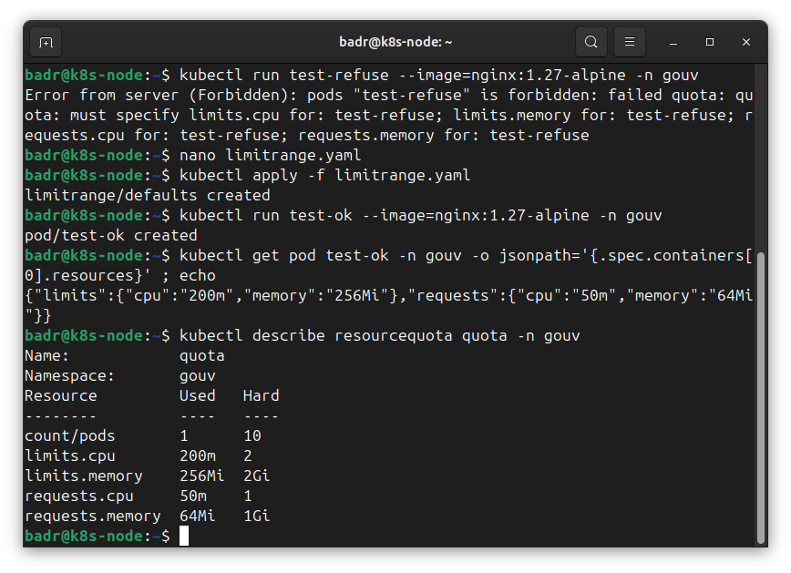

Nettoyage (supprimer le namespace efface tout d'un coup) :

```bash
kubectl delete namespace gouv
```

**Résumé :** ResourceQuota = plafond par namespace (Used/Hard). LimitRange = défauts par conteneur. Quota seul refuse un pod sans requests, quota + LimitRange le laisse passer. Sécuriser sans bloquer.

---

## 5.6 — Helm

Écrire 15 YAML à la main par appli ça passe pas à l'échelle. Helm = le apt/npm de Kubernetes. Vocabulaire : chart (le paquet, des YAML templatisés), values (les variables qui remplissent les trous), release (une instance installée), et `helm template` (rendre le YAML final sans installer).

Créer un chart :

```bash
helm create demo
ls demo/
cat demo/values.yaml | head -30
```

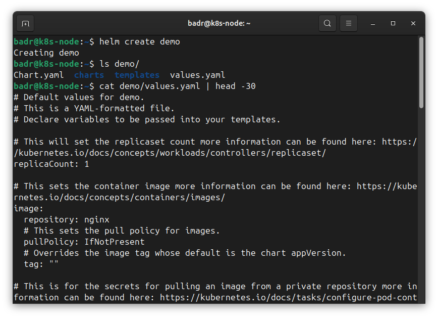

Structure : dossier templates/ (les YAML à trous) et values.yaml (les variables : replicaCount, image, service). J'ajuste les values, pas les templates.

Le réflexe sécu, le plus important de la section : un chart tiers exécute du code de templating et déploie ce qu'il veut avec MES droits. Donc je le rends et je le lis avant d'installer.

```bash
helm template demo ./demo | head -40
helm template demo ./demo | grep -nE 'privileged|hostPath|hostNetwork|ClusterRole|NET_ADMIN' \
  || echo "rien de suspect"
```

Dans le rendu j'ai vu les labels générés automatiquement (app.kubernetes.io/name: demo, managed-by: Helm) : un seul mot, le nom de release, propage partout, c'est ça le templating. Le grep chasse les demandes de privilèges élevés (accès disque hôte, réseau hôte, droits cluster-wide). Là "rien de suspect", mais le jour où ça sort un hostPath ou un ClusterRole sur un chart d'internet, je m'arrête et je lis.

Installer / lister / désinstaller :

```bash
helm install demo ./demo
helm list
kubectl get pods -l app.kubernetes.io/instance=demo
helm uninstall demo
```

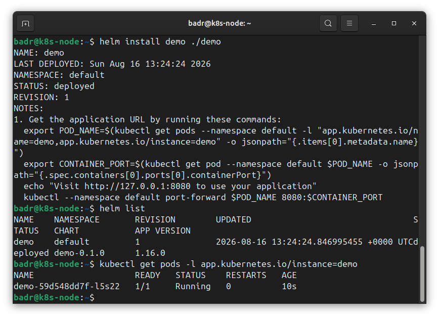

helm list montre demo, deployed, REVISION 1. Helm garde la trace de ce qu'il a posé (REVISION s'incrémente à chaque upgrade, rollback revient en arrière), c'est ce qui rend le uninstall propre.

**Résumé :** chart + values → release versionnée (REVISION, upgrade/rollback). Réflexe = `helm template | grep` avant d'installer.

---

## 5.7 — cert-manager

Le problème : un certificat TLS expiré c'est l'incident de prod le plus banal et le plus évitable. cert-manager émet et renouvelle les certifs tout seul avant expiration.

Vocabulaire : un certificat = carte d'identité d'un serveur ("je suis bien api.lab.local"), avec une date d'expiration et une signature. La clé privée = le secret qui va avec, jamais divulgué. La CA (autorité) = l'entité de confiance qui signe. Chaîne de confiance : si ça remonte à une CA connue → cadenas vert, sinon avertissement navigateur. Issuer/ClusterIssuer = objets cert-manager qui répondent à "qui émet ?". Certificate = ma demande déclarative.

Report acté : la vraie puissance ce serait d'adosser à ma CA du Module 10 (connue de mes machines) pour un cadenas vert sans avertissement. Ça suppose ma PKI + le réseau réveillé, donc Partie 6. Là j'ai monté une CA interne au cluster juste pour la mécanique.

Installer cert-manager :

```bash
helm repo add jetstack https://charts.jetstack.io && helm repo update
helm install cert-manager jetstack/cert-manager -n cert-manager \
  --create-namespace --set crds.enabled=true
kubectl get pods -n cert-manager -w
```

`crds.enabled=true` installe les CRD = de nouveaux types d'objets que cert-manager ajoute au cluster (Certificate, Issuer, ClusterIssuer). Avant K8s connaissait que Pod/Deployment/Service, là on lui apprend ces types. C'est ça qui rend K8s extensible. Trois pods démarrent (cert-manager, cainjector, webhook), version 1.21.1.

Bootstrapper une CA interne (`ca-setup.yaml`). Problème d'amorçage : pour avoir une CA il faut un certif de CA signé par quelqu'un, mais j'ai personne au départ. Solution : partir d'un self-signed juste pour amorcer. Trois objets enchaînés :

1. ClusterIssuer `selfsigned` (`selfSigned: {}`) = le point de départ, il émet de l'auto-signé.
2. Certificate `lab-ca` signé par selfsigned, avec `isCA: true` (ce cert peut lui-même signer d'autres certs), duration 87600h (10 ans), stocké dans `lab-ca-secret`.
3. ClusterIssuer `lab-ca` qui utilise ce secret comme autorité.

La chaîne : selfsigned amorce → signe lab-ca (isCA true) → lab-ca devient mon autorité maison.

```bash
kubectl apply -f ca-setup.yaml
kubectl get clusterissuer
```

Les deux passent READY True.

Émettre un certif de service (`cert-api.yaml`). Réglages qui comptent : duration 2160h (90j de validité), renewBefore 720h (renouvelle 30j avant l'échéance, il attend pas la panne), rotationPolicy Always (régénère aussi la clé privée à chaque renouvellement).

```bash
kubectl apply -f cert-api.yaml
kubectl get certificate
kubectl describe certificate api-tls
```

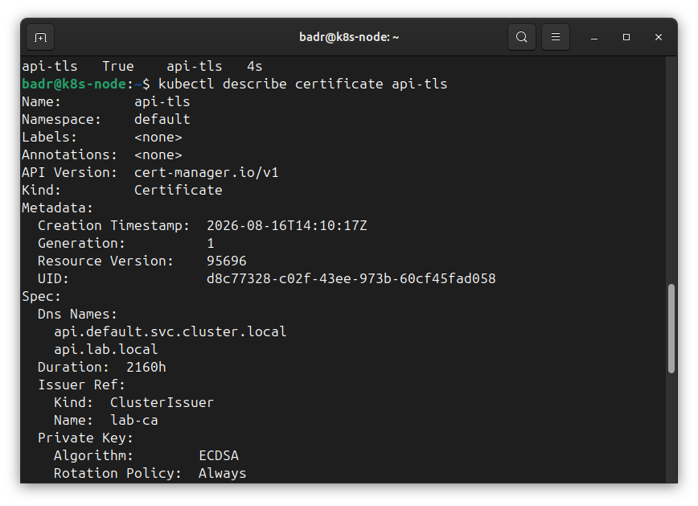

api-tls passe READY True. Le describe montre Not After 2026-11-14 et Renewal Time 2026-10-15 : cert-manager a déjà planifié le renouvellement 30j avant, tout seul. Les Events racontent son workflow : Issuing → Generated (clé privée) → Requested (CertificateRequest) → Issued.

Vérifier qui a signé et forcer un renouvellement :

```bash
kubectl get secret api-tls -o jsonpath='{.data.tls\.crt}' | base64 -d | \
  openssl x509 -noout -issuer -subject -dates -serial
```

Résultat issuer=CN=lab-ca + un serial. Je note le serial. Puis je supprime le secret et cert-manager le réémet aussitôt (réconciliation : le Certificate veut un secret, il disparaît, il le refabrique).

```bash
kubectl delete secret api-tls
sleep 10
kubectl get secret api-tls -o jsonpath='{.data.tls\.crt}' | base64 -d | \
  openssl x509 -noout -issuer -serial
```

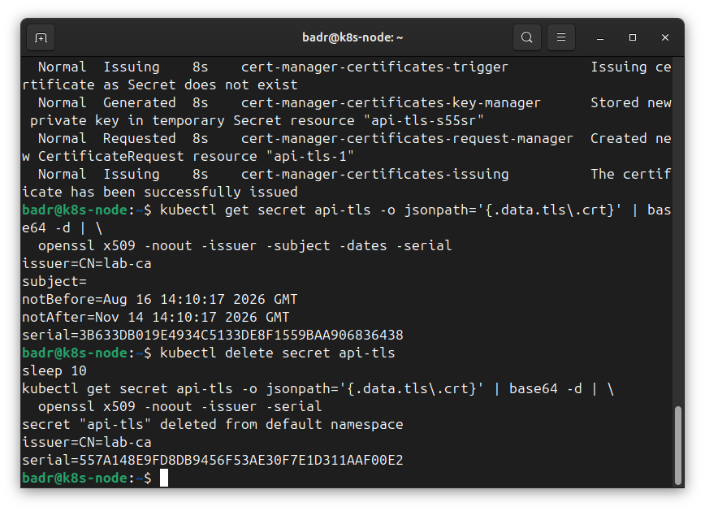

Le serial a changé (3B633DB0... → 557A148E...). Nouveau certif, réémis seul en moins de 10s. C'est exactement ce que fait un vrai renouvellement auto en prod, sauf qu'ici je l'ai déclenché à la main pour le voir. En vrai il le fait 30j avant expiration, la nuit, sans réveiller personne. L'incident du certif expiré disparaît.

**Résumé :** certificat = carte d'identité signée par une CA + clé privée secrète. cert-manager installe des CRD et automatise émission + renouvellement avant expiration (renewBefore). CA interne bootstrappée : selfsigned amorce → lab-ca (isCA) devient l'autorité. Preuve = je supprime le secret, le serial change.

---

## Ce que je retiens de toute la Partie 5

- 5.1 StatefulSet : identité stable + disque qui survit (db-0 + volumeClaimTemplates).
- 5.2 Placement : nodeSelector (attirer), taints (repousser), anti-affinité (disperser), échelle = topologyKey.
- 5.3 HPA : autoscale entre min/max, prérequis metrics-server + requests.cpu, toujours un max.
- 5.4 Probes : readiness/liveness/startup, la fausse panne du mauvais port, PDB avec minAvailable < replicas.
- 5.5 Gouvernance : quota refuse, LimitRange débloque = sécuriser sans bloquer.
- 5.6 Helm : chart/values/release, template + grep avant d'installer.
- 5.7 cert-manager : automate d'émission/renouvellement, CA interne bootstrappée, serial qui change.

Les trois fils rouges partout : réconciliation, labels/selectors, get → describe → logs.

## Reporté en Partie 6 (quand je rallume mes VMs)
- Chiffrement des volumes (LUKS/KMS).
- Vrais exercices de placement + drain réel (multi-nœuds, kind 3 nœuds ou k3s).
- cert-manager adossé à ma vraie CA du Module 10 (cadenas vert bout en bout) + cert du WAF.

## Exercices de la partie
- Reformuler l'erreur du quota (le Forbidden must specify...) en une phrase pour un dev.
- Révocation : K8s ne vérifie pas les CRL par défaut, la vraie parade c'est la durée de vie courte + renouvellement auto.
