# Mes notes — Partie 6 : Cycle de vie et exploitation d'un cluster Kubernetes

> Notes prises après avoir monté un cluster kind **lab-n2** à 3 nœuds,
> volontairement en retard de deux versions (1.34.8), puis upgradé
> jusqu'à la version courante (1.36.1) sans jamais couper le service.
> VM `k8s-node` (Ubuntu, NAT, Docker).
> Trajet fait : **1.34.8 → 1.35.5 → 1.36.1**.

---

## PARTIE A — Comprendre le problème

### 6.1 — Pourquoi cette partie existe

Kubernetes sort une nouvelle version tous les 4 mois environ. L'ancienne finit par ne plus recevoir de correctifs de sécurité. Donc un jour, il faut mettre le cluster à jour — pendant que les applications tournent.

C'est une question d'entretien standard pour un poste plateforme : « raconte-moi ton dernier upgrade de cluster ». Moi je peux raconter celui-là, avec les emmerdes rencontrées et les durées mesurées.

La partie se fait intégralement sur kind : c'est exactement pour ces exercices destructifs qu'on a gardé un cluster jetable.

### 6.2 — Le vocabulaire des versions : N, N−1, N−2

N n'est pas un nombre. C'est une position dans une file.

Dans `1.34.8` : **1** = majeur (ne bouge jamais), **34** = mineur (c'est lui qui compte), **8** = patch.

| Position | Version (août 2026) |
|----------|-------------------|
| N        | 1.36              |
| N−1      | 1.35              |
| N−2      | 1.34              |

N−2 est le point d'équilibre de l'exercice. Assez en retard pour que le skew impose un palier, pas assez pour que ce soit ingérable. Une entreprise qui a eu un trimestre chargé se retrouve à N−2 sans avoir rien décidé.

### 6.3 — La règle du version skew

Deux programmes discutent en permanence :
- **L'API server** vit sur le control-plane. C'est le guichet unique du cluster.
- **Le kubelet** vit sur chaque nœud. C'est l'agent qui exécute.

La règle : **le kubelet peut être en RETARD sur l'API server, jamais en AVANCE.**

| Cas | Situation | Verdict |
|-----|-----------|---------|
| A   | API server 1.35, kubelet 1.34 | ✅ OK — le chef s'adapte à l'ouvrier |
| B   | API server 1.34, kubelet 1.35 | ❌ INTERDIT — l'ouvrier utilise des mots que le chef ne connaît pas |

Ce que ça implique : **le chef d'abord**, parce que c'est le seul ordre qui ne traverse jamais une situation interdite.

---

## PARTIE B — Le drain, découvert en cassant

### 6.4 — Ma première tentative : le drain sur un seul nœud

```bash
kubectl drain lab-control-plane --ignore-daemonsets --delete-emptydir-data
```

La commande a réussi. Aucune erreur. Et pourtant : mes pods sont passés en **Pending**. Pas déplacés — en attente. Il n'existait aucun autre nœud où aller.

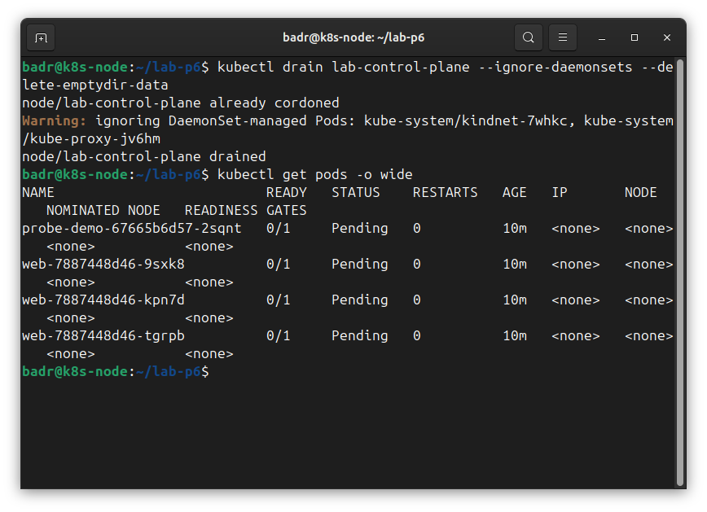

Le drain sur un nœud unique n'est pas une maintenance sans coupure. C'est une panne. Kubernetes m'a obéi. Il ne m'a pas protégé de moi-même.

```bash
kubectl uncordon lab-control-plane
```

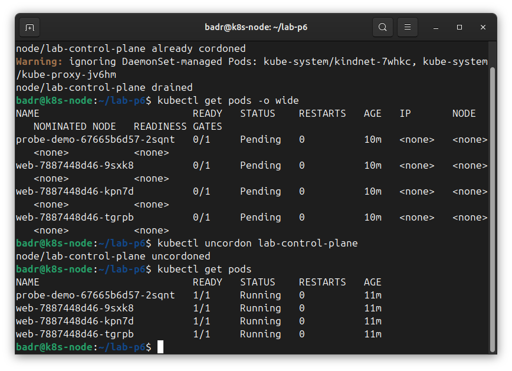

### 6.5 — Le pod orphelin qui bloque tout

Avant que le drain fonctionne, il a refusé :

```
error: unable to drain node "lab-control-plane" due to error:
cannot delete Pods that declare no controller (use --force to override): gouv/test-ok
```

Le diagnostic :

```bash
kubectl get pod test-ok -n gouv -o jsonpath='{.metadata.ownerReferences}'
kubectl get pod web-7887448d46-72p8j -o jsonpath='{.metadata.ownerReferences}'
```

`test-ok` n'a rien retourné — aucun propriétaire. Un pod créé à la main pendant la Partie 5. Le ReplicaSet a un seul travail : maintenir N pods en vie. Un pod orphelin n'a personne qui veille sur lui.

Un seul pod orphelin bloque toute la maintenance d'un nœud.

```bash
kubectl delete pod test-ok -n gouv
```

En production, on ne met jamais `--force` sans avoir regardé ce qu'il y a dedans.

### 6.6 — Monter un vrai cluster à 3 nœuds (et la panne inotify)

```yaml
kind: Cluster
apiVersion: kind.x-k8s.io/v1alpha4
name: lab-n2
nodes:
  - role: control-plane
    image: kindest/node:v1.34.8
  - role: worker
    image: kindest/node:v1.34.8
  - role: worker
    image: kindest/node:v1.34.8
```

Pourquoi un fichier : les images sont épinglées explicitement. Sans `image:`, kind prend le défaut de son binaire (probablement 1.36). Toute la partie s'effondrerait en silence.

Le premier échec :

```
✗ Joining worker nodes 🚜
ERROR: failed to create cluster: failed to join node with kubeadm
```

Le diagnostic :

```bash
sysctl fs.inotify.max_user_instances fs.inotify.max_user_watches
```

```
fs.inotify.max_user_instances = 128       ← LE COUPABLE
```

Les nœuds kind sont des conteneurs, donc ils partagent le noyau de la VM. Ce n'est pas 128 par nœud — c'est 128 pour tout le monde.

```bash
sudo sysctl -w fs.inotify.max_user_instances=1024 fs.inotify.max_user_watches=524288

echo -e "fs.inotify.max_user_instances=1024\nfs.inotify.max_user_watches=524288" \
  | sudo tee /etc/sysctl.d/99-kind.conf
```

```bash
docker stop lab-control-plane
kind create cluster --config ~/lab-p6/kind-n2.yaml
```

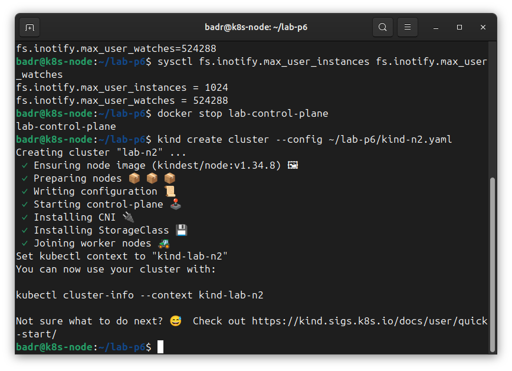

### 6.7 — Le drain qui marche vraiment

```bash
kubectl create deployment web --image=nginx:alpine --replicas=4
kubectl get pods -o wide
```

Le scheduler a réparti 2/2 tout seul. Zéro pod sur le control-plane (taint de protection).

```bash
kubectl drain lab-n2-worker --ignore-daemonsets --delete-emptydir-data
```

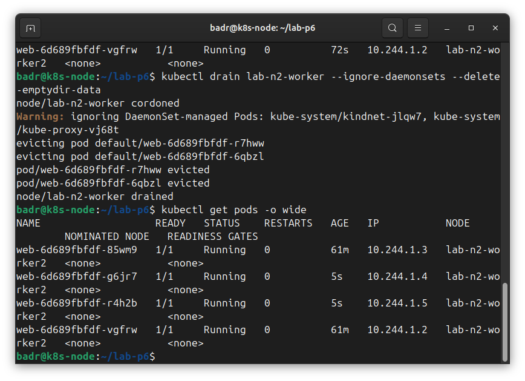

Les pods n'ont pas été « déplacés ». Ils ont été **TUÉS et REFAITS** ailleurs. Les âges le prouvent : 61m pour ceux qui n'ont pas bougé, 5s pour les nouveaux. Ce ne sont pas les mêmes pods.

### 6.8 — Cordon, drain, uncordon : le cycle complet

```bash
kubectl get nodes
```

```
lab-n2-worker   Ready,SchedulingDisabled   <none>   v1.34.8
```

Le cordon ferme la porte, le drain sort les gens. L'image : le panneau « caisse fermée » au supermarché.

```bash
kubectl uncordon lab-n2-worker
```

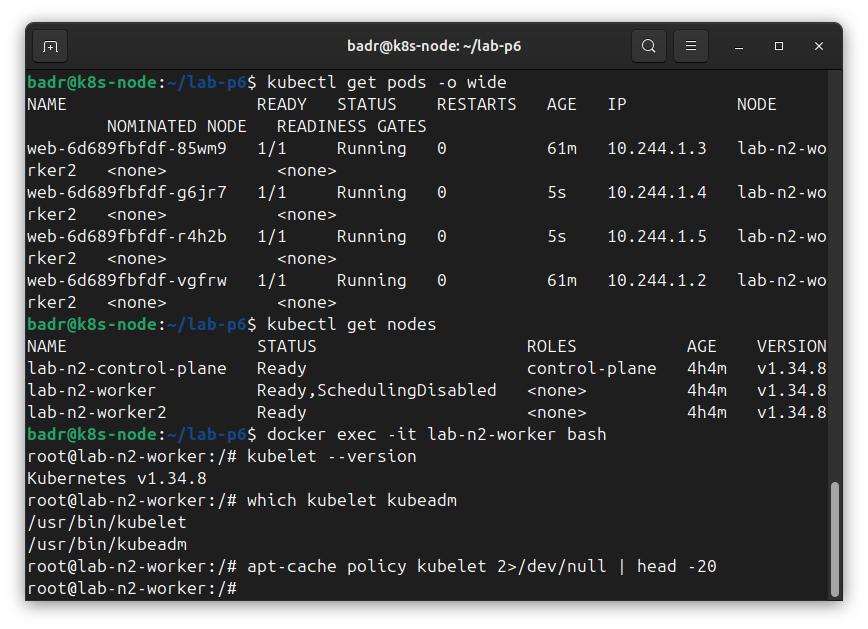

Les pods ne sont PAS revenus. **Kubernetes ne rééquilibre pas.** Le scheduler ne décide qu'au moment où un pod naît. Un pod déjà en vie ne bouge jamais tout seul.

---

## PARTIE C — L'upgrade

### 6.9 — Pourquoi le control-plane en premier

Le kubelet peut être en retard sur l'API server, jamais en avance. Donc : control-plane d'abord, workers ensuite. C'est le seul ordre qui ne traverse jamais une situation interdite.

### 6.10 — Pourquoi apt install ne marchait pas chez moi

```bash
docker exec -it lab-n2-worker bash
kubelet --version
apt-cache policy kubelet
```

`apt` ne connaît que les logiciels qu'il a lui-même installés. Dans les nœuds kind, kubelet et kubeadm ont été copiés directement dans `/usr/bin/` — apt ne sait même pas qu'ils existent.

```bash
curl -sSLO https://dl.k8s.io/v1.35.5/bin/linux/amd64/kubelet
curl -sSLO https://dl.k8s.io/v1.35.5/bin/linux/amd64/kubeadm
chmod +x kubelet kubeadm
./kubeadm version -o short
```

```bash
docker cp kubeadm lab-n2-control-plane:/usr/bin/kubeadm
```

### 6.11 — kubeadm upgrade plan : regarder avant de toucher

```bash
docker exec lab-n2-control-plane kubeadm upgrade plan
```

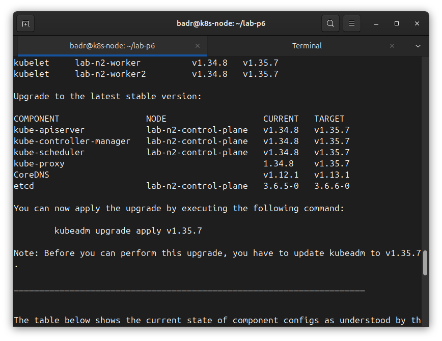

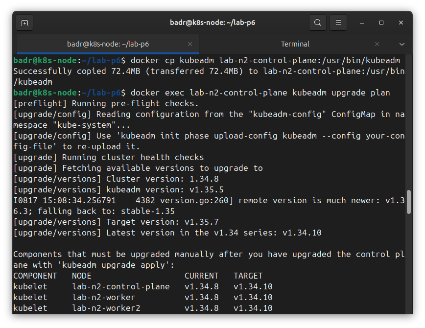

kubeadm a trouvé 1.36.3 et a dit : non, trop loin, je te ramène à 1.35. C'est la règle « pas de saut de version », appliquée par l'outil lui-même.

Six programmes à changer :

```
kube-apiserver            v1.34.8 → v1.35.7
kube-controller-manager   v1.34.8 → v1.35.7
kube-scheduler            v1.34.8 → v1.35.7
kube-proxy                1.34.8  → v1.35.7
CoreDNS                   v1.12.1 → v1.13.1
etcd                      3.6.5-0 → 3.6.6-0
```

Et kubeadm ne touche PAS aux kubelet. C'est mon travail après.

### 6.12 — L'erreur SystemVerification

```bash
docker exec lab-n2-control-plane kubeadm upgrade apply v1.35.5 -y
```

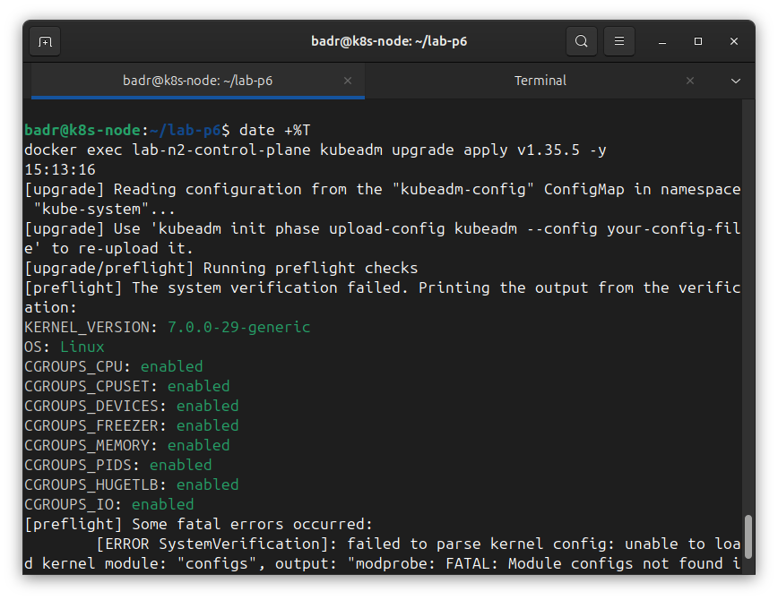

kubeadm n'échoue pas parce qu'il manque quelque chose. Il échoue parce qu'il n'a pas pu lire le fichier pour le confirmer (module noyau non chargeable dans un conteneur).

```bash
docker exec lab-n2-control-plane kubeadm upgrade apply v1.35.5 -y \
  --ignore-preflight-errors=SystemVerification
```

Je NOMME l'erreur que j'accepte. Pas `--ignore-preflight-errors=all`.

### 6.13 — Ce qui se passe vraiment : les static pods

Le kubelet surveille `/etc/kubernetes/manifests/`. Tout fichier YAML posé là est démarré comme un pod, SANS passer par l'API server. L'API server, etcd, le controller-manager et le scheduler sont des static pods.

Pour mettre à jour l'API server, kubeadm **réécrit un fichier YAML**. Le kubelet voit le changement, arrête l'ancien pod, démarre le nouveau.

L'ordre : **etcd d'abord** → kube-apiserver → kube-controller-manager → kube-scheduler. On met à jour la base AVANT celui qui l'utilise.

Le backup à `/etc/kubernetes/tmp/kubeadm-backup-manifests-<date>/` — c'est le retour arrière.

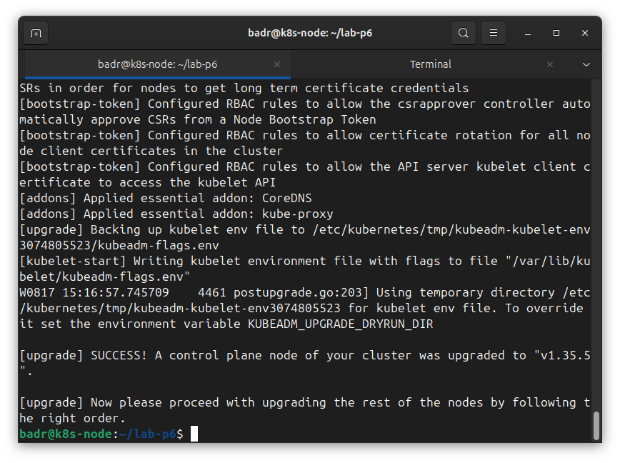

### 6.14 — La rotation des certificats

Un upgrade renouvelle les certificats internes du cluster. Chaque composant prouve son identité aux autres par un certificat. Ces certificats durent environ **UN AN**.

À l'expiration : le cluster devient totalement inaccessible — y compris pour le réparer.

L'effet pervers : une équipe qui upgrade régulièrement ne voit JAMAIS ses certificats expirer. Puis un jour, 14 mois passent sans upgrade. Tout tombe d'un coup.

```bash
kubeadm certs check-expiration
kubeadm certs renew all
```

### 6.15 — Le piège du kubectl get nodes

Après le SUCCESS, `kubectl get nodes` affichait toujours `v1.34.8`. La colonne VERSION montre la version du **KUBELET**, pas celle du cluster.

```bash
kubectl version
```

```
Server Version: v1.35.5
```

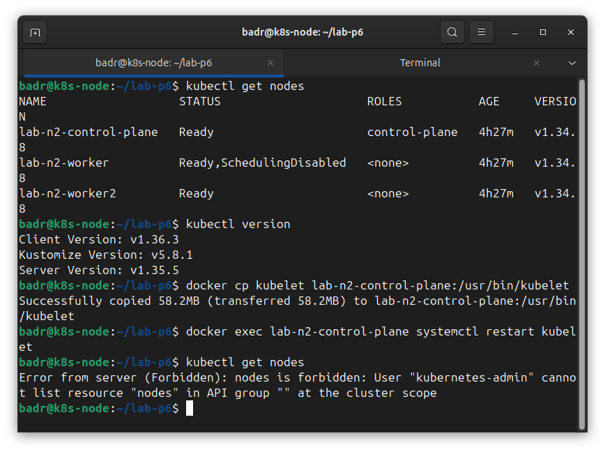

### 6.16 — Copier un binaire ne suffit pas

Le kubelet TOURNE DÉJÀ. Le processus en mémoire est l'ancien. Remplacer le fichier sur le disque ne change rien au programme en cours d'exécution.

```bash
docker cp kubelet lab-n2-control-plane:/usr/bin/kubelet
docker exec lab-n2-control-plane systemctl restart kubelet
```

Les 3 étapes sont obligatoires : remplacer le fichier, relancer le service, vérifier.

### 6.17 — Le 403 après le redémarrage

```
Error from server (Forbidden): nodes is forbidden: User "kubernetes-admin"
cannot list resource "nodes" in API group "" at the cluster scope
```

Ce n'est PAS une erreur de connexion. L'API server RÉPOND, mais le RBAC n'est pas encore rechargé après le restart. Attendre 30 secondes. Ne rien corriger.

### 6.18 — Les workers, un par un

```bash
docker cp kubeadm lab-n2-worker:/usr/bin/kubeadm
docker cp kubelet lab-n2-worker:/usr/bin/kubelet
docker exec lab-n2-worker kubeadm upgrade node --ignore-preflight-errors=SystemVerification
docker exec lab-n2-worker systemctl restart kubelet
kubectl uncordon lab-n2-worker
```

`kubeadm upgrade node` sur un worker : six lignes « Skipping », UNE SEULE utile — récupérer la config kubelet. D'où l'écart : 3 min 05 s pour le control-plane, ~1 s pour un worker.

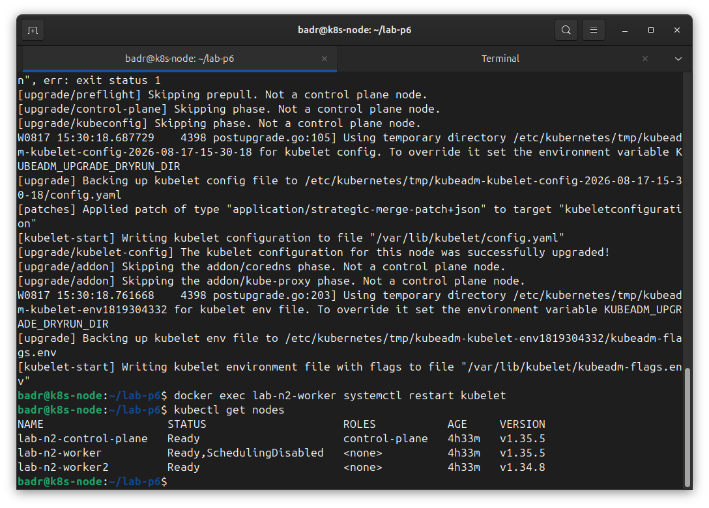

Le balancier — en drainant worker2, les pods sont revenus sur worker :

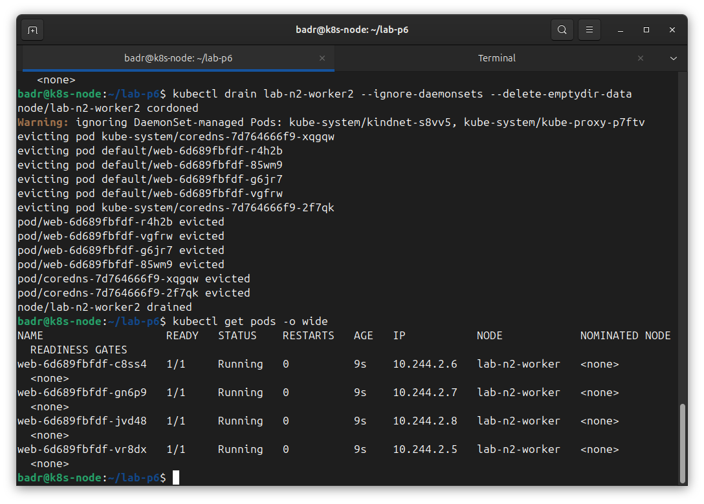

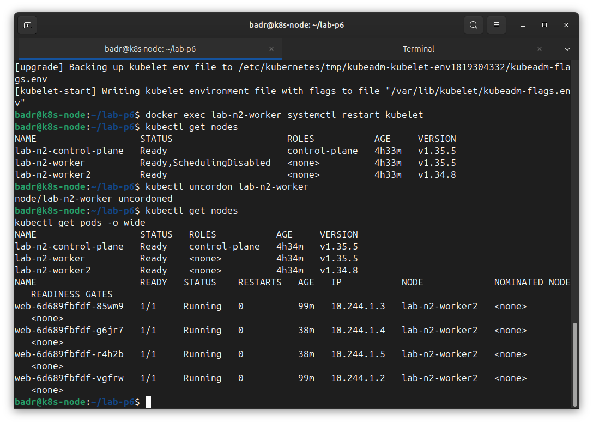

Les 4 pods ont AGE 9s — tous recréés en même temps. Pendant quelques secondes : zéro pod prêt. Les deux CoreDNS étaient sur le même nœud et sont partis ensemble.

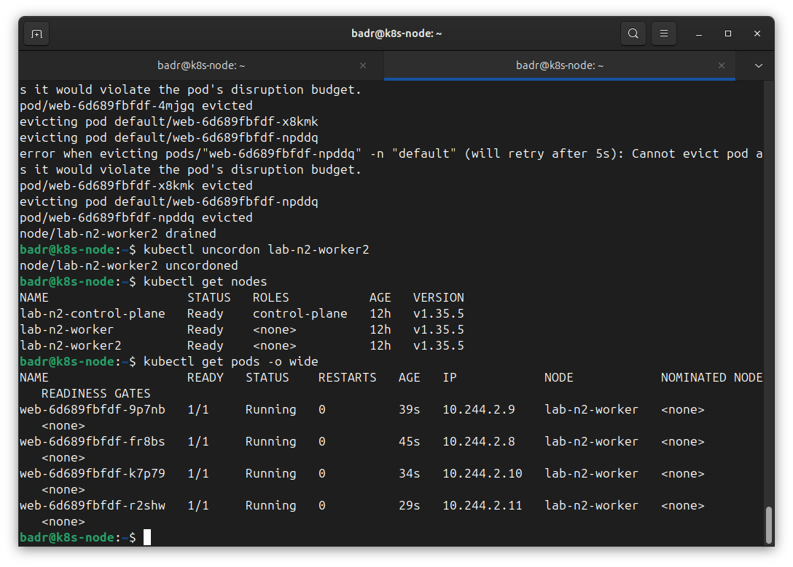

Durée totale : **18 min 15 s** pour 3 nœuds.

⚠️ **UN NŒUD À LA FOIS.** Attendre Ready avant de passer au suivant.

---

## PARTIE D — Le PodDisruptionBudget

### 6.19 — Le problème que j'ai vu de mes yeux

Sans PDB, quand je draine un nœud, Kubernetes évince TOUS les pods EN MÊME TEMPS. Le ReplicaSet en recrée d'autres ailleurs, mais pendant quelques secondes, j'ai zéro pod prêt. C'est une coupure.

### 6.20 — Créer un PDB et le voir travailler

```yaml
apiVersion: policy/v1
kind: PodDisruptionBudget
metadata:
  name: web
spec:
  minAvailable: 3
  selector:
    matchLabels:
      app: web
```

```bash
kubectl apply -f ~/lab-p6/pdb-web.yaml
kubectl get pdb
```

```
NAME   MIN AVAILABLE   MAX UNAVAILABLE   ALLOWED DISRUPTIONS   AGE
web    3               N/A               1                     0s
```

ALLOWED DISRUPTIONS: 1 = 4 réplicas, minimum 3 → il peut en sacrifier 1.

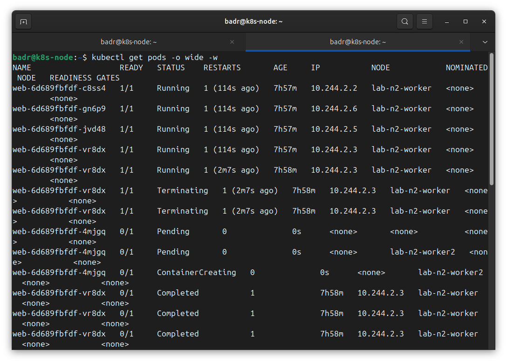

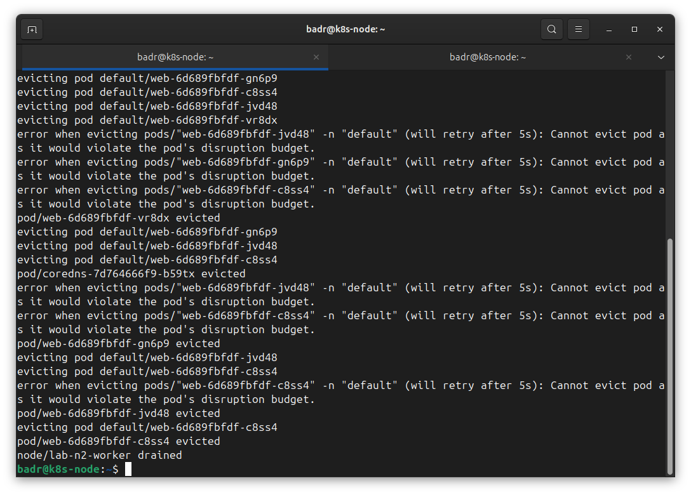

Kubernetes REFUSE SES PROPRES ÉVICTIONS. Il demande à sortir les 4 pods, en obtient 1, et pour les trois autres il se répond « non, ça casserait le contrat ». Puis il réessaie toutes les 5 secondes.

| Sans PDB | Avec PDB |
|----------|----------|
| 4 evicted d'affilée | 1 evicted, 3 refus, attente, 1 de plus… |
| 0 pod dispo pendant quelques secondes | jamais moins de 3 debout |
| tous les pods au même AGE | âges en escalier : 29s, 34s, 39s, 45s |

Le drain est plus lent — ET C'EST LE BUT.

### 6.21 — Provoquer un upgrade qui ne finit jamais

```bash
kubectl patch pdb web -p '{"spec":{"minAvailable":4}}'
kubectl get pdb
```

```
NAME   MIN AVAILABLE   MAX UNAVAILABLE   ALLOWED DISRUPTIONS   AGE
web    4               N/A               0                     102s
```

ALLOWED DISRUPTIONS: **0**. Kubernetes n'a plus le droit de retirer un seul pod. J'ai créé un cluster IMPOSSIBLE À MAINTENIR.

```bash
kubectl drain lab-n2-worker2 --ignore-daemonsets --delete-emptydir-data --timeout=60s
```

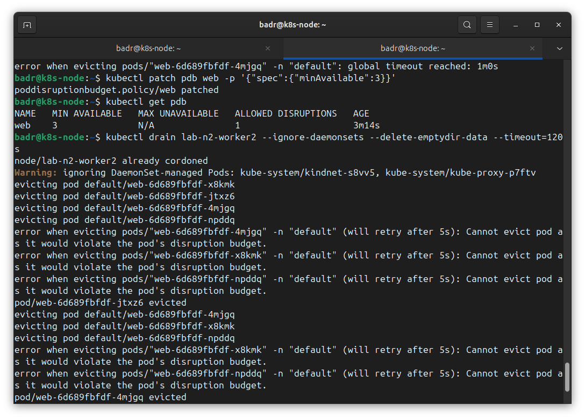

**LA RÈGLE :** `minAvailable` doit être **STRICTEMENT INFÉRIEUR** à `replicas`. 3 sur 4 → ralentit le drain (c'est voulu). 4 sur 4 → le rend IMPOSSIBLE, pour toujours.

```bash
kubectl patch pdb web -p '{"spec":{"minAvailable":3}}'
```

Débloqué en une commande.

---

## PARTIE E — Les pannes d'environnement

### 6.22 — Le disque plein, et LVM qui me sauve

```
cat: -: No space left on device
```

```bash
df -h /
```

```
/dev/mapper/ubuntu--vg-ubuntu--lv   19G   18G   0   100%  /
```

Un upgrade télécharge les images de la nouvelle version sur chaque nœud SANS supprimer les anciennes.

```bash
lsblk
```

Ma partition fait 38 Go, mais le volume logique n'en utilise que 19 (le défaut Ubuntu).

```bash
sudo lvextend -l +100%FREE -r /dev/mapper/ubuntu--vg-ubuntu--lv
```

```
/dev/mapper/ubuntu--vg-ubuntu--lv   38G   18G   19G   50%   /
```

19 Go libérés, à chaud, sans démonter quoi que ce soit. C'est du Module 2 qui ressert ici.

---

## PARTIE F — L'autre méthode

### 6.23 — Patching en place vs remplacement immuable

| | En place | Immuable |
|---|----------|----------|
| Principe | on patche le nœud existant | on crée un nœud neuf, on bascule, on détruit l'ancien |
| Dérive de config | s'accumule | impossible |
| Retour arrière | complexe | trivial |

```bash
sed -i 's/v1.35.5/v1.36.1/; s/v1.34.8/v1.36.1/' ~/lab-p6/kind-n2.yaml
kind delete cluster --name lab-n2
kind create cluster --config ~/lab-p6/kind-n2.yaml
```

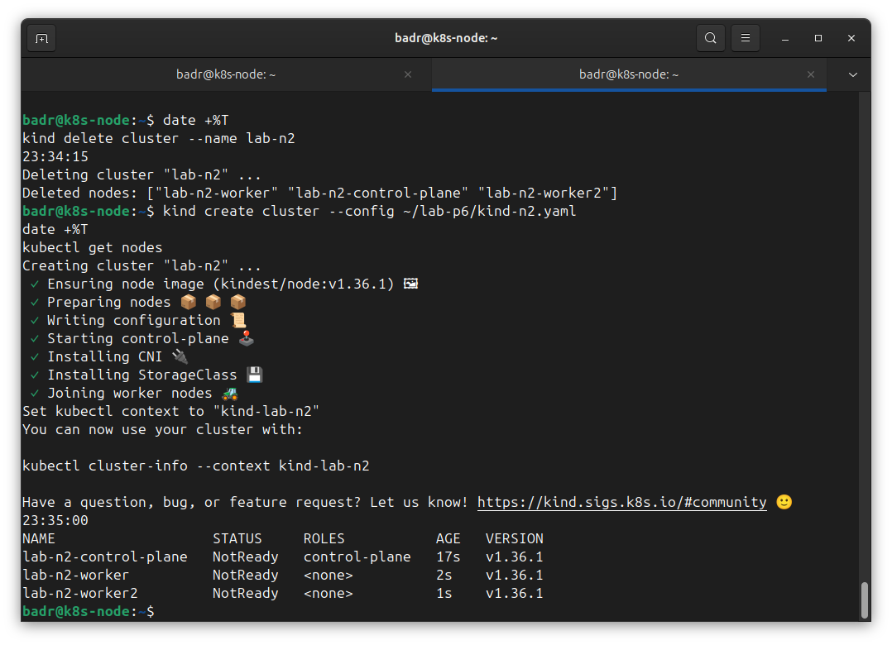

| Méthode | Durée |
|---------|-------|
| En place (1.34→1.35) | 18 min 15 s |
| Immuable (1.35→1.36) | **45 s** |

24× plus rapide. Zéro dérive. Mais ici j'ai détruit TOUT l'état du cluster. En production, l'immuable remplace les nœuds un par un — le control-plane et etcd survivent.

---

## PARTIE G — Ce qu'il faut faire AVANT un upgrade

### 6.24 — Les APIs dépréciées : la cause n°1 des upgrades ratés

Kubernetes retire des APIs à chaque version. Un manifest qui marchait en 1.34 peut être refusé en 1.36.

| Outil | Ce qu'il lit | Quand l'utiliser |
|-------|-------------|-----------------|
| pluto | mes FICHIERS (dépôt Git, charts Helm) | en CI, sur chaque commit |
| kubent | le CLUSTER (ce qui est déjà déployé) | avant chaque upgrade |

```bash
./pluto detect-files -d manifests/
```

```
NAME         KIND      VERSION                     REPLACEMENT            REMOVED   DEPRECATED
legacy-app   Ingress   networking.k8s.io/v1beta1   networking.k8s.io/v1   true      true
```

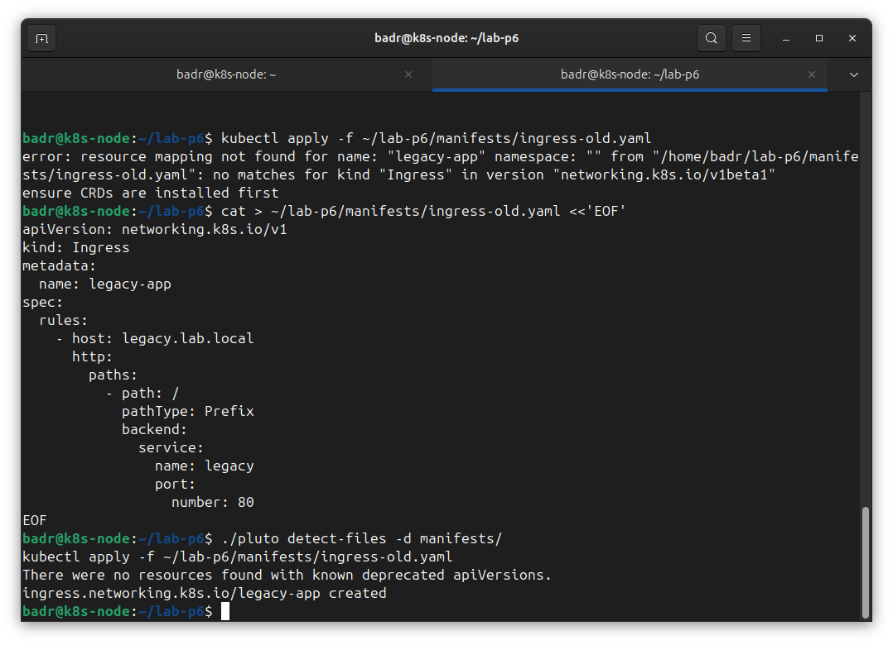

La correction n'est pas qu'une ligne — la STRUCTURE change (pathType obligatoire, bloc service imbriqué). On ne peut PAS automatiser ça avec un `sed`.

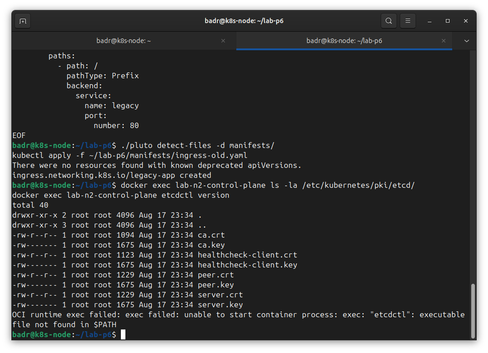

### 6.25 — Sauvegarder etcd (et vérifier la sauvegarde)

etcd contient TOUT l'état du cluster. Perdre etcd = perdre le cluster.

```bash
kubectl -n kube-system exec etcd-lab-n2-control-plane -- etcdctl \
  --endpoints=https://127.0.0.1:2379 \
  --cacert=/etc/kubernetes/pki/etcd/ca.crt \
  --cert=/etc/kubernetes/pki/etcd/server.crt \
  --key=/etc/kubernetes/pki/etcd/server.key \
  snapshot save /var/lib/etcd/snap-$(date +%F-%H%M).db
```

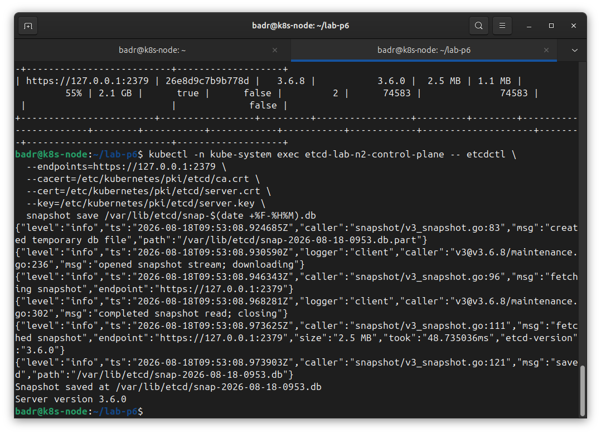

La vérification — l'étape que tout le monde saute :

```bash
kubectl -n kube-system exec etcd-lab-n2-control-plane -- \
  etcdutl snapshot status /var/lib/etcd/verif.db --write-out=table
```

```
+----------+----------+------------+------------+---------+
|   HASH   | REVISION | TOTAL KEYS | TOTAL SIZE | VERSION |
+----------+----------+------------+------------+---------+
| d7101698 |    59647 |        312 |     2.5 MB |   3.6.0 |
+----------+----------+------------+------------+---------+
```

TOTAL KEYS: 312 — la différence entre « un fichier de 2,5 Mo existe » et « ma sauvegarde contient réellement mon cluster ».

⚠️ Un snapshot etcd contient TOUS les Secrets EN CLAIR si le chiffrement au repos n'est pas activé.

---

## PARTIE H — Exploiter au quotidien

### 6.26 — Capacity planning : requests vs réel

Kubernetes réserve ce que je DEMANDE, pas ce que je CONSOMME.

```bash
kubectl describe node lab-n2-worker | grep -A 8 "Allocated resources"
```

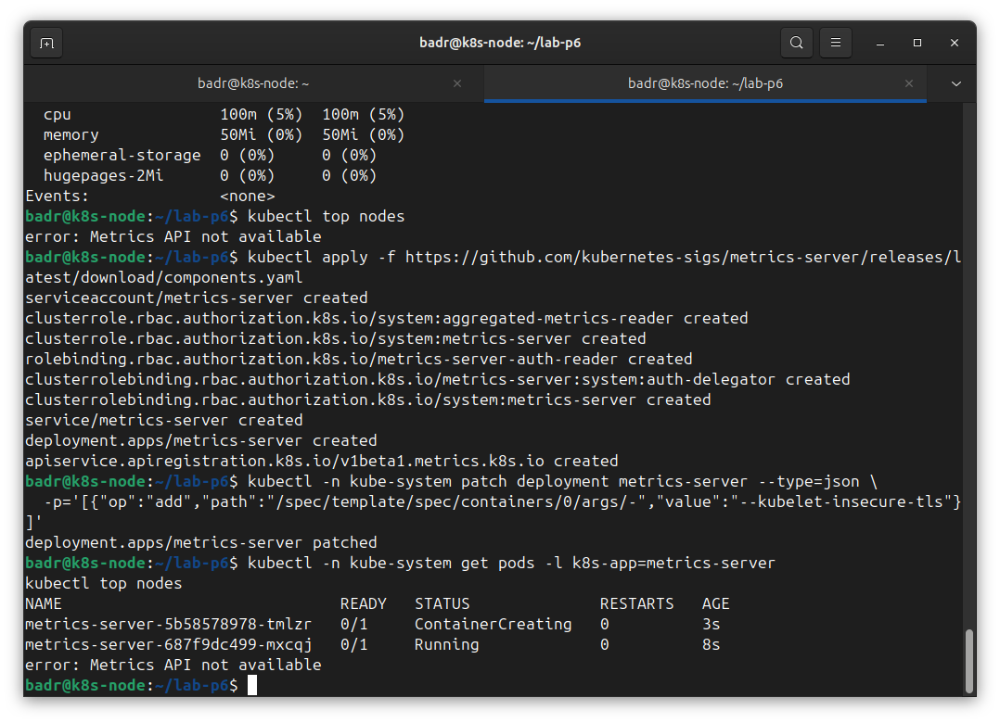

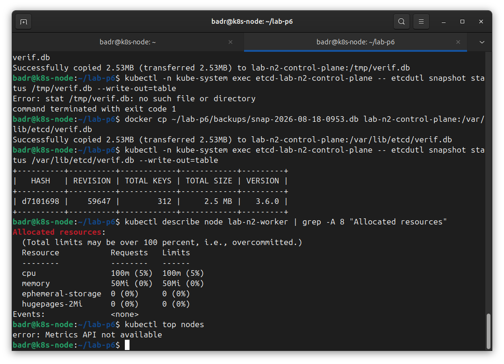

| | Réservé (requests) | Consommé réellement |
|---|---|---|
| worker CPU | 100m (5%) | 125m (6%) |
| worker RAM | 50Mi (0%) | 148Mi (1%) |

La consommation DÉPASSE la réservation. C'est l'overcommit en action.

### 6.27 — kured : automatiser les redémarrages

kured (KUbernetes REboot Daemon) tourne sur chaque nœud et :
1. Surveille `/var/run/reboot-required`
2. Prend un VERROU GLOBAL — un seul nœud à la fois
3. cordon → drain → reboot → uncordon
4. Respecte les PDB

C'est le pendant automatisé du cycle fait à la main sur les workers.

---

## PARTIE I — Le livrable

### 6.28 — Mon runbook d'upgrade

**Version** : 1.0 — **Testé sur** : kind 3 nœuds, 1.34.8 → 1.35.5 → 1.36.1
**Durée constatée** : 18 min 15 s (en place) / 45 s (immuable)

#### Préconditions

| # | Vérification | Commande |
|---|-------------|----------|
| 1 | Espace disque ≥ 20 Go libres par nœud | `df -h /` |
| 2 | Limites inotify ≥ 1024 instances | `sysctl fs.inotify.max_user_instances` |
| 3 | Tous les PDB ont minAvailable < replicas | `kubectl get pdb -A` |
| 4 | Aucun pod orphelin | vérifier ownerReferences |
| 5 | Sauvegarde etcd prise ET VÉRIFIÉE | TOTAL KEYS > 0 |
| 6 | APIs dépréciées détectées et corrigées | `pluto detect-files -d manifests/` |
| 7 | Version cible = N+1 maximum | `kubeadm upgrade plan` |

#### Procédure

**Étape 1 — Sauvegarder** : snapshot etcd + copie hors du nœud + vérification

**Étape 2 — Control-plane** :

```bash
kubeadm upgrade plan
kubeadm upgrade apply vX.Y.Z
systemctl restart kubelet
```

Attendre ~30 s (403 transitoire normal). Vérifier : `kubectl version` → Server Version = cible.

**Étape 3 — Chaque worker, UN PAR UN** :

```bash
kubectl drain <noeud> --ignore-daemonsets --delete-emptydir-data --timeout=300s
kubeadm upgrade node
systemctl restart kubelet
kubectl uncordon <noeud>
```

Attendre Ready avant de passer au suivant.

#### Pièges connus

| Symptôme | Cause | Correctif |
|----------|-------|-----------|
| kubelet is not healthy after 4m | inotify.max_user_instances=128 | `sysctl -w ...=1024` |
| cannot delete Pods that declare no controller | pod sans ownerReferences | supprimer sciemment |
| [ERROR SystemVerification] | module configs non chargeable dans conteneur | `--ignore-preflight-errors=SystemVerification` |
| 403 Forbidden sur kubernetes-admin | RBAC pas rechargé après restart | attendre 30 s |
| No space left on device | images ×2 versions × N nœuds | `lvextend -l +100%FREE -r` |
| drain boucle sans fin | PDB avec minAvailable = replicas | `kubectl patch pdb` |

### 6.29 — Ce que je dois savoir dire en entretien

Les 7 étapes : Sauvegarder → Lire les notes de version → Détecter les APIs dépréciées → Control-plane → Workers un par un → Add-ons → Vérifier les intégrations.

Les phrases qui distinguent :
- « Control-plane d'abord, parce que le kubelet peut être en retard sur l'API server, jamais en avance. »
- « Le control-plane est fait de static pods : kubeadm réécrit des YAML dans /etc/kubernetes/manifests/ — c'est là qu'est le rollback. »
- « Un upgrade renouvelle les certificats internes au passage. C'est pour ça qu'une équipe qui upgrade régulièrement ne voit jamais l'expiration venir. »

Mes chiffres : **18 min 15 s** pour 3 nœuds en place, **45 s** en immuable.

### 6.30 — Ce qui reste à faire

| # | Exercice | Statut |
|---|----------|--------|
| 1 | Provoquer un échec d'upgrade (PDB bloquant) | ✅ fait |
| 2 | Faire expirer un certificat de cluster | ⬜ à faire |
| 3 | Comparer patching en place vs remplacement immuable | ✅ fait |
| 4 | Écrire une alerte pour les APIs dépréciées | ⬜ à faire |
| 5 | Mesurer les erreurs sur le WAF pendant un drain | ⬜ reporté (VMs) |

**Reporté à la Partie 6-bis** : OIDC, cert-manager adossé au Module 10, SIEM, egress Squid, WAF.

**Lien avec la Partie 9** : la RESTAURATION etcd. Une sauvegarde jamais restaurée n'est pas une sauvegarde.

---

## Synthèse — Les 6 idées à retenir

1. **Le chef avant les ouvriers** — le kubelet peut être en retard, jamais en avance.
2. **Un nœud à la fois** — cordon → drain → travaux → uncordon, puis attendre Ready.
3. **Un pod ne se déplace pas** — il est tué et recréé ailleurs.
4. **minAvailable < replicas** — sinon le drain est impossible, pour toujours.
5. **Un upgrade renouvelle les certificats internes (~1 an)** — à l'expiration : cluster inaccessible.
6. **kubectl get nodes** montre la version du KUBELET, **kubectl version** celle de l'API server.

Les 2 chiffres : **18 min 15 s** en place, **45 s** en immuable.

Le réflexe : 5 pannes rencontrées, 4 n'avaient RIEN à voir avec Kubernetes. **Ce n'est presque jamais Kubernetes qui casse.**
