# Partie 7 — Sécurité et durcissement Kubernetes
## Mes notes complètes

**Ce que j'ai fait :** attaqué mon propre cluster pour comprendre les failles, puis durci couche par couche. Chaque commande est expliquée. Les pièges sont signalés par ⚠️.
**Mon environnement :** VM `k8s-node` (Ubuntu), cluster kind `lab-n2` à 3 nœuds, Kubernetes 1.36.1, CNI = kindnet.
**Méthode :** « attaque d'abord, durcis ensuite ». Je casse, je comprends, je répare, je vérifie.
**Principe qui guide tout le RBAC :** *une permission se juge par ce qu'elle permet d'atteindre, pas par son nom.* On raisonne en **chemins d'escalade**.

---

# SOMMAIRE

**Partie A — Contrôle d'accès**
1. [RBAC — l'escalade par `create pods`](#s1)
2. [SecurityContext — durcir un conteneur](#s2)
3. [Pod Security Admission (PSA) — durcir tout un namespace](#s3)

**Partie B — Réseau et données**
4. [NetworkPolicies — le zero-trust réseau](#s4)
5. [Secrets — base64 n'est PAS du chiffrement](#s5)

**Partie C — Audit et conformité**
6. [kube-bench — auditer contre le benchmark CIS](#s6)
7. [Kyverno — policy-as-code (admission control)](#s7)
8. [Audit logging — qui a fait quoi sur l'API](#s8)

**Partie D — Protection des données**
9. [Chiffrement etcd at-rest — modifier l'API server](#s9)

**Partie E — Détection**
10. [Falco — la détection runtime](#s10)
11. [Falco → SIEM (Wazuh) — le concept](#s11)

**Partie F — Identité**
12. [OIDC — l'identité humaine](#s12)

**Récapitulatif**

---
---

# PARTIE A — CONTRÔLE D'ACCÈS

<a name="s1"></a>
## 1. RBAC — l'escalade par `create pods`

### Le pourquoi

Le RBAC répond à **une seule question** : *ce sujet peut-il faire ce verbe sur cette ressource, dans ce périmètre ?*
Il n'y a que 4 objets :
- `Role` + `RoleBinding` → périmètre **un namespace**.
- `ClusterRole` + `ClusterRoleBinding` → périmètre **tout le cluster**.

Le `Role` dit *ce qui est permis*. Le `RoleBinding` dit *à qui*. **Un Role sans binding ne donne rien.**

Le piège que je prouve ici : donner `create pods` semble anodin, mais **créer un pod = choisir ce que ce pod monte**. Je peux donc monter un secret dans un pod que je crée, et le lire — sans jamais avoir eu le droit `get secrets`.

### Les commandes

```bash
kubectl create namespace attaque
kubectl create secret generic tresor \
  --namespace attaque \
  --from-literal=password='S3cr3t-Badr-2026'
kubectl create serviceaccount attaquant -n attaque
kubectl create role creer-pods -n attaque \
  --verb=create --verb=get --verb=list \
  --resource=pods
kubectl create rolebinding attaquant-creer-pods -n attaque \
  --role=creer-pods \
  --serviceaccount=attaque:attaquant
```

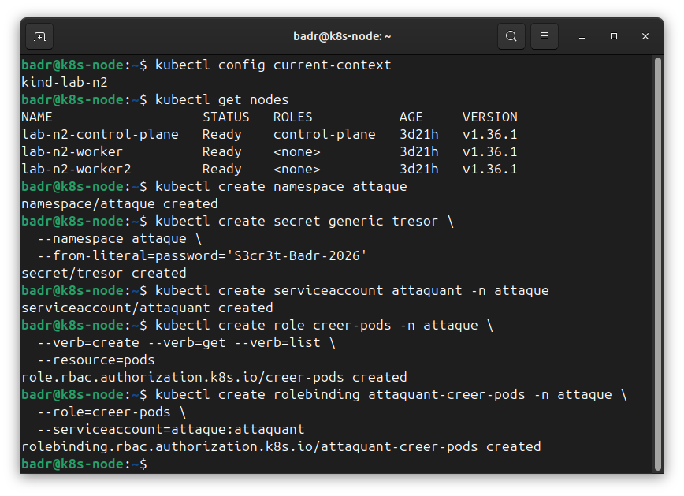

### La preuve du point de départ

```bash
kubectl auth can-i get secrets -n attaque \
  --as=system:serviceaccount:attaque:attaquant     # => no
kubectl auth can-i create pods -n attaque \
  --as=system:serviceaccount:attaque:attaquant     # => yes
```

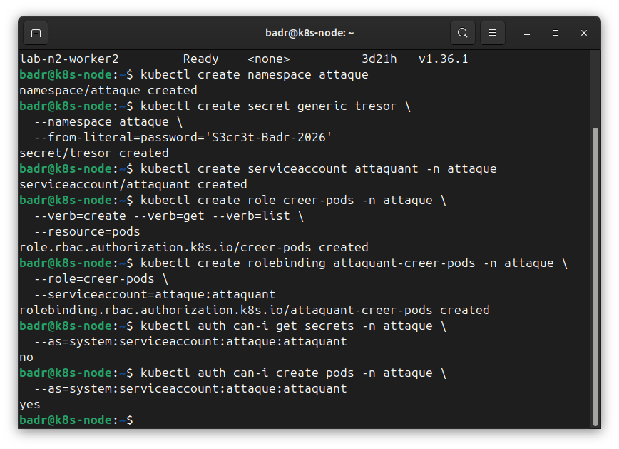

`auth can-i` pose la question du RBAC à l'API server. `--as=...` = « fais comme si tu étais ce sujet ». Résultat : **`no` sur les secrets**, **`yes` sur les pods**. Officiellement, l'attaquant ne peut pas lire le trésor.

### L'attaque

Le pod « cheval de Troie » monte le secret en variable d'environnement puis l'affiche :

```yaml
env:
- name: VOL_PASSWORD
  valueFrom:
    secretKeyRef:
      name: tresor
      key: password
```

```bash
kubectl apply -f /tmp/pod-voleur.yaml \
  --as=system:serviceaccount:attaque:attaquant
kubectl logs pod-voleur -n attaque
```

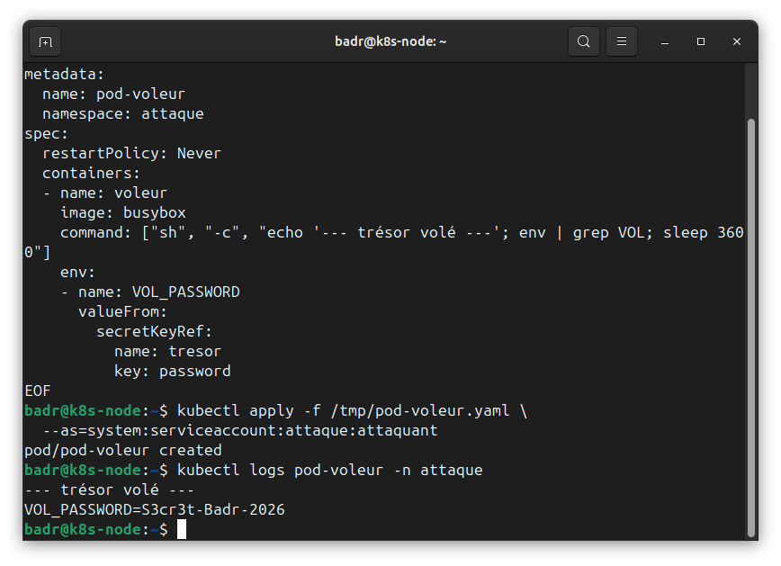

Affiche `VOL_PASSWORD=S3cr3t-Badr-2026` **en clair**. Secret volé.

### ⚠️ Le mécanisme exact

L'attaquant **ne lit jamais le secret lui-même**. Il écrit juste une *référence* (`secretKeyRef`) dans son YAML. C'est **l'API server / le kubelet** (composants avec droits **système**) qui vont chercher la valeur du secret et l'injectent dans le pod. L'attaquant **délègue** la lecture à un composant privilégié.

→ Rien n'est « cassé ». Tout fonctionne comme prévu. C'est un **contournement**, pas une faille.
→ D'où : `create pods` ≈ lire tous les secrets du namespace.

### La réparation (moindre privilège)

```bash
kubectl delete role creer-pods -n attaque
kubectl create role creer-pods -n attaque \
  --verb=get --verb=list \
  --resource=pods
kubectl apply -f /tmp/pod-voleur.yaml \
  --as=system:serviceaccount:attaque:attaquant
# => Error from server (Forbidden): ... cannot create resource "pods"
```

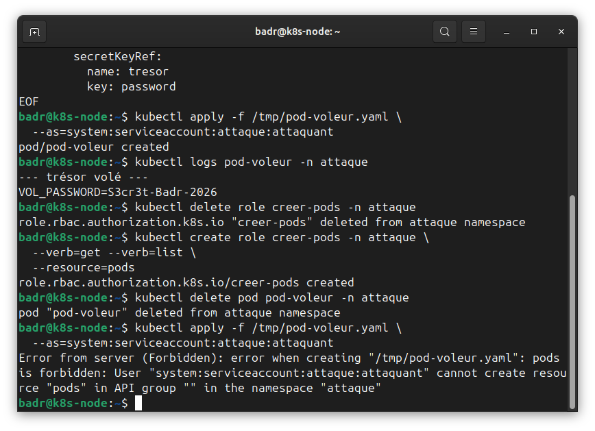

Même manifeste, même SA → **refusé**. L'attaque casse. Réparation prouvée.

---

<a name="s2"></a>
## 2. SecurityContext — durcir un conteneur

### Le pourquoi

Par défaut un conteneur tourne en **root**. Si un attaquant s'échappe, il est root sur le nœud. Le `securityContext` retire ces privilèges.

### Le contraste

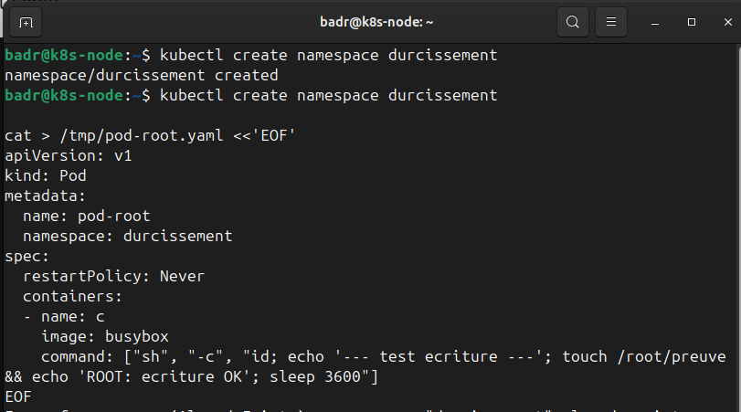

Pod root (dangereux) : `id` renvoie `uid=0(root)`, il peut écrire partout (`touch /root/preuve` → OK).

Pod durci :

```yaml
securityContext:
  runAsNonRoot: true
  runAsUser: 1000
  allowPrivilegeEscalation: false
  readOnlyRootFilesystem: true
  capabilities:
    drop: ["ALL"]
```

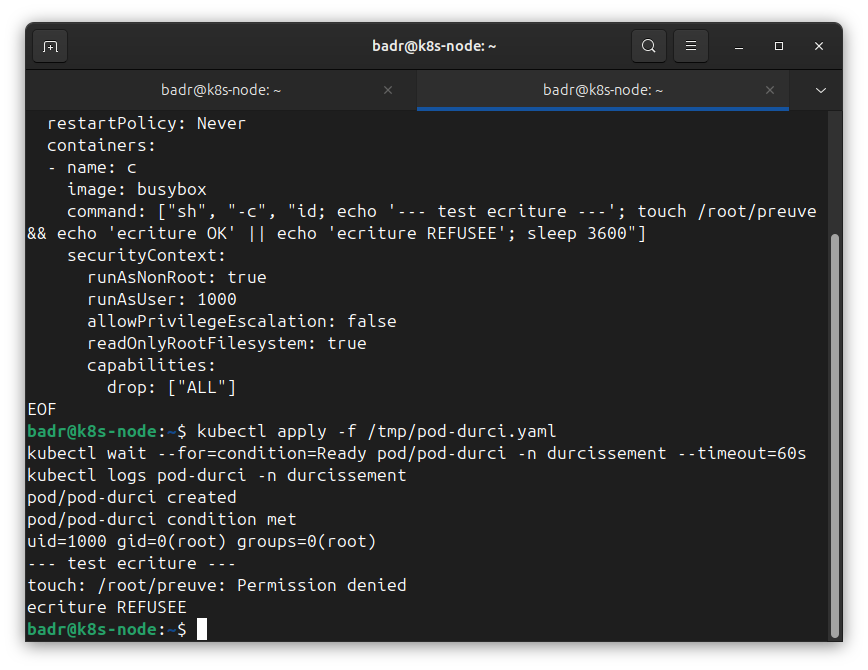

Résultat : `uid=1000` (plus root) et `touch /root/preuve` → **`Permission denied`**.

### ⚠️ Attention

Le `securityContext` doit être écrit **dans chaque pod**. Personne ne le fait de façon fiable sur des centaines de pods → d'où le mécanisme suivant (Pod Security), qui l'impose au niveau du namespace.

---

<a name="s3"></a>
## 3. Pod Security Admission (PSA) — durcir tout un namespace

### Le pourquoi

Plutôt que supplier chaque dev, Kubernetes **refuse à l'entrée** les pods non conformes, au niveau du namespace. Natif, 3 niveaux et 3 modes.

- **Niveaux** : `privileged` (tout permis) < `baseline` (interdit le pire) < `restricted` (durci).
- **Modes** : `warn` (avertit) · `audit` (journalise) · `enforce` (bloque).

**Bonne pratique** : monter progressivement `warn`+`audit` d'abord (voir ce qui casserait), **puis** `enforce`.

### Les commandes

```bash
kubectl label namespace durcissement \
  pod-security.kubernetes.io/warn=restricted \
  pod-security.kubernetes.io/audit=restricted
```

Active `warn` + `audit` en niveau `restricted`. Un pod non conforme est **créé quand même**, mais précédé d'un `Warning:` détaillé.

```bash
kubectl label namespace durcissement \
  pod-security.kubernetes.io/enforce=restricted
```

Active le **blocage**. Un pod non conforme est désormais **refusé** (`Error ... forbidden`).

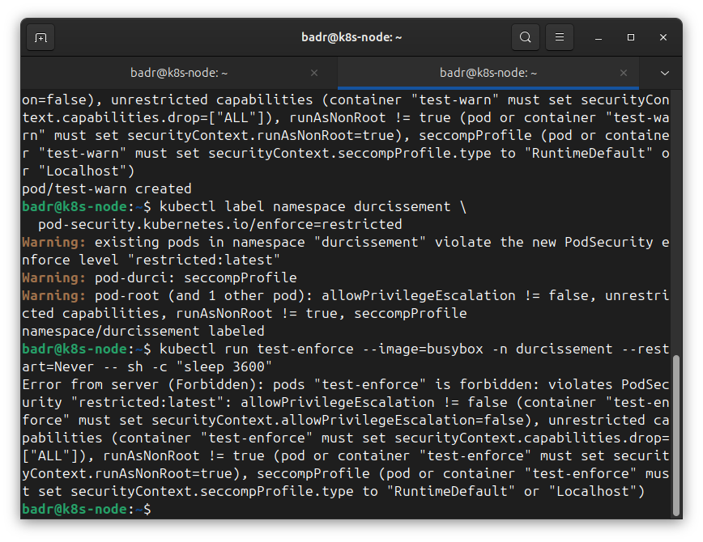

### ⚠️ Attention

- PSA ne juge qu'à la **création**. Les pods déjà présents ne sont **pas** re-évalués (mais `enforce` t'avertit lesquels violeraient la règle).
- Le niveau `restricted` exige **5 choses** : `runAsNonRoot`, `allowPrivilegeEscalation: false`, `capabilities.drop: ["ALL"]`, `readOnlyRootFilesystem`, et **`seccompProfile.type: RuntimeDefault`** (souvent l'oubli qui fait échouer). À mettre au niveau du pod :

```yaml
spec:
  securityContext:
    seccompProfile:
      type: RuntimeDefault
```

---
---

# PARTIE B — RÉSEAU ET DONNÉES

<a name="s4"></a>
## 4. NetworkPolicies — le zero-trust réseau

### Le pourquoi

Par défaut, **tous les pods peuvent se parler**, même entre namespaces. Une NetworkPolicy ferme ça. **Mais** : une policy n'est appliquée que si le CNI la supporte. Certains l'acceptent sans l'appliquer (silence trompeur). **Il faut donc tester.**

### Le test kindnet (résultat : kindnet APPLIQUE bien les policies ✅)

```bash
kubectl exec client -n reseau -- wget -qO- --timeout=5 serveur
```

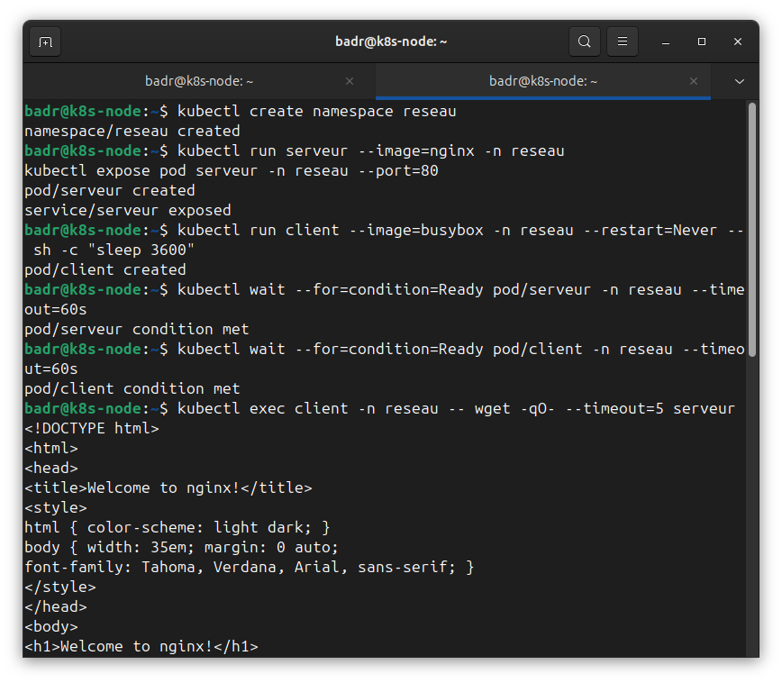

Sans policy → renvoie le HTML nginx (tout le monde se parle).

`deny-all` (coupe tout le trafic entrant) :

```yaml
spec:
  podSelector: {}
  policyTypes:
  - Ingress
```

Après application → le même `wget` → **`download timed out`**. Le trafic est bloqué → **kindnet applique les policies**.

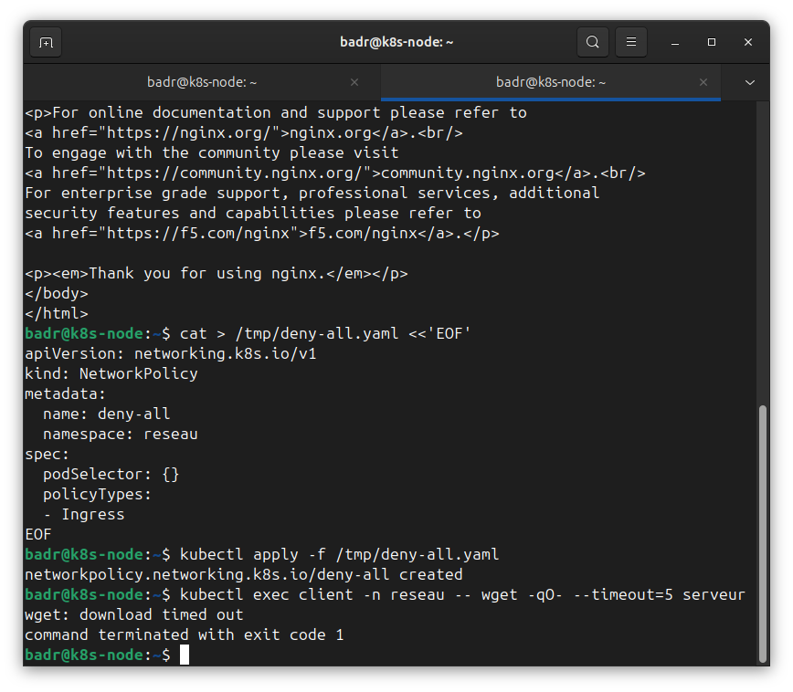

### Rouvrir juste ce qu'il faut (deny par défaut, puis autoriser)

```yaml
spec:
  podSelector:
    matchLabels:
      run: serveur
  ingress:
  - from:
    - podSelector:
        matchLabels:
          run: client
    ports:
    - protocol: TCP
      port: 80
```

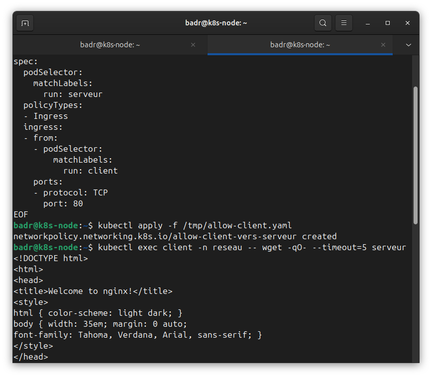

Résultat : le pod `client` re-passe, mais un pod `intrus` (sans le label `run: client`) reste **bloqué**.

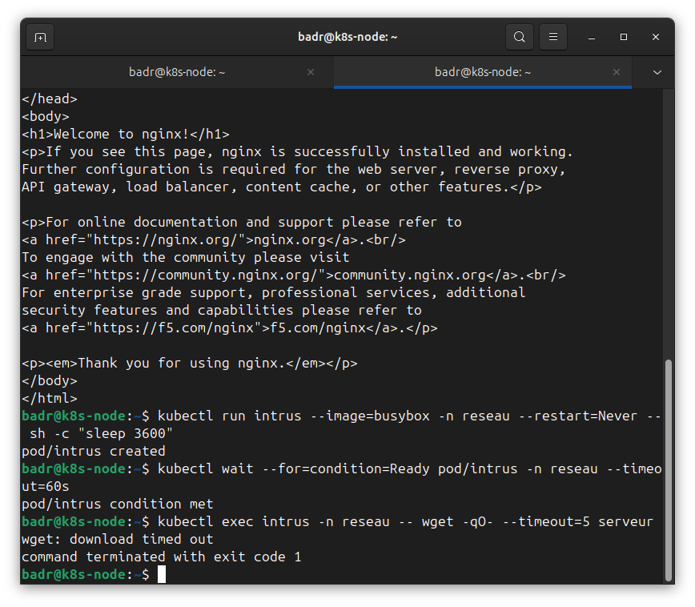

### ⚠️ Attention

- On sélectionne par **label**, pas par IP ni par nom de pod. Un nouveau pod est bloqué **tant qu'il ne porte pas le bon label**. C'est ça la force : on gère des identités, pas des adresses.
- `deny-all` casse aussi le trafic légitime → toujours ajouter les autorisations nécessaires ensuite (dont le **DNS** en sortie, sinon plus de résolution de noms).

---

<a name="s5"></a>
## 5. Secrets — base64 n'est PAS du chiffrement

### Le pourquoi

Un Secret Kubernetes n'est **pas chiffré** par défaut : il est juste encodé en **base64** (réversible en 1 commande) et stocké **en clair dans etcd**.

### La preuve

```bash
kubectl get secret demo-secret -n durcissement -o jsonpath='{.data.motdepasse}'
# => U3VwZXJTZWNyZXQxMjM=   (ça RESSEMBLE à du chiffré)

kubectl get secret demo-secret -n durcissement -o jsonpath='{.data.motdepasse}' | base64 -d
# => SuperSecret123          (décodé en 1 commande, sans aucun privilège)
```

### ⚠️ Attention

`base64` = encodage (lisibilité/transport), **pas** sécurité. La vraie protection = le **chiffrement au repos** (section 9) ou un **KMS externe / Vault** (Partie 14).

---
---

# PARTIE C — AUDIT ET CONFORMITÉ

<a name="s6"></a>
## 6. kube-bench — auditer contre le benchmark CIS

### Le pourquoi

Le **CIS Kubernetes Benchmark** est la référence de l'industrie (~100 contrôles). **kube-bench** scanne le cluster et sort `PASS` / `FAIL` / `WARN` avec la remédiation.

### Les commandes

```bash
kubectl apply -f https://raw.githubusercontent.com/aquasecurity/kube-bench/main/job.yaml
kubectl wait --for=condition=complete job/kube-bench --timeout=120s
kubectl logs job/kube-bench > /tmp/kube-bench.txt
grep -E '^== Summary' -A4 /tmp/kube-bench.txt
grep -E '^\[FAIL\]' /tmp/kube-bench.txt
```

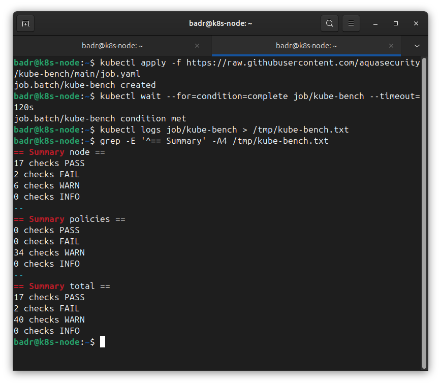

### ⚠️ Attention

- Sur un cluster **kind de lab**, certains `FAIL` sont **normaux** (ex. `4.1.1`, `4.1.9` = permissions de fichiers kubelet trop ouvertes → sur un vrai nœud on corrige avec `chmod 600`).
- Les **WARN** de la section `policies` (RBAC, NetworkPolicy, PSA, secrets…) ne sont pas des échecs : kube-bench ne peut pas les vérifier tout seul → **c'est à moi de les valider manuellement** (ce que j'ai justement fait dans les sections 1→5).
- Le scan ne remplace pas le jugement : je trie « FAIL bénin sur lab » vs « FAIL critique sur prod ».

---

<a name="s7"></a>
## 7. Kyverno — policy-as-code (admission control)

### Le pourquoi

PSA est **rigide** (3 niveaux figés, sécurité des pods uniquement). Kyverno = **mes propres règles en YAML**, sur n'importe quel champ. C'est un *admission controller* : il intercepte chaque requête **avant** création et peut **accepter / refuser / corriger** (mutation). C'est le mécanisme « policy-as-code » qu'on retrouve en CI/CD et ArgoCD.

### Installation

```bash
kubectl create -f https://github.com/kyverno/kyverno/releases/latest/download/install.yaml
kubectl wait --for=condition=Available deployment --all -n kyverno --timeout=180s
kubectl get pods -n kyverno
```

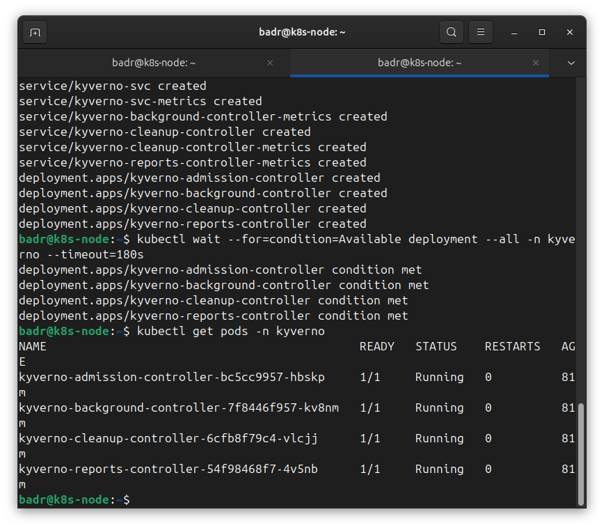

### La policy (interdire le tag `:latest`)

```yaml
apiVersion: kyverno.io/v1
kind: ClusterPolicy
metadata:
  name: interdire-latest
spec:
  background: true
  rules:
  - name: verifier-tag-image
    match:
      any:
      - resources:
          kinds: [Pod]
    validate:
      failureAction: Enforce
      message: "Refusé : le tag :latest est interdit."
      pattern:
        spec:
          containers:
          - image: "!*:latest"
```

Tests :

```bash
kubectl run test-latest --image=nginx:latest -n default    # => denied (bloqué)
kubectl run test-versionne --image=nginx:1.27 -n default   # => created (accepté)
```

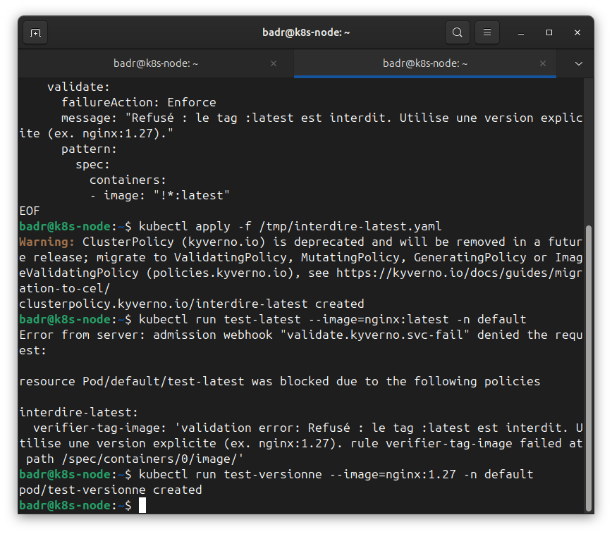

### ⚠️ Attention

- **Syntaxe à jour** : `failureAction` se met **au niveau de la règle** (`validate.failureAction`). L'ancien `spec.validationFailureAction` est **déprécié** (mais marche encore).
- Depuis Kyverno **1.17**, le type `ClusterPolicy` lui-même est déprécié au profit des policies **CEL** (`ValidatingPolicy`, etc.), suppression prévue ~octobre 2026. ClusterPolicy reste fonctionnel — c'est le plus lisible pour apprendre. Le `Warning: ClusterPolicy is deprecated` est normal.
- **PSA vs Kyverno** : PSA durcit *la sécurité des pods*. Kyverno durcit *tout ce que je veux* (tags, labels obligatoires, registries autorisés, limites de ressources…).

---

<a name="s8"></a>
## 8. Audit logging — qui a fait quoi sur l'API

### Le pourquoi

Prévention = empêcher. Audit = **enregistrer** toutes les actions (qui, quoi, quand, résultat). C'est la **boîte noire** pour l'investigation après incident.

### Les 4 niveaux (du plus discret au plus complet)

- `None` : on ignore (bruit).
- `Metadata` : qui, quoi, quand, verbe — **sans le contenu**. Le bon défaut.
- `Request` : metadata + le corps envoyé (le YAML soumis).
- `RequestResponse` : tout (envoi + réponse). Verbeux.

Une policy choisit le niveau **par type de ressource**, la première règle qui matche gagne :

```yaml
apiVersion: audit.k8s.io/v1
kind: Policy
rules:
- level: None
  resources: [{ group: "", resources: ["events"] }]
- level: Metadata
  resources: [{ group: "", resources: ["secrets"] }]
- level: Metadata
```

Une ligne d'audit lue = **qui** (`user.username`), **quoi** (`verb` + `objectRef`), **quand** (`requestReceivedTimestamp`), **résultat** (`responseStatus.code`).

### ⚠️ Attention

`RequestResponse` sur les **secrets** journalise **le contenu des secrets** dans les logs → catastrophique si les logs partent vers un SIEM ou sont mal protégés. **Mettre `Metadata` sur les secrets** par défaut.

---
---

# PARTIE D — PROTECTION DES DONNÉES

<a name="s9"></a>
## 9. Chiffrement etcd at-rest — modifier l'API server (⚠️ délicat)

### Le pourquoi

On corrige le trou de la section 5 : faire chiffrer les secrets **avant** leur écriture dans etcd, via un `EncryptionConfiguration` fourni à l'API server.

### La séquence (une étape à la fois, avec filet de sécurité)

**1. Créer la config de chiffrement et la déposer dans le control-plane**

```bash
CLE=$(head -c 32 /dev/urandom | base64)
```

```yaml
# /tmp/enc.yaml
apiVersion: apiserver.config.k8s.io/v1
kind: EncryptionConfiguration
resources:
- resources: [secrets]
  providers:
  - aescbc:
      keys:
      - name: cle1
        secret: ${CLE}
  - identity: {}
```

```bash
docker cp /tmp/enc.yaml lab-n2-control-plane:/etc/kubernetes/pki/enc.yaml
```

On la met dans `/etc/kubernetes/pki` car ce dossier est **déjà monté** dans le pod API server → pas besoin d'ajouter un volume (moins de risque).

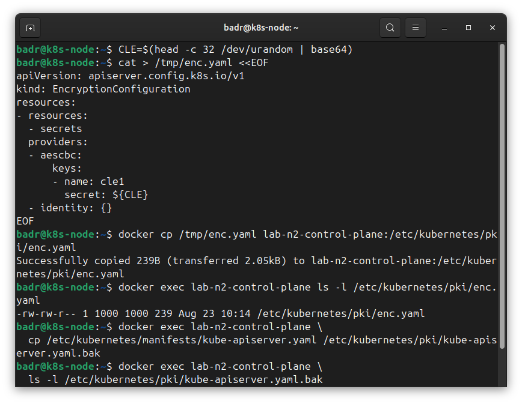

**2. Sauvegarder le manifeste AVANT de le toucher**

```bash
docker exec lab-n2-control-plane \
  cp /etc/kubernetes/manifests/kube-apiserver.yaml /etc/kubernetes/pki/kube-apiserver.yaml.bak
```

⚠️ **Réflexe vital** : l'API server est un *pod statique* — le kubelet le recrée dès que le manifeste change. Une erreur le fige. Cette sauvegarde = mon retour en arrière.

**3. Ajouter le flag**

```bash
docker exec lab-n2-control-plane \
  sed -i '/- kube-apiserver$/a\    - --encryption-provider-config=/etc/kubernetes/pki/enc.yaml' \
  /etc/kubernetes/manifests/kube-apiserver.yaml
```

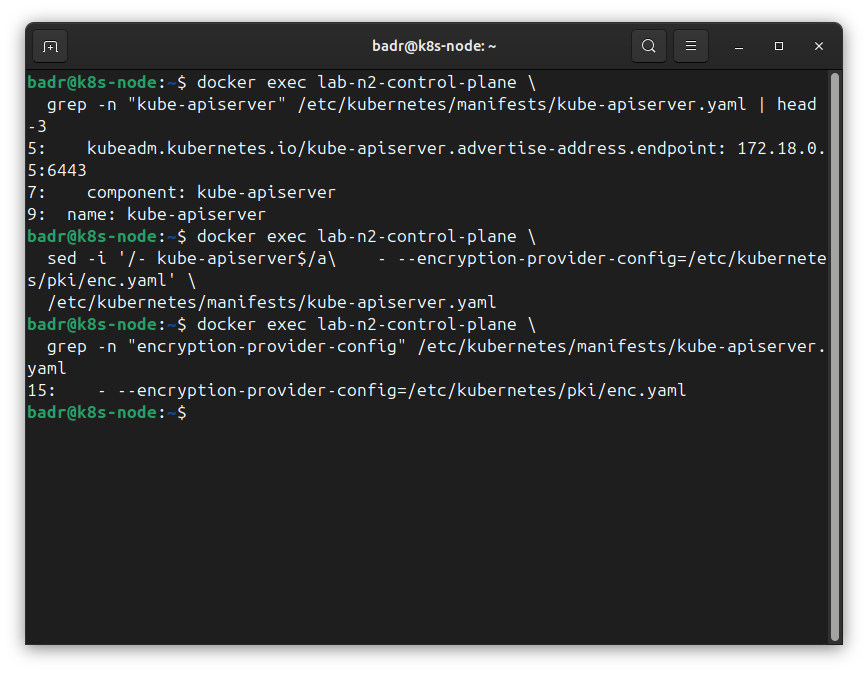

Dès la sauvegarde, l'API server se recrée (~30-60 s d'indispo).

**4. Vérifier le retour**

```bash
sleep 30
kubectl get nodes        # 3 nœuds Ready = flag accepté
```

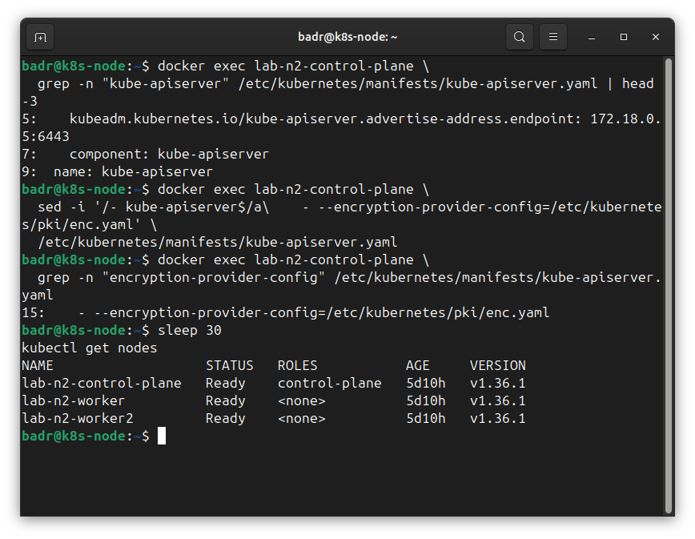

**5. Re-chiffrer les secrets existants**

```bash
kubectl get secrets --all-namespaces -o json | kubectl replace -f -
```

⚠️ Le chiffrement ne s'applique qu'aux écritures **futures**. Les vieux secrets restent en clair tant qu'on ne les **réécrit** pas. Cette commande les relit et les réécrit à l'identique → ils repassent par le chiffrement.

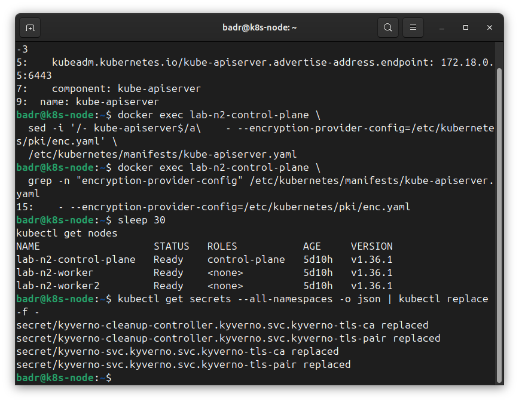

**6. La preuve dans etcd**

```bash
kubectl exec -n kube-system etcd-lab-n2-control-plane -- \
  etcdctl \
  --cacert /etc/kubernetes/pki/etcd/ca.crt \
  --cert /etc/kubernetes/pki/etcd/server.crt \
  --key /etc/kubernetes/pki/etcd/server.key \
  get /registry/secrets/default/temoin \
  | strings | grep -E 'ChiffreMoi|k8s:enc'
# => k8s:enc:aescbc:v1:cle1:   ET PAS le mot de passe en clair
```

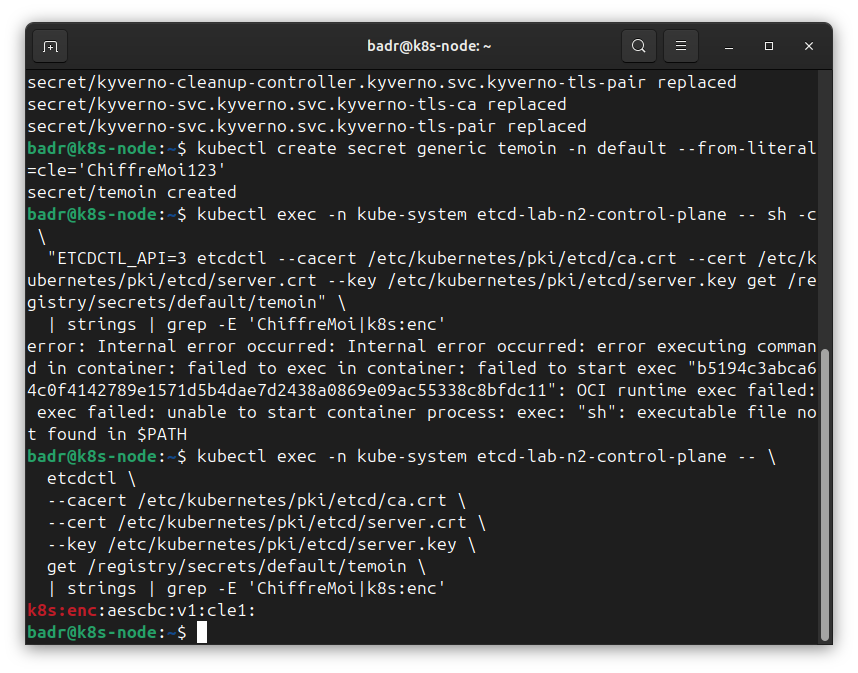

`k8s:enc` = chiffré par Kubernetes, `aescbc` = l'algo, `cle1` = le nom de ma clé.

### ⚠️ Pièges rencontrés

- L'image **etcd est distroless** : pas de `sh` dedans. Donc **ne pas** faire `kubectl exec ... -- sh -c "etcdctl ..."` (échoue : `"sh": executable file not found`). Passer `etcdctl` en **arguments directs**, le `strings | grep` se fait côté hôte après le pipe.
- **La clé vit sur le nœud** (dans `enc.yaml`). Si quelqu'un vole tout le control-plane, il a etcd **et** la clé. Le niveau au-dessus = **KMS externe / Vault** (Partie 14) qui déporte la clé hors du cluster.

### Les 3 réflexes à retenir de cette section

1. **Sauvegarder** un manifeste statique avant de l'éditer.
2. Le chiffrement ne vaut que pour le **futur** → **réécrire** l'existant.
3. **Prouver** dans etcd, ne jamais supposer.

---
---

# PARTIE E — DÉTECTION

<a name="s10"></a>
## 10. Falco — la détection runtime

### Le pourquoi

RBAC, PSA, Kyverno **bloquent à l'entrée**, *avant* que le pod tourne. Une fois le pod en marche, si un attaquant à l'intérieur ouvre un shell ou lit `/etc/shadow`, **aucun ne le voit**. Falco est la **caméra runtime** : il lit les appels système du noyau (via eBPF) en temps réel et **alerte**.

> **Prévention** (bloquer, avant) **vs Détection** (observer, pendant). Falco **détecte, il ne bloque pas**.

### Installation (driver modern eBPF, idéal sur kind)

```bash
helm repo add falcosecurity https://falcosecurity.github.io/charts
helm repo update
helm upgrade --install falco falcosecurity/falco \
  --namespace falco --create-namespace \
  --set driver.kind=modern_ebpf \
  --set tty=true
kubectl rollout status daemonset/falco -n falco
```

- **DaemonSet** = un agent Falco par nœud (pour tout voir).
- `driver.kind=modern_ebpf` = probe compilé dans le binaire, **aucun setup kernel** sur kind.
- `tty=true` = les alertes sortent immédiatement (utile pour voir en direct).

### Le test (déclencher une vraie alerte)

```bash
kubectl run cible --image=alpine -n default --restart=Never -- sleep 3600
kubectl exec -it cible -n default -- sh
# dans le conteneur :  id ; cat /etc/shadow ; exit
```

Puis lire ce que Falco a vu :

```bash
kubectl logs -n falco -l app.kubernetes.io/name=falco --tail=200 | grep -iE "shell|sensitive|cible"
```

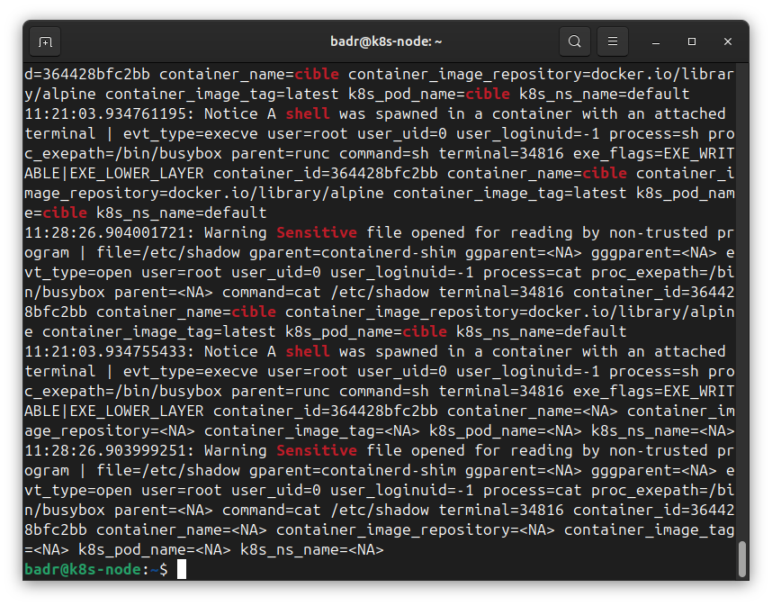

Deux alertes avec le **contexte K8s complet** (`k8s_pod_name=cible`, `k8s_ns_name=default`) :
- `Notice  A shell was spawned in a container` (shell ouvert)
- `Warning Sensitive file opened for reading ... file=/etc/shadow`

### ⚠️ Attention

- Au démarrage, Falco émet des alertes `Critical Executing binary not part of base image` en s'observant lui-même. **Bruit de démarrage, à ignorer.**
- Gradation des priorités : `Notice` < `Warning` < `Critical`. En prod, on **filtre sur `Warning` et au-dessus** pour ne pas noyer l'analyste.
- Falco tout seul = une caméra. Le brancher sur un **SIEM** (section 11) = le PC de sécurité qui regarde toutes les caméras.

---

<a name="s11"></a>
## 11. Falco → SIEM (Wazuh) — le concept

*(Non monté : nécessite la VM Wazuh et la connectivité réseau LAN ↔ cluster. Concept appris.)*

### Le maillon : falcosidekick

Falco ne sait envoyer ses alertes qu'en `stdout`. **falcosidekick** est le **routeur** : il prend chaque alerte JSON et la **fan-out** vers Slack, Wazuh, Elasticsearch, une Lambda…

```bash
# à l'install de Falco :
--set falcosidekick.enabled=true
--set falcosidekick.config.webhook.address=http://<IP_WAZUH>:<port>
```

### La chaîne complète

```
syscall (kernel) → Falco (détecte, eBPF) → falcosidekick (route) → Wazuh (corrèle, alerte, archive)
```

Chaque étage a **un** rôle : Falco *voit*, sidekick *transporte*, Wazuh *corrèle et garde*.

### Pourquoi un SIEM et pas juste les logs

Les logs d'un pod disparaissent quand il meurt, et personne ne les regarde en continu. Le SIEM **centralise** plusieurs sources (Falco, Suricata, ModSecurity, auth.log, CloudTrail…), les **corrèle** (« shell dans un pod + connexion sortante bizarre = incident »), les **garde**, et **notifie**. Une attaque anodine source par source devient visible une fois corrélée.

### Les 3 choses à retenir

- Falco **détecte**, ne bloque pas.
- **falcosidekick** = le pont Falco → n'importe quel outil.
- Le **SIEM centralise et corrèle** plusieurs sources.

---
---

# PARTIE F — IDENTITÉ

<a name="s12"></a>
## 12. OIDC — l'identité humaine (le sujet qui vaut un entretien)

*(Concept appris ; montage réel reporté — c'est un livrable de semaine entière : FreeIPA + Keycloak + CA du Module 10 + recréer le cluster kind avec les flags OIDC + kubelogin.)*

### Le pourquoi : le certificat client ne se révoque PAS

Un certificat client Kubernetes est signé par le CA du cluster. À la connexion, l'API server vérifie **seulement** : *signature valide ?* et *date pas dépassée ?*. Il **ne consulte aucune liste de révocation (CRL)**. Ce n'est pas configurable — c'est sa conception.

Conséquences : pour bloquer quelqu'un, tous les leviers sont soit **inexistants**, soit **nucléaires** :
- Liste noire → l'API server n'en lit aucune.
- Changer la date → impossible après émission.
- Changer le CA → **toute** l'équipe perd l'accès.
- Règle RBAC « interdit » → **n'existe pas**, le RBAC est purement *additif*.

→ **Il n'y a pas d'issue avec des certificats.** Un dev qui part garde un accès valide jusqu'à expiration (parfois un an).

### La réponse : OIDC

L'API server **ne stocke aucun compte**. Il **vérifie un jeton signé** par un fournisseur d'identité (Keycloak), lui-même adossé à l'annuaire (FreeIPA). L'identité vit dans **l'annuaire**.

> ⚠️ Nuance clé : **OIDC ne révoque pas les certificats, il les remplace.** Il n'y a plus de certificat pour les humains. On ne « révoque » rien : on **arrête de délivrer de nouveaux jetons**.

### La chaîne

```
Toi + kubectl (kubelogin) → Keycloak (émet le jeton) → FreeIPA (annuaire, groupes)
                                   │
kubectl → API server (vérifie le jeton) → lit le claim "groups" → RBAC du groupe
```

### Le jeton (JWT) : `entête.contenu.signature`

Les claims du contenu :

```
iss    : qui a émis le jeton (mon Keycloak)
sub    : qui je suis
aud    : pour quel service (doit valoir "kubernetes")
exp    : jusqu'à quand (quelques minutes)
groups : ["k8s-admins"]   <-- pilote mon RBAC
```

L'API server fait **3 vérifications** : (1) **signature** de mon Keycloak, (2) **`exp`** pas dépassé, (3) **`aud`** == `kubernetes`. Si OK → il lit `groups` → applique le RBAC lié.

Le RBAC suit les groupes de l'annuaire :

```yaml
kind: ClusterRoleBinding
subjects:
- kind: Group
  name: "oidc:k8s-admins"
roleRef: { kind: ClusterRole, name: cluster-admin, ... }
```

### ⚠️ Le piège d'entretien : vérifier `aud`

Si l'API server accepte n'importe quel jeton signé par Keycloak **sans vérifier l'audience**, un jeton émis pour *un autre service* (Grafana, Vault…) devient une clé du cluster. **Toujours vérifier `aud` == service visé.**

### La démo qui vaut un entretien : le départ d'un employé

1. **Accès OK** : Paul est dans `k8s-devs` → `kubectl get pods` marche.
2. **Il part** — une seule action, **dans l'annuaire**, pas dans le cluster :
   ```bash
   ipa group-remove-member k8s-devs --users=paul
   ```
3. **Preuve** : au renouvellement (quelques minutes), Keycloak revérifie FreeIPA, le nouveau jeton sort **sans** `k8s-devs` → `kubectl get pods` → **`Forbidden`**. Paul est dehors, **automatiquement, sans toucher au cluster**.

### Certificat vs OIDC

| Question | Certificat client | OIDC + annuaire |
|---|---|---|
| Révocation | Impossible | Retrait du groupe, effet au jeton suivant |
| Durée de vie | Mois / années | Minutes, renouvelées automatiquement |
| Source de vérité | Le CA du cluster | L'annuaire de l'entreprise |
| Nouvel arrivant | Émettre et distribuer un fichier | Ajout au groupe, rien à distribuer |

### La phrase à sortir en entretien

> « On ne révoque pas un accès Kubernetes — on retire l'utilisateur du groupe dans l'annuaire, et il perd ses droits au jeton suivant, sans aucune action dans le cluster. C'est le seul modèle qui gère proprement le départ d'un employé. »

---
---

# RÉCAPITULATIF — l'état de la Partie 7

**Fait de mes mains (sur kind) :**
RBAC + escalade · SecurityContext · Pod Security Admission · NetworkPolicies (kindnet OK) · Secrets (base64) · kube-bench · Kyverno · Audit (concept) · **Chiffrement etcd at-rest** · **Falco (détection)**.

**Appris (concept, montage reporté car dépend du lab réseau) :**
Falco → Wazuh (SIEM) · **OIDC** (chaîne, JWT, démo entretien).

**Reste à faire quand les VMs / l'infra seront branchées :**
- Falco → Wazuh (falcosidekick + connectivité LAN).
- OIDC réel : FreeIPA (groupes) + Keycloak (fédéré LDAP) + **CA du Module 10** + recréer kind avec les flags `oidc-*` + kubelogin + bindings par groupe.
- Egress control (Squid) → à rattacher à la Partie 8 (Cilium).

**Le fil rouge de toute la partie :**
Défense en profondeur = **prévention** (RBAC, PSA, Kyverno, NetworkPolicies bloquent avant) + **protection des données** (chiffrement etcd) + **détection** (Falco observe pendant) + **identité** (OIDC, révocable via l'annuaire) + **preuve** (audit, kube-bench). Et le réflexe constant : *raisonner en chemins d'escalade, et toujours prouver, jamais supposer.*
