# Partie 8 — Réseau cloud-native et eBPF : Cilium, Hubble, Tetragon
## Mes notes complètes

**Ce que j'ai fait :** remplacé le CNI basique (kindnet) par Cilium pour passer à un réseau nouvelle génération — filtrage par identité, inspection HTTP (L7), chiffrement WireGuard, observation en direct (Hubble) et blocage au niveau noyau (Tetragon).
**Mon environnement :** VM `k8s-node` (Ubuntu, Docker), cluster kind `lab-cilium` à 3 nœuds, CNI = **Cilium**.
**Trajet fait :** kindnet → Cilium + Hubble + WireGuard + Tetragon.

---

# SOMMAIRE

**Partie A — Infrastructure**
0. [L'idée centrale : pourquoi Cilium](#s0)
1. [Recréer le cluster SANS CNI](#s1)
2. [Installer Cilium](#s2)
3. [Les deux options activées (WireGuard, kube-proxy)](#s3)

**Partie B — Observation**
4. [Hubble : voir le réseau](#s4)

**Partie C — Politiques réseau**
5. [Ma première policy — et le piège VALID: False](#s5)
6. [Les niveaux d'objets Kubernetes](#s6)
7. [Policy L7 : filtrer le contenu HTTP](#s7)
8. [Egress par nom de domaine](#s8)

**Partie D — Sécurité runtime**
9. [Tetragon : détecter ET bloquer au niveau du noyau](#s9)

**Récapitulatif**

---
---

# PARTIE A — INFRASTRUCTURE

<a name="s0"></a>
## 0. L'idée centrale : pourquoi Cilium

Un **CNI** (Container Network Interface), c'est le composant qui donne une IP à chaque pod et fait circuler le trafic entre eux. Avant j'avais **kindnet** (basique). Maintenant j'ai **Cilium** (puissant). Même job de base, mais Cilium voit beaucoup plus loin.

La différence qui change tout :
- **kindnet filtre par adresse IP.** Problème : dans un cluster, les IP des pods **changent à chaque redéploiement**. Filtrer dessus n'a aucun sens durablement.
- **Cilium filtre par identité** (dérivée des labels du pod) **et comprend le HTTP** (couche 7).

C'est ce qui me permet des règles impossibles avant : « ce pod peut faire `GET` mais pas `DELETE` », ou « ce pod ne peut sortir que vers tel domaine ».

Les 3 niveaux réseau :
- **L3 = identité / adresse** → *qui* parle à *qui*.
- **L4 = port / protocole** → *par quelle porte* (TCP 80).
- **L7 = contenu applicatif** → *quoi exactement* (la requête HTTP `GET /produits`).

---

<a name="s1"></a>
## 1. Recréer le cluster SANS CNI

### Le pourquoi

On ne peut pas greffer Cilium sur un cluster déjà né avec kindnet. Il faut créer un cluster **sans CNI par défaut**, pour que Cilium prenne cette place.

### Les commandes

```bash
kind delete cluster --name lab-n2
```

```bash
cat > ~/lab-p6/kind-cilium.yaml <<'EOF'
kind: Cluster
apiVersion: kind.x-k8s.io/v1alpha4
name: lab-cilium
networking:
  disableDefaultCNI: true
  kubeProxyMode: "none"
nodes:
  - role: control-plane
  - role: worker
  - role: worker
EOF

kind create cluster --config ~/lab-p6/kind-cilium.yaml
```

- `disableDefaultCNI: true` → **la ligne clé**. Par défaut kind installe kindnet ; je le désactive pour que Cilium occupe la place.
- `kubeProxyMode: "none"` → je désactive aussi **kube-proxy**. Cilium le remplacera (section 3).
- 3 nœuds → indispensable pour que le chiffrement inter-nœuds et l'observation multi-nœuds aient un sens.

### ⚠️ NotReady est NORMAL ici

```bash
kubectl get nodes   # => les 3 nœuds sont NotReady
```

Un nœud passe `Ready` seulement quand son réseau de pods fonctionne. Comme j'ai **volontairement retiré le CNI**, ce réseau n'existe pas encore. Image mentale : une maison construite mais sans électricité — dès que l'électricien (Cilium) passe, tout s'allume.

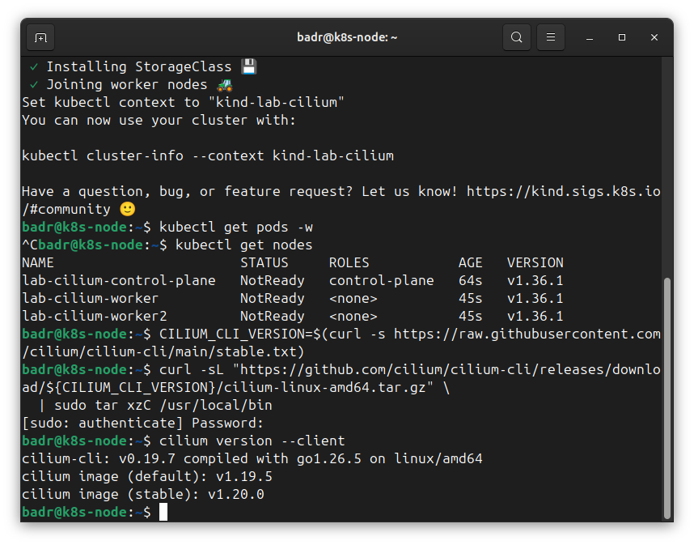

---

<a name="s2"></a>
## 2. Installer Cilium

### 2a — La CLI `cilium`

```bash
CILIUM_CLI_VERSION=$(curl -s https://raw.githubusercontent.com/cilium/cilium-cli/main/stable.txt)
curl -sL "https://github.com/cilium/cilium-cli/releases/download/${CILIUM_CLI_VERSION}/cilium-linux-amd64.tar.gz" \
  | sudo tar xzC /usr/local/bin
cilium version --client
```

### 2b — Cilium dans le cluster

```bash
cilium install \
  --set kubeProxyReplacement=true \
  --set hubble.enabled=true \
  --set hubble.relay.enabled=true \
  --set hubble.ui.enabled=true \
  --set encryption.enabled=true \
  --set encryption.type=wireguard
cilium status --wait
```

Chaque `--set` :
- `kubeProxyReplacement=true` → Cilium prend le rôle de kube-proxy en eBPF (plus rapide).
- `hubble.*` → active l'observation du trafic + son agrégateur + l'UI web.
- `encryption.type=wireguard` → **chiffrement automatique** du trafic entre nœuds.

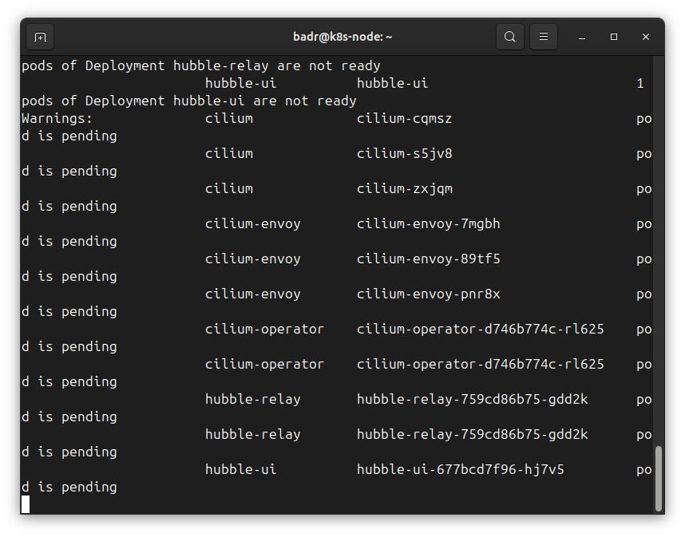

`cilium status --wait` → bloque jusqu'à ce que tout soit prêt. Je veux voir des `OK` verts et `Desired: 3, Ready: 3`.

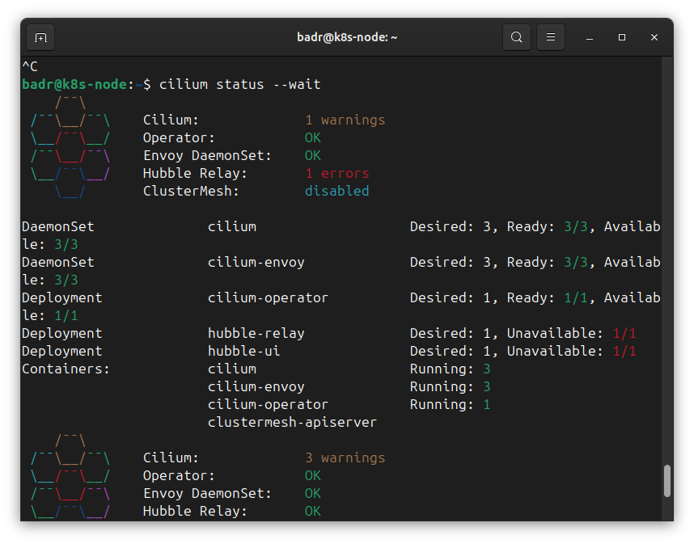

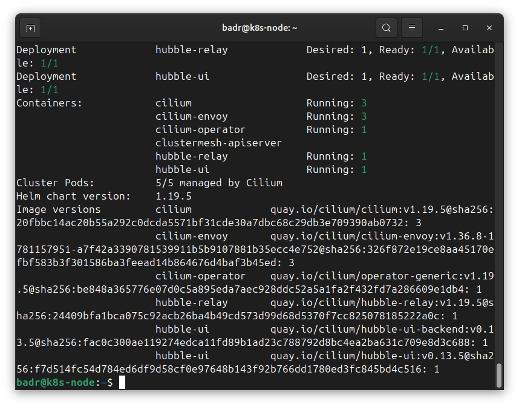

Les nœuds sont maintenant **Ready** — Cilium a pris le rôle de CNI.

### ⚠️ Attention

- `cilium install` prend 1-2 min (télécharge ses images). Voir des pods en `pending` **pendant** l'install est normal.
- `ClusterMesh: disabled` dans le statut = normal, c'est une fonction multi-clusters que je n'utilise pas.

---

<a name="s3"></a>
## 3. Les deux options activées

### WireGuard (chiffrement entre nœuds)

Chiffre automatiquement le trafic **entre les nœuds**. Sans lui, ce trafic circule **en clair** sur le réseau. Activé par le seul flag `--set encryption.type=wireguard`. Cilium gère tout seul les clés et les tunnels.

```bash
cilium encrypt status
kubectl exec -n kube-system ds/cilium -- wg show
```

### kube-proxy remplacé

`kube-proxy` route le trafic vers les Services avec des règles `iptables`. À grande échelle, ces règles deviennent lentes. Cilium fait ce routage en **eBPF** (dans le noyau), bien plus rapide.

---
---

# PARTIE B — OBSERVATION

<a name="s4"></a>
## 4. Hubble : voir le réseau

### Le pourquoi

Hubble est la **caméra du réseau**. Il montre chaque flux : qui parle à qui, sur quel port, et le **verdict** (autorisé ou refusé).

### La CLI `hubble`

```bash
HUBBLE_VERSION=$(curl -s https://raw.githubusercontent.com/cilium/hubble/main/stable.txt)
curl -sL "https://github.com/cilium/hubble/releases/download/${HUBBLE_VERSION}/hubble-linux-amd64.tar.gz" \
  | sudo tar xzC /usr/local/bin
```

### Ouvrir le tunnel et observer

```bash
cilium hubble port-forward &
hubble observe --namespace demo --last 20
```

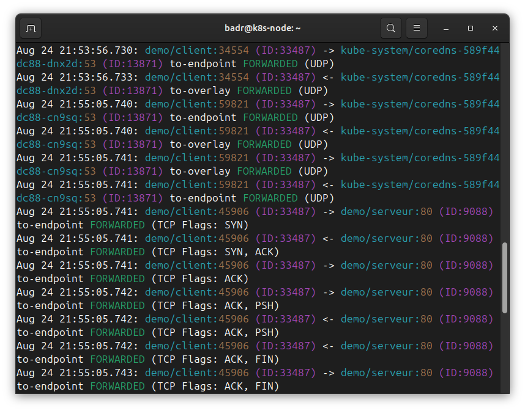

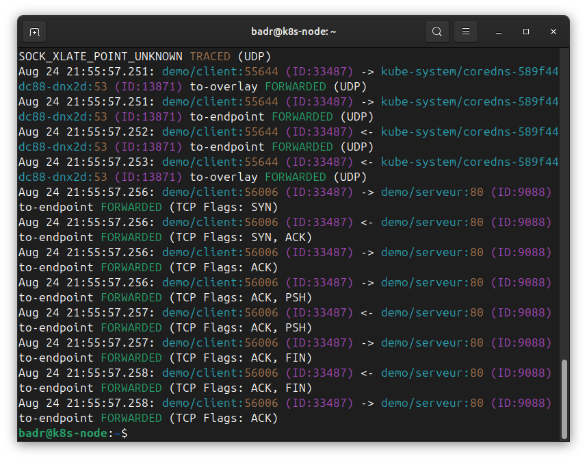

Ce que ça m'apprend :
- Chaque flux est identifié par **qui → qui** (`demo/client` → `demo/serveur`), par **identité**, pas par IP.
- Le verdict est écrit à chaque ligne : `FORWARDED` (laissé passer).
- **Le DNS passe toujours en premier** : avant d'appeler `serveur`, le client demande son IP à CoreDNS. Ce détail est crucial pour l'egress (section 8).

### ⚠️ Pièges

- **Conflit de port** : si je relance `cilium hubble port-forward` alors qu'un tunnel tourne déjà → `Unable to listen on port 4245`. Le premier tunnel fonctionne déjà.
- **Le tunnel peut lâcher** (`connection reset by peer`). Relancer : `pkill -f "hubble port-forward"` puis `cilium hubble port-forward &`.

---
---

# PARTIE C — POLITIQUES RÉSEAU

<a name="s5"></a>
## 5. Ma première policy — et le piège `VALID: False`

### Le pourquoi

Zero-trust : par défaut, le serveur ne doit accepter **aucun** trafic entrant, puis je rouvre juste ce qu'il faut.

### Le piège `VALID: False`

Ma première tentative avec `ingress: []` (liste vide) → Cilium a **rejeté** la policy. Elle existe dans Kubernetes mais Cilium refuse de l'appliquer → le trafic passe toujours.

### ⚠️ LE réflexe de diagnostic Cilium

**Toujours vérifier la colonne `VALID` après un `apply`.** Et `cilium endpoint list` montre si l'enforcement est `Enabled` ou `Disabled` sur un pod précis.

### La version correcte

```yaml
apiVersion: cilium.io/v2
kind: CiliumNetworkPolicy
metadata:
  name: allow-client-vers-serveur
  namespace: demo
spec:
  endpointSelector:
    matchLabels:
      app: serveur
  ingress:
  - fromEndpoints:
    - matchLabels:
        app: client
```

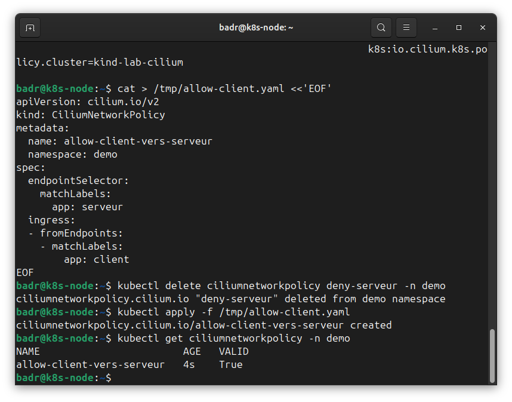

### Prouver le filtrage

```bash
kubectl exec client -n demo -- wget -qO- --timeout=5 serveur     # => HTML (autorisé)
kubectl exec intrus -n demo -- wget -qO- --timeout=5 serveur     # => timeout (bloqué)
```

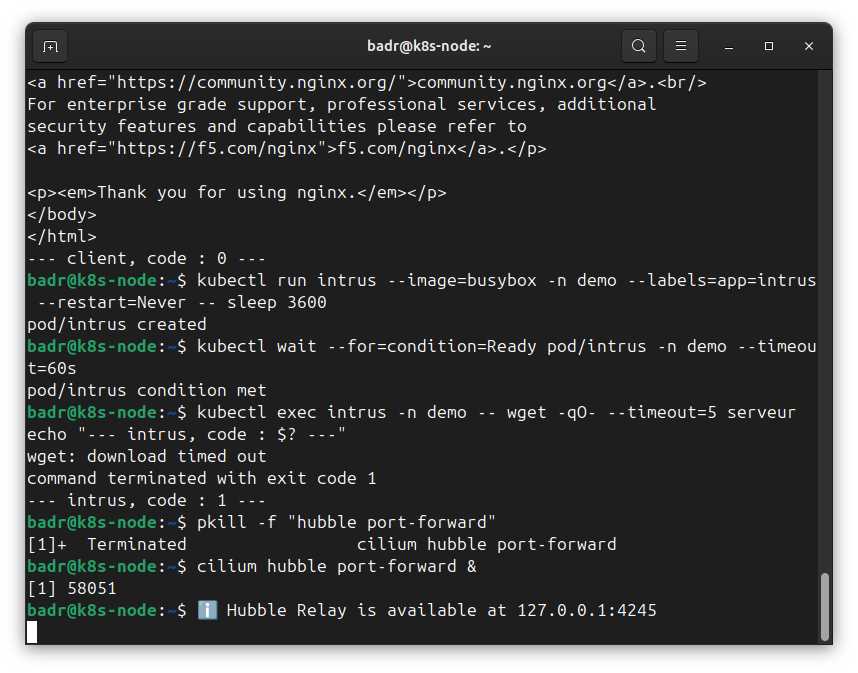

Dans Hubble, le flux refusé apparaît clairement :

```bash
hubble observe --namespace demo --verdict DROPPED --last 10
```

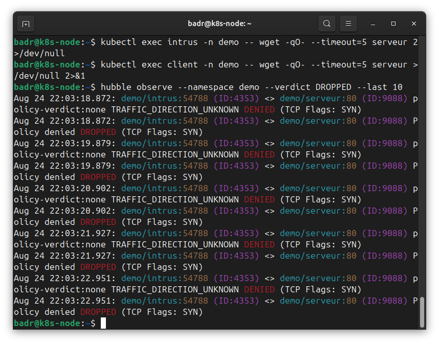

C'est le **filtrage par identité** : ce n'est plus l'adresse qui compte, c'est *qui tu es* (le label).

---

<a name="s6"></a>
## 6. Les niveaux d'objets Kubernetes — où j'ai travaillé

| Objet | Ce que c'est | Ce que j'y ai fait |
|---|---|---|
| **Cluster** (`lab-cilium`) | tout l'ensemble | créé au début + installé Cilium |
| **Node** ×3 | les 3 machines | chiffrement entre elles ; agents Cilium/Tetragon dessus |
| **Namespace** (`demo`) | dossier logique | terrain isolé pour la démo |
| **Service** (`serveur`) | nom stable pour joindre un pod | créé avec `kubectl expose` |
| **Pod** (`serveur`, `client`, `intrus`) | conteneur qui tourne | **c'est là que mes policies agissent**, via les labels |

**En une phrase** : j'ai sécurisé la communication **entre pods**, à l'intérieur d'un **namespace**, sur un **cluster** monté avec Cilium. Les policies vivent tout en bas, au niveau des pods (via leurs labels).

---

<a name="s7"></a>
## 7. Policy L7 : filtrer le contenu HTTP (`GET` oui, `DELETE` non)

### Le pourquoi

Jusqu'ici mes règles étaient « tout ou rien » sur la connexion. Au **L7**, j'inspecte le **contenu** de la requête HTTP et je décide *méthode par méthode*. Un pare-feu classique voit « du trafic sur le port 80 » ; Cilium voit « un `GET` » ou « un `DELETE` » et tranche.

### La policy

```yaml
apiVersion: cilium.io/v2
kind: CiliumNetworkPolicy
metadata:
  name: allow-client-vers-serveur
  namespace: demo
spec:
  endpointSelector:
    matchLabels:
      app: serveur
  ingress:
  - fromEndpoints:
    - matchLabels:
        app: client
    toPorts:
    - ports:
      - port: "80"
        protocol: TCP
      rules:
        http:
        - method: "GET"
```

Ce qui est nouveau : `rules.http: - method: "GET"` → **le cœur du L7** : n'autoriser QUE les requêtes `GET`. Tout autre verbe → refusé.

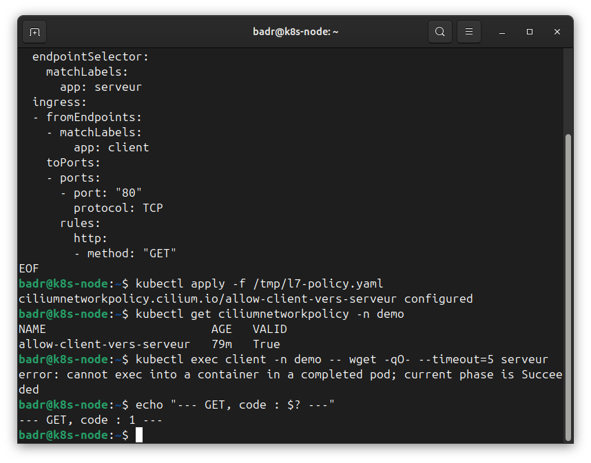

### ⚠️ Un proxy s'insère (Envoy)

Quand j'ajoute des règles L7, Cilium insère un **proxy HTTP (Envoy)** dans le chemin. Conséquence : un flux bloqué en L7 ne fait **pas** timeout — la connexion s'établit, mais le proxy renvoie une réponse **`403 Forbidden`**. C'est la signature du L7.

### ⚠️ Le pod qui meurt

Le `wget` de busybox ne connaît pas `--method`. Il faut `curl`. Et le pod nu créé avec `--restart=Never` meurt après le `sleep` → il faut un **Deployment** + `sleep infinity`.

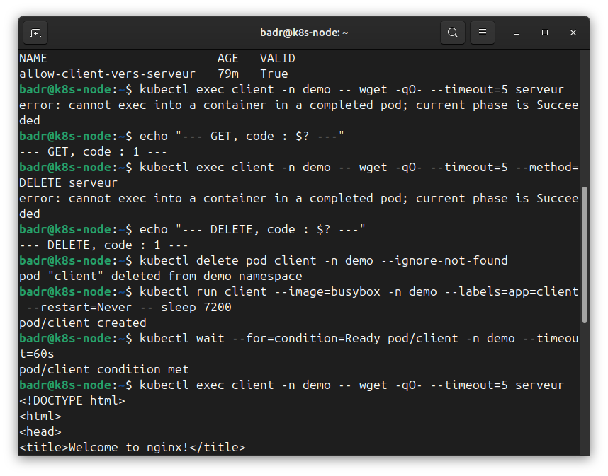

### Prouver le L7

```bash
kubectl run curl-test --image=curlimages/curl -n demo --labels=app=client --restart=Never --rm -it -- \
  -s -o /dev/null -w "GET -> %{http_code}\n" http://serveur/
# => GET -> 200   (autorisé)

kubectl run curl-test2 --image=curlimages/curl -n demo --labels=app=client --restart=Never --rm -it -- \
  -s -o /dev/null -w "DELETE -> %{http_code}\n" -X DELETE http://serveur/
# => DELETE -> 403   (refusé par le proxy L7)
```

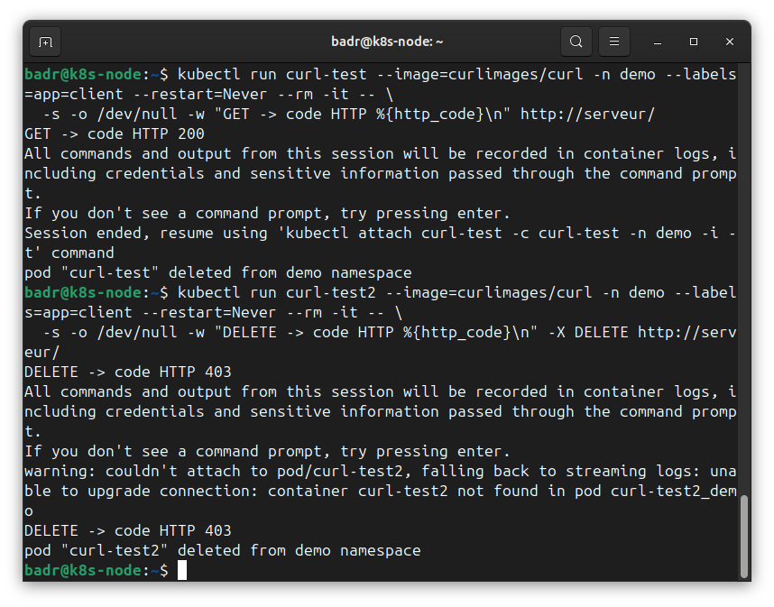

**Le contraste qui prouve tout** : `GET → 200`, `DELETE → 403`. Même client, même serveur, même port. Seule la **méthode HTTP** change le verdict. Un pare-feu classique en serait incapable.

---

<a name="s8"></a>
## 8. Egress par nom de domaine (contrôle des flux sortants)

### Le pourquoi

Jusqu'ici je filtrais l'**entrant** (ingress). Maintenant le **sortant** (egress). Ça coupe l'**exfiltration** de données et le **command & control**. Cilium filtre par **nom de domaine** (`toFQDNs`), le seul truc stable quand les IP changent sans cesse.

### La policy egress FQDN

```yaml
apiVersion: cilium.io/v2
kind: CiliumNetworkPolicy
metadata:
  name: egress-restreint
  namespace: demo
spec:
  endpointSelector:
    matchLabels:
      app: client
  egress:
  - toFQDNs:
    - matchName: "example.com"
  - toEndpoints:
    - matchLabels:
        io.kubernetes.pod.namespace: kube-system
        k8s-app: kube-dns
    toPorts:
    - ports:
      - port: "53"
        protocol: UDP
      rules:
        dns:
        - matchPattern: "*"
```

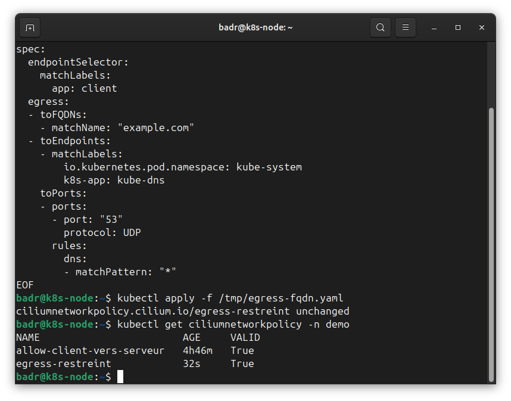

Les deux blocs `egress` :
- `toFQDNs: matchName: "example.com"` → autorise la sortie **uniquement** vers ce domaine.
- Le bloc `kube-dns / port 53 / dns` → **réautorise le DNS** (sinon tout casse).

### ⚠️ LE piège classique de l'egress : le DNS

Si j'applique un egress restreint **sans réautoriser le DNS**, tout casse : les pods « n'ont plus de réseau » alors qu'ils n'ont simplement plus de **résolution de noms**. Donc : **egress restreint = toujours penser à réautoriser le DNS vers `kube-dns` (port 53)**.

### Prouver le filtrage

```bash
kubectl exec deploy/client -n demo -- curl -s -o /dev/null -w "example.com -> %{http_code}\n" --max-time 8 http://example.com
# => example.com -> 200   (autorisé)

kubectl exec deploy/client -n demo -- curl -s -o /dev/null -w "cloudflare.com -> %{http_code}\n" --max-time 8 http://cloudflare.com
# => cloudflare.com -> 000  (bloqué ; exit code 28 = timeout)
```

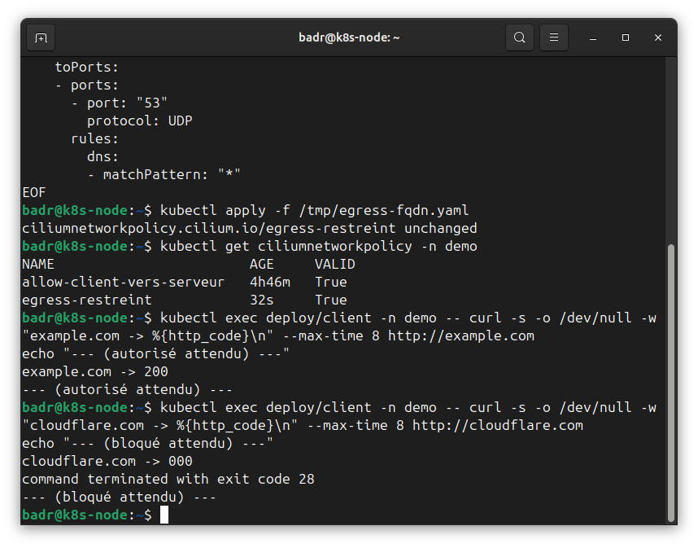

Même pod, même type de requête, mais un seul domaine est autorisé → un seul passe.

---
---

# PARTIE D — SÉCURITÉ RUNTIME

<a name="s9"></a>
## 9. Tetragon : détecter ET bloquer au niveau du noyau

### Le pourquoi

Un outil de détection runtime **voit** un shell s'ouvrir et **alerte** — mais l'action a lieu quand même. **Tetragon** va plus loin : il peut **tuer l'action au niveau du noyau, avant qu'elle n'aboutisse** (`SIGKILL` au moment de l'appel système). C'est le passage de **détection** à **application**.

### ⚠️ LA règle d'or : observer AVANT de bloquer

Bloquer directement est dangereux : un faux positif tue un processus légitime. La méthode est **toujours** : d'abord **observer** sans bloquer, mesurer les déclenchements, *puis* passer en blocage. C'est la même logique que PSA (`audit → warn → enforce`), IDS → IPS, WAF détection → blocage.

### Installer Tetragon

```bash
helm repo add cilium https://helm.cilium.io
helm repo update
helm install tetragon cilium/tetragon -n kube-system
kubectl rollout status daemonset/tetragon -n kube-system --timeout=120s
```

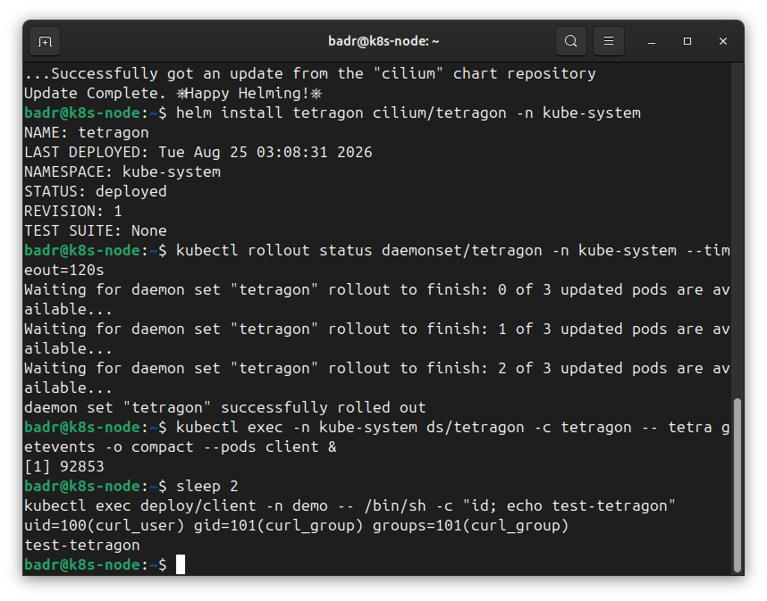

### Phase OBSERVATION

```bash
kubectl exec -n kube-system ds/tetragon -c tetragon -- tetra getevents -o compact > /tmp/tetra.log 2>&1 &
sleep 3
kubectl exec deploy/client -n demo -- /bin/sh -c "id; cat /etc/hostname"
cat /tmp/tetra.log
```

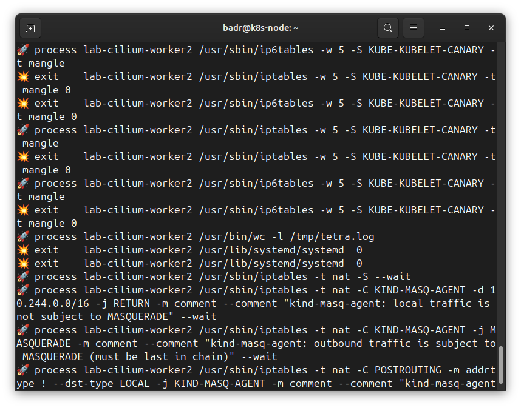

Tetragon voit **chaque processus** lancé (le `🚀`) et sa fin (le `💥 exit`), y compris tous les processus système. C'est la puissance de l'eBPF : rien ne lui échappe.

### Phase BLOCAGE : la TracingPolicy qui tue le shell

```yaml
apiVersion: cilium.io/v1alpha1
kind: TracingPolicyNamespaced
metadata:
  name: bloquer-shell
  namespace: demo
spec:
  kprobes:
  - call: "sys_execve"
    syscall: true
    args:
    - index: 0
      type: "string"
    selectors:
    - matchArgs:
      - index: 0
        operator: "Postfix"
        values:
        - "/bin/sh"
        - "/bin/bash"
      matchActions:
      - action: Sigkill
```

- `sys_execve` → l'appel système que Linux utilise pour **lancer un programme**.
- `operator: "Postfix"` → matche tout programme dont le chemin finit par `/bin/sh` ou `/bin/bash`.
- `action: Sigkill` → **tue le processus** instantanément.

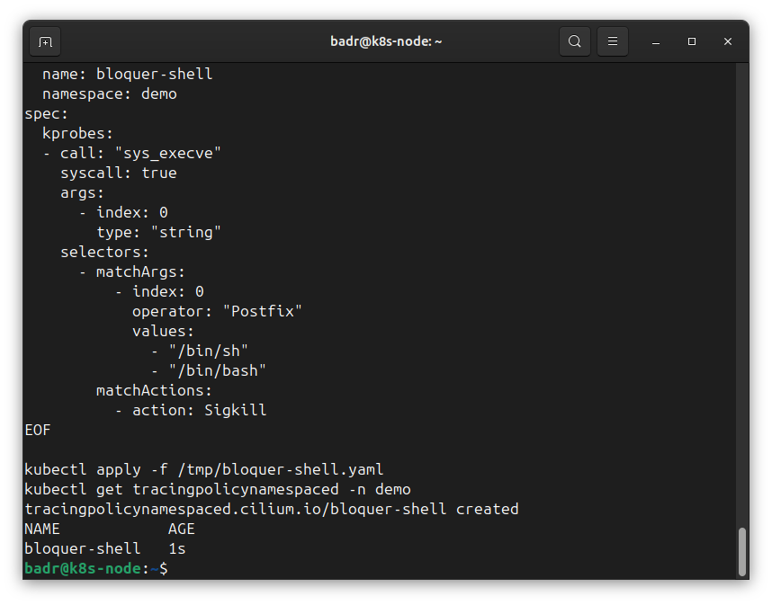

### Prouver le blocage

```bash
kubectl exec deploy/client -n demo -- /bin/sh -c "id; echo je-ne-devrais-pas-voir-ceci"
echo "code de sortie : $?"
```

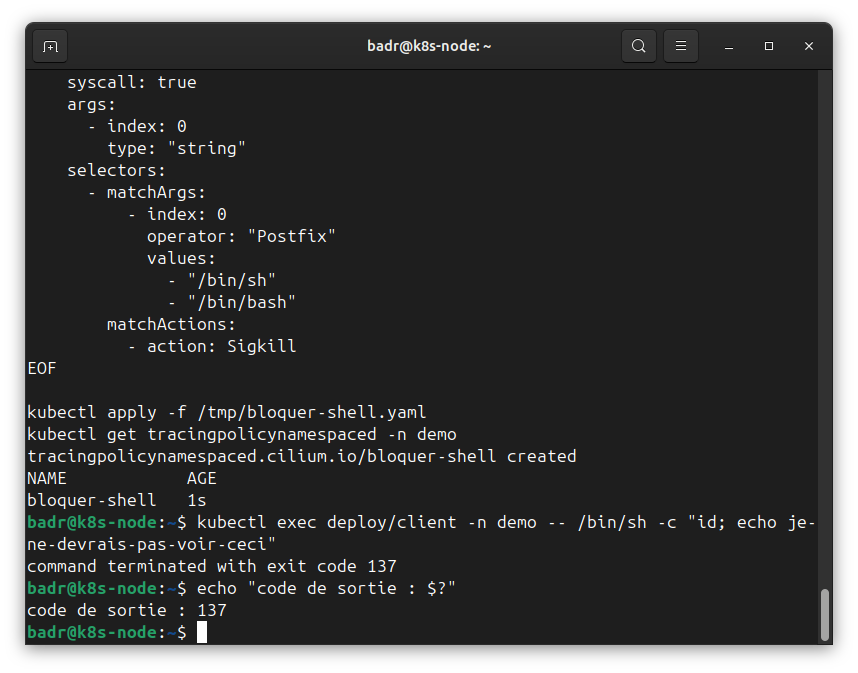

- **Aucune sortie** : le shell est mort **avant** d'exécuter quoi que ce soit.
- **`137` = 128 + 9** → `9` = `SIGKILL`. Ce **137 est la signature d'un processus tué par Tetragon**.

| | Détection (alerte) | Tetragon (application) |
|---|---|---|
| Le shell s'ouvre ? | **Oui**, puis alerte | **Non**, tué (`137`) |
| Ce que je vois | une alerte | rien, processus mort |
| Rôle | **détecter** | **empêcher** |

---
---

# RÉCAPITULATIF — l'état de la Partie 8

**Fait de mes mains :**
- Cluster recréé **sans CNI** puis avec **Cilium** (CNI eBPF).
- **WireGuard** (chiffrement entre nœuds) + **kube-proxy remplacé** (routage eBPF).
- **Hubble** : observer le trafic en direct (`FORWARDED`/`DROPPED`), lire un appel web complet.
- Diagnostic d'une **policy invalide** (`VALID: False`) — réflexe : toujours vérifier `VALID` + `cilium endpoint list`.
- **Policy L3/L4** par identité : client autorisé, intrus `DROPPED`.
- **Policy L7** : `GET → 200`, `DELETE → 403` (proxy Envoy).
- **Egress FQDN** : `example.com` passe, `cloudflare.com` bloqué — avec le DNS réautorisé.
- **Tetragon** : observation (voir tous les process), puis blocage d'un shell (`exit code 137`).

**Reste à faire :**
- **Hubble UI** : la carte visuelle du trafic dans le navigateur.
- **Brancher Tetragon sur le SIEM** : remonter les événements pour les corréler.
- **Traduire toutes mes anciennes NetworkPolicies** en CiliumNetworkPolicy + L7.

**Les réflexes à graver :**
1. Cilium filtre des **identités** et des **méthodes HTTP**, pas des IP.
2. Après chaque policy : **vérifier `VALID: True`**.
3. **Egress restreint = toujours réautoriser le DNS**.
4. **Observer avant de bloquer** (Tetragon `Sigkill`).
5. Pour un client de test durable : **Deployment + `sleep infinity`**, pas un pod nu.
6. `curl` (pas le `wget` de busybox) pour tester les méthodes HTTP.
7. **`exit code 137` = SIGKILL** = processus tué par Tetragon.

**Le fil conducteur** : un réseau cloud-native, c'est **filtrer par identité** (L3/L4), **par contenu** (L7), **contrôler la sortie** (egress FQDN), **chiffrer** (WireGuard), **observer** (Hubble) et **bloquer au niveau noyau** (Tetragon). Chaque couche a son rôle, et elles se complètent.
