# Partie 10 — Infrastructure as Code : Terraform & sécurité IaC
## Mes notes complètes

**Ce que j'ai fait :** appris l'IaC sur du cloud réel (AWS), du premier fichier local au state distant chiffré, en passant par le scan de sécurité Trivy.
**Mon environnement :** VM `k8s-node` (Ubuntu), compte AWS free tier, utilisateur IAM `lab-admin`.
**Le fil conducteur :** mon infrastructure devient du **code** — reproductible, versionné dans Git, relu, et surtout **scannable** pour trouver ses failles avant tout déploiement.

---

# SOMMAIRE

**Partie A — Les fondamentaux**
0. [L'idée centrale : pourquoi Terraform](#s0)
1. [Installer Terraform](#s1)
2. [Mon premier projet (100% local, zéro coût)](#s2)

**Partie B — AWS réel**
3. [Configurer l'accès à AWS](#s3)
4. [Premier projet sur AWS : un bucket S3](#s4)

**Partie C — Sécurité et industrialisation**
5. [L'angle DevSecOps : scanner l'IaC avec Trivy](#s5)
6. [Les variables : du code réutilisable](#s6)
7. [Le state distant (la brique sécurité la plus importante)](#s7)

**Récapitulatif**

---
---

# PARTIE A — LES FONDAMENTAUX

<a name="s0"></a>
## 0. L'idée centrale : pourquoi Terraform

Créer une ressource cloud à la main (cliquer dans la console AWS) est **manuel** (long, source d'erreurs), **non reproductible** (refaire = re-cliquer partout) et **invisible** (personne ne sait ce qui existe ni pourquoi).

Terraform inverse ça : je **décris** ce que je veux dans un fichier texte, et Terraform le **crée** pour moi.

**Le mécanisme central** : Terraform compare ce que je veux (mon code = l'état souhaité) à ce qui existe vraiment (le réel), et applique la différence.

Les 3 acteurs :
- **Mon code** (fichiers `.tf`) = l'état souhaité.
- **Le cloud** (AWS…) = l'état réel.
- **Le fichier d'état** (`terraform.tfstate`) = la mémoire de Terraform.

Les 3 verbes : `init` (préparer) → `plan` (montrer la différence) → `apply` (créer). Plus `destroy` (supprimer). **Terraform ne change jamais rien sans me montrer le plan avant.**

---

<a name="s1"></a>
## 1. Installer Terraform

```bash
wget -O- https://apt.releases.hashicorp.com/gpg | \
  sudo gpg --dearmor -o /usr/share/keyrings/hashicorp-archive-keyring.gpg

echo "deb [signed-by=/usr/share/keyrings/hashicorp-archive-keyring.gpg] \
  https://apt.releases.hashicorp.com $(lsb_release -cs) main" | \
  sudo tee /etc/apt/sources.list.d/hashicorp.list

sudo apt update && sudo apt install -y terraform
terraform version
```

Clé GPG (authenticité) → dépôt officiel HashiCorp → installation propre et à jour.

---

<a name="s2"></a>
## 2. Mon premier projet (100% local, zéro coût)

### Le code

```hcl
# main.tf
terraform {
  required_providers {
    local = { source = "hashicorp/local" }
  }
}

resource "local_file" "bonjour" {
  filename = "${path.module}/bonjour.txt"
  content  = "Salut Badr, ceci est mon premier fichier créé par Terraform.\n"
}
```

- Le bloc `terraform { required_providers }` → déclare le **provider** (plugin qui sait parler à un système : AWS, ou ici `local` pour les fichiers).
- Le bloc `resource` → une chose que Terraform crée et gère. `local_file` = le type, `bonjour` = le nom interne.

### ⚠️ Piège de débutant : écrire le code ne crée rien

`cat main.tf` montre le code source, PAS le fichier `bonjour.txt`. Écrire le code décrit un **souhait** ; Terraform ne le réalise qu'au `apply`. Comme écrire une recette ne cuisine pas le plat.

### Les 3 verbes

```bash
terraform init     # télécharge le provider, crée .terraform/ + .terraform.lock.hcl
terraform plan     # montre ce qui va se passer SANS rien faire (+ = créer, ~ = modifier, - = détruire)
terraform apply    # exécute le plan → taper "yes" → Apply complete!
```

### La réconciliation (le cœur de l'IaC)

- Relancer `plan` sans rien changer → `No changes. Your infrastructure matches the configuration.`
- Casser le fichier à la main (`echo "..." > bonjour.txt`) puis `plan` → Terraform détecte l'écart (`~`, `1 to change`) et propose de **remettre en état**.

→ Terraform ne « lance pas des commandes », il **maintient un état désiré**. Le code fait foi.

```bash
terraform destroy    # supprime proprement → Destroy complete!
```

**Le cycle complet : `init → plan → apply → destroy`.**

---
---

# PARTIE B — AWS RÉEL

<a name="s3"></a>
## 3. Configurer l'accès à AWS

### Installer l'AWS CLI

```bash
curl "https://awscli.amazonaws.com/awscli-exe-linux-x86_64.zip" -o "awscliv2.zip"
unzip -q awscliv2.zip && sudo ./aws/install
aws --version
```

### ⚠️ Sécurité des clés (règle absolue)

- **Ne jamais créer de clé depuis le compte root AWS.** Utiliser un utilisateur IAM dédié.
- **Ne jamais partager ni committer un Secret Access Key.** Dès qu'un secret est exposé = **révoquer immédiatement**.
- Le Secret ne s'affiche **qu'une seule fois** à la création.

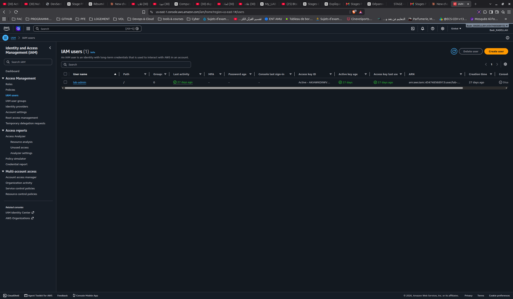

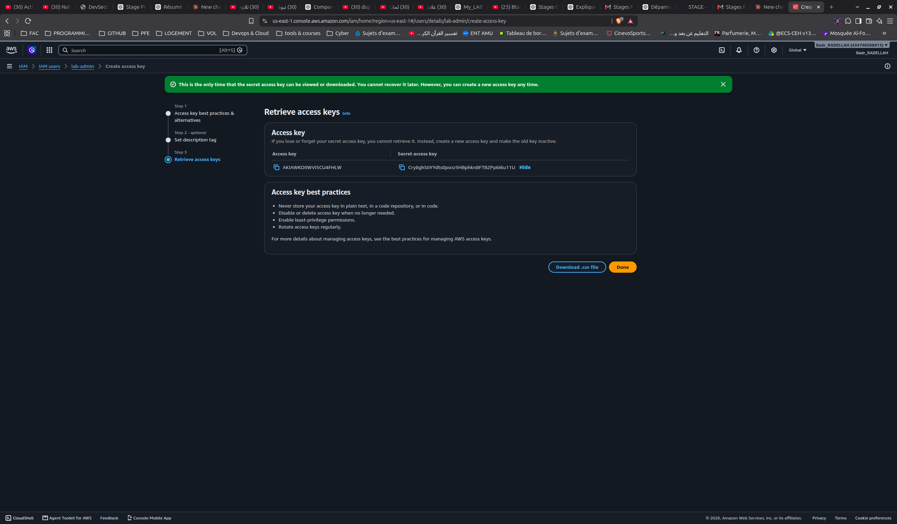

### Configurer et vérifier

```bash
aws configure       # interactif : Access Key, Secret (masqué), region, format
aws sts get-caller-identity   # => JSON avec Account et Arn (aucun secret dedans)
```

---

<a name="s4"></a>
## 4. Premier projet sur AWS : un bucket S3

### Le code

```hcl
terraform {
  required_providers {
    aws = { source = "hashicorp/aws", version = "~> 5.0" }
  }
}
provider "aws" { region = "us-east-1" }

resource "aws_s3_bucket" "mon_bucket" {
  bucket = "lab-badr-tf-8271946"
}
```

### ⚠️ Nom de bucket unique dans le MONDE ENTIER

Minuscules, chiffres et tirets uniquement. J'ajoute des chiffres au hasard pour être tranquille.

### ⚠️ Incident n°1 : le "state lock" coincé

Erreur `Error acquiring the state lock`. Cause : j'avais fait **`Ctrl+Z`** (mise en pause) au lieu de `Ctrl+C` (tuer). Le processus gelé gardait le verrou.
- Diagnostic : `ps aux | grep terraform` → STAT `Tl` = stopped.
- Solution : `kill -9 <PID>` + `rm -f .terraform.tfstate.lock.info`.
- **La leçon** : `Ctrl+C` = tuer (ce qu'on veut), `Ctrl+Z` = pause en arrière-plan (casse Terraform).

### ⚠️ Incident n°2 : AccessDenied IAM

Erreur `User lab-admin is not authorized to perform: s3:CreateBucket`. L'utilisateur est authentifié mais n'a **pas la permission**.
- **La leçon** : sur AWS, l'identité ne suffit pas — ce sont les **policies IAM** qui donnent les droits. Un utilisateur nommé « admin » sans policy n'a **aucun** droit.
- Solution : IAM → Users → `lab-admin` → Attach `AmazonS3FullAccess`.

### Vérifier des deux côtés

```bash
terraform show    # mémoire de Terraform (arn, region…)
aws s3 ls         # réalité AWS : le bucket apparaît
```

**Réflexe** : vérifier côté Terraform ET côté AWS (preuve indépendante).

### Le réflexe anti-facture

```bash
terraform destroy    # yes → Destroy complete!
aws s3 ls            # le bucket a disparu
```

**La discipline** : ne jamais laisser traîner une ressource cloud. Le compteur `X to destroy` est le chiffre à lire avant `yes`.

---
---

# PARTIE C — SÉCURITÉ ET INDUSTRIALISATION

<a name="s5"></a>
## 5. L'angle DevSecOps : scanner l'IaC avec Trivy

### Le pourquoi

Mon bucket « marchait », mais était-il **sécurisé** ? Non. Un bucket par défaut a plusieurs faiblesses **invisibles**. Le scan IaC lit mon `.tf` **avant** tout déploiement et me dit ce qui ne va pas. C'est le principe **shift-left**.

### Le scan

```bash
trivy config .
trivy config . --skip-version-check 2>/dev/null | grep -E "Tests:|Failures:"
```

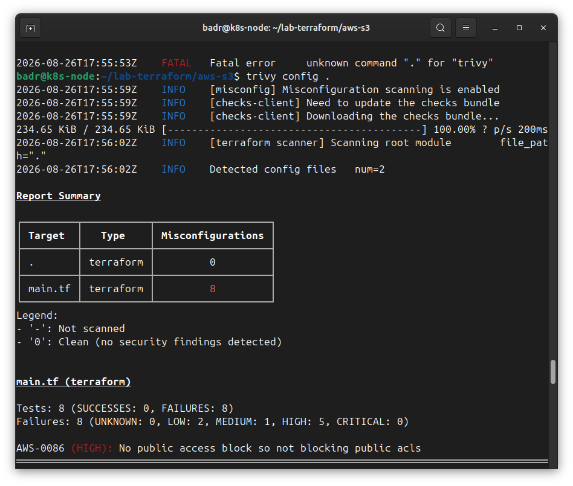

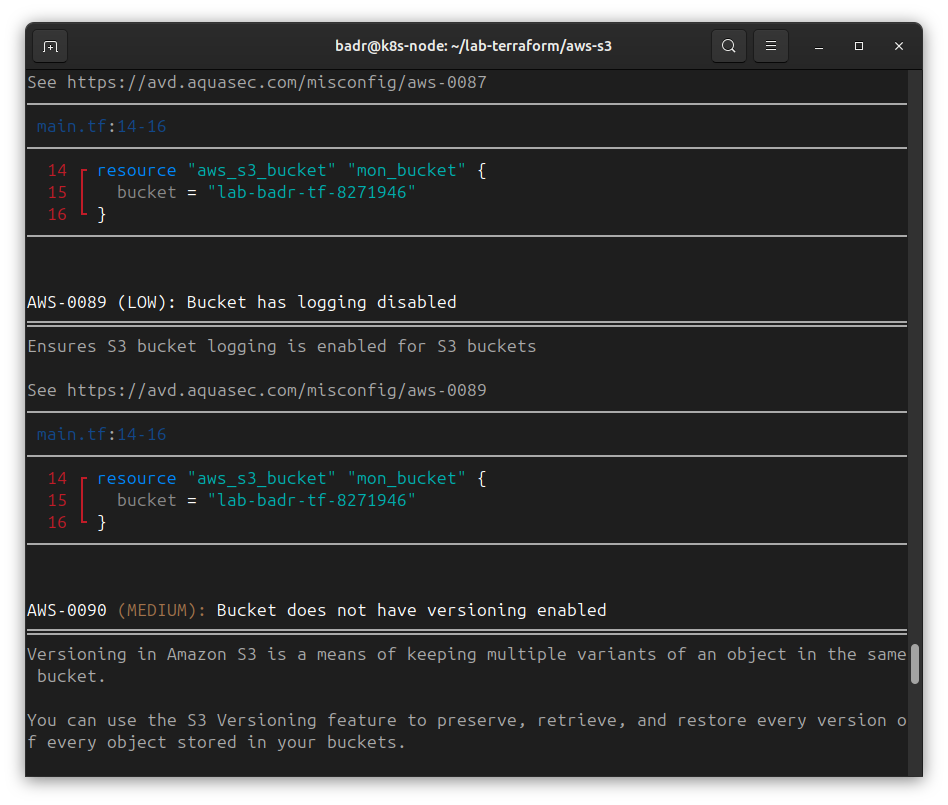

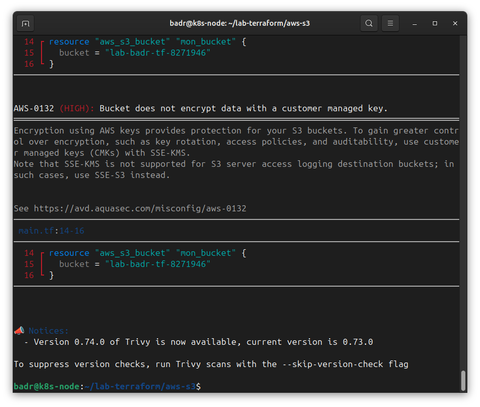

**`Tests: 8 → FAILURES: 8`**. Un bucket nu ne passe **aucun** contrôle :
- **Accès public (5 HIGH)** : `AWS-0086/0087/0091/0093/0094` — rien n'empêche de rendre le bucket public. **Cause n°1 des fuites de données cloud.**
- **Chiffrement (1 HIGH)** : `AWS-0132` — pas de chiffrement par clé cliente.
- **Traçabilité** : `AWS-0090` (pas de versioning), `AWS-0089` (pas de logging).

### Durcir le bucket

```hcl
resource "aws_s3_bucket_public_access_block" "bloquer_public" {
  bucket                  = aws_s3_bucket.mon_bucket.id
  block_public_acls       = true
  block_public_policy     = true
  ignore_public_acls      = true
  restrict_public_buckets = true
}

resource "aws_s3_bucket_server_side_encryption_configuration" "chiffrement" {
  bucket = aws_s3_bucket.mon_bucket.id
  rule {
    apply_server_side_encryption_by_default { sse_algorithm = "aws:kms" }
  }
}

resource "aws_s3_bucket_versioning" "versioning" {
  bucket = aws_s3_bucket.mon_bucket.id
  versioning_configuration { status = "Enabled" }
}
```

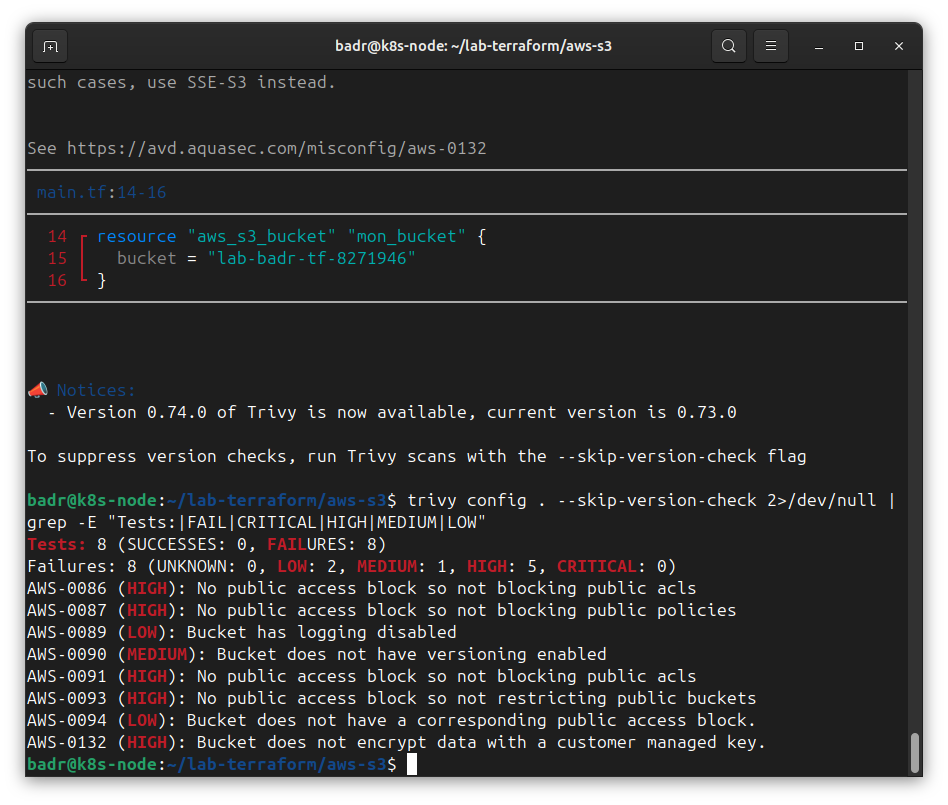

Résultat du re-scan : **`FAILURES: 8 → 2`**. 6 failles éliminées d'un coup.

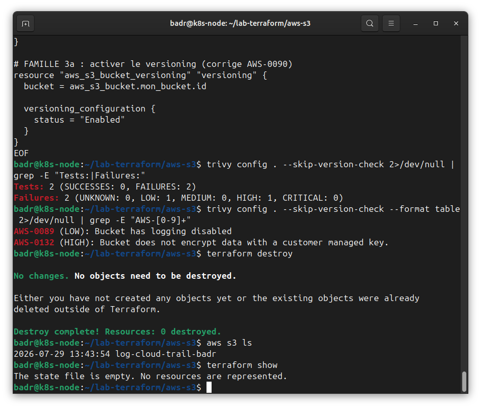

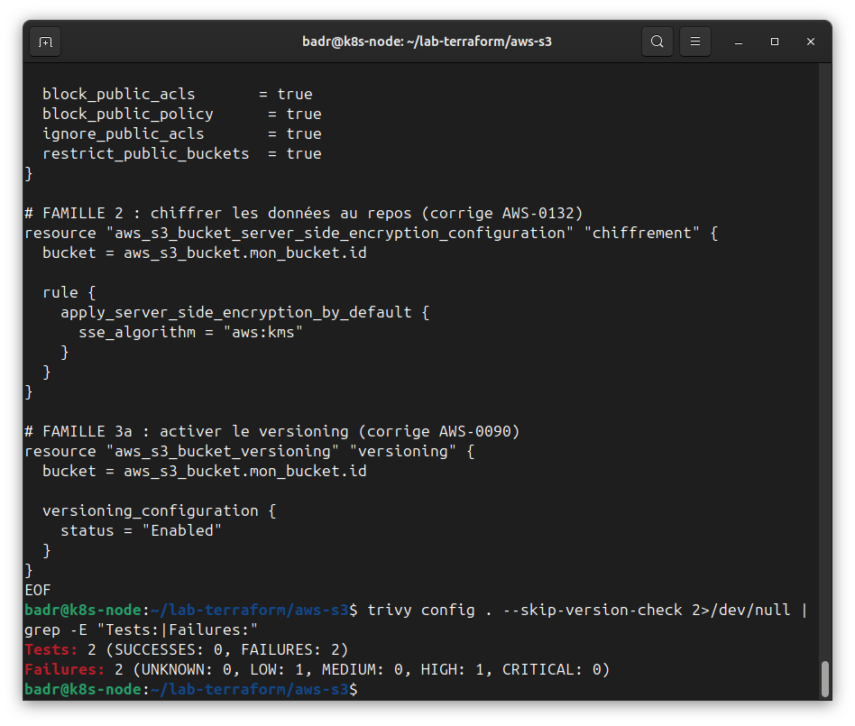

### ⚠️ Le cas subtil AWS-0132 (persiste)

`aws:kms` utilise une clé **gérée par AWS**, mais Trivy veut une clé **que JE crée** (CMK — Customer Managed Key). Acceptable pour un lab — l'essentiel (les 5 HIGH d'accès public) est corrigé.

**Le workflow DevSecOps : écrire → scanner → durcir → re-scanner.**

---

<a name="s6"></a>
## 6. Les variables : du code réutilisable

### Le pourquoi

Écrire le nom du bucket et la région **en dur** oblige à modifier le code pour chaque réutilisation. Les **variables** séparent le *code* (la logique, fixe) des *valeurs* (qui changent). Le code devient un **modèle réutilisable**.

### La structure (3 fichiers = convention Terraform)

**`variables.tf`** — on *déclare* les variables :
```hcl
variable "region" {
  description = "La région AWS où déployer"
  type        = string
  default     = "us-east-1"
}
variable "bucket_name" {
  description = "Le nom unique du bucket S3"
  type        = string
}
variable "environnement" {
  description = "L'environnement (dev, staging, prod)"
  type        = string
  default     = "dev"
}
```

**`main.tf`** — le code *utilise* les variables :
```hcl
provider "aws" { region = var.region }

resource "aws_s3_bucket" "mon_bucket" {
  bucket = var.bucket_name
  tags = {
    Environnement = var.environnement
    GereePar      = "Terraform"
  }
}
```

**`terraform.tfvars`** — où on *donne les valeurs* :
```hcl
bucket_name   = "lab-badr-tf-vars-8271946"
environnement = "dev"
region        = "us-east-1"
```

Terraform lit `terraform.tfvars` **automatiquement**. Pour un autre environnement, je change juste ce fichier, **sans toucher au code**.

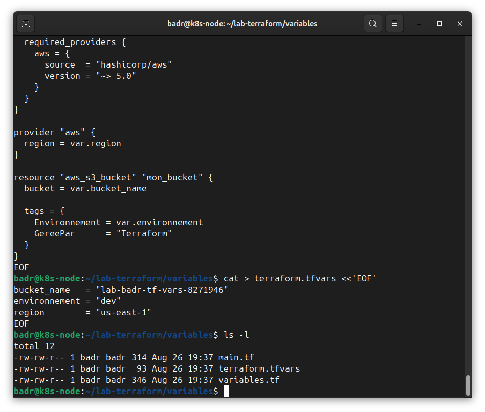

### La hiérarchie des variables

```bash
terraform plan -var="environnement=prod"
```

`-var="..."` force une valeur qui **écrase** celle du fichier. Dans le plan, le tag passe à `"prod"`.

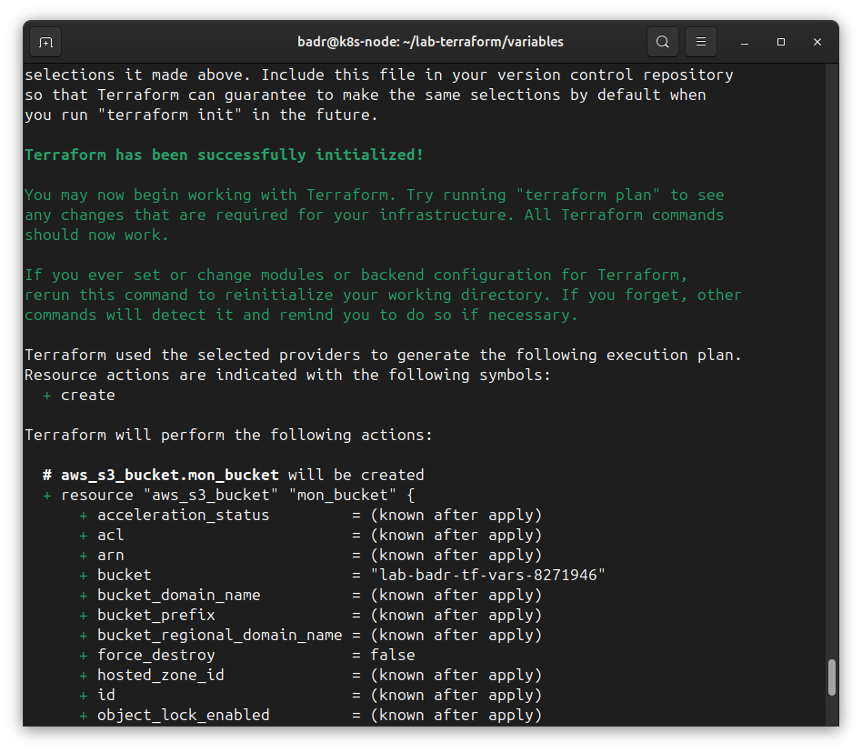

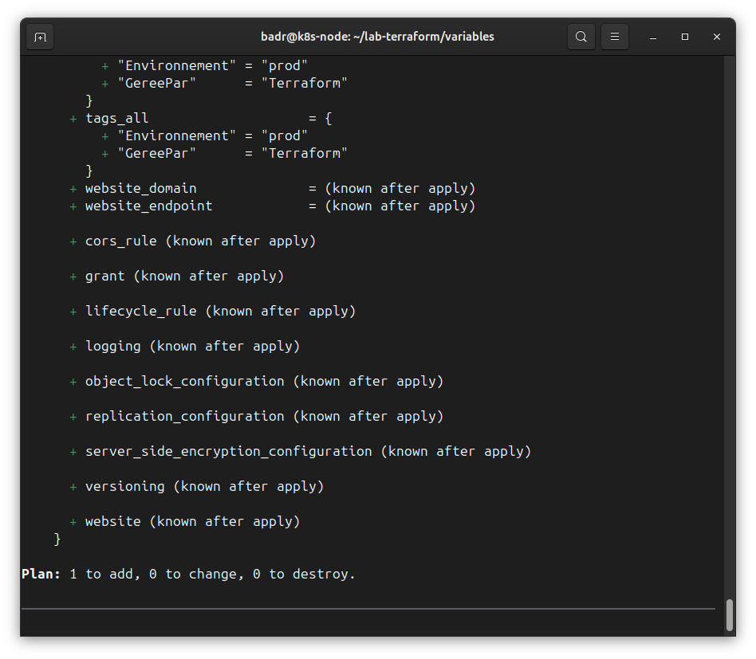

**Hiérarchie** : ligne de commande (`-var`) > `terraform.tfvars` > `default`. C'est comme ça qu'on déploie le *même code* en dev puis en prod.

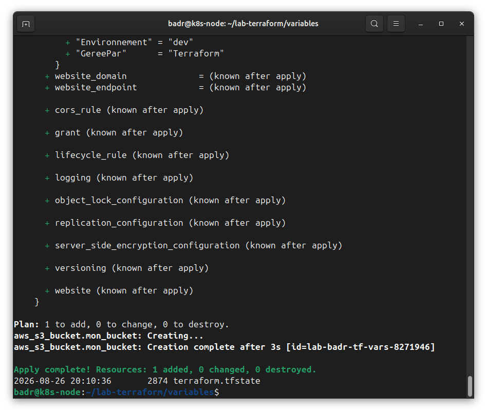

---

<a name="s7"></a>
## 7. Le state distant (la brique sécurité la plus importante)

### Le pourquoi : le tfstate local est un DANGER

Depuis le début, mon état (`terraform.tfstate`) est un **fichier local**. Triple problème :
1. **Sécurité** 🔴 — le `tfstate` contient **tout en clair**, y compris des **secrets**. Un fichier local non chiffré = tous les secrets d'infra exposés.
2. **Collaboration** — en équipe, deux `apply` simultanés → états divergents → infra corrompue.
3. **Perte** — disque crashé = Terraform oublie tout ce qu'il a créé.

**La solution** : stocker le `tfstate` à distance, **chiffré**, **versionné** et **partagé**.

### ⚠️ Le piège de l'œuf et la poule

Pour stocker le `tfstate` dans un bucket S3, il faut... un bucket S3. Solution : créer le bucket "backend" **d'abord** (état local), puis basculer le reste dessus.

### 7a — Créer le bucket backend

```hcl
resource "aws_s3_bucket" "tfstate" {
  bucket = "lab-badr-tfstate-8271946"
}
resource "aws_s3_bucket_versioning" "tfstate" {
  bucket = aws_s3_bucket.tfstate.id
  versioning_configuration { status = "Enabled" }
}
resource "aws_s3_bucket_server_side_encryption_configuration" "tfstate" {
  bucket = aws_s3_bucket.tfstate.id
  rule {
    apply_server_side_encryption_by_default { sse_algorithm = "aws:kms" }
  }
}
```

- **versioning** → garde l'historique de l'état (filet de sécurité).
- **chiffrement** → le `tfstate` contient des secrets, il DOIT être chiffré au repos.

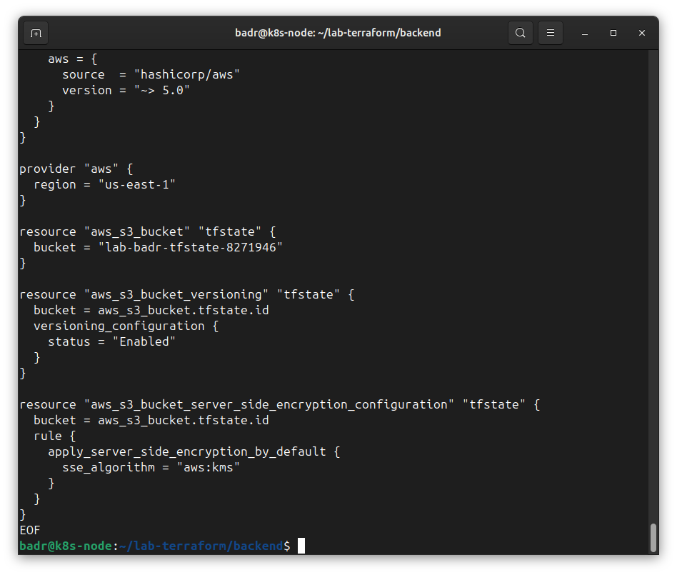

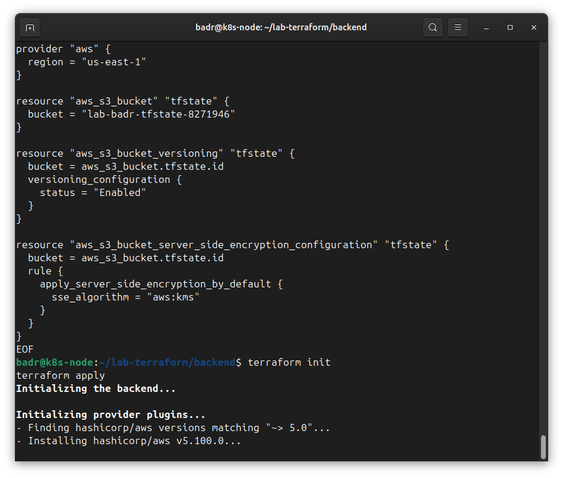

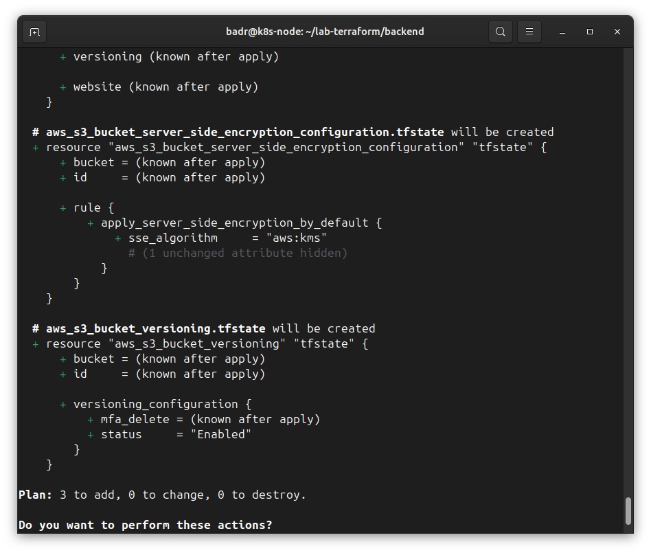

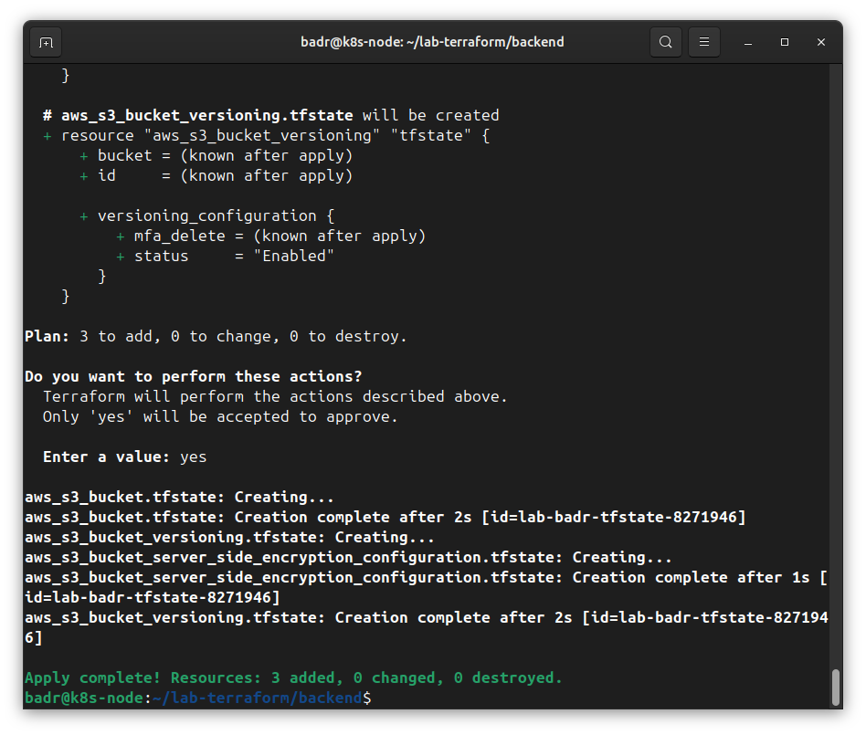

### 7b — Basculer un projet vers le state distant

```hcl
# backend.tf
terraform {
  backend "s3" {
    bucket  = "lab-badr-tfstate-8271946"
    key     = "variables/terraform.tfstate"
    region  = "us-east-1"
    encrypt = true
  }
}
```

- `key = "variables/terraform.tfstate"` → chaque projet a sa propre `key` → **un seul bucket héberge les états de tous mes projets**.
- `encrypt = true` → double protection (chiffrement côté client aussi).

```bash
terraform init    # détecte le passage local → S3, propose de migrer → yes
```

### La preuve

```bash
terraform apply -auto-approve
aws s3 ls s3://lab-badr-tfstate-8271946/variables/
# => terraform.tfstate apparaît DANS le bucket
```

L'état a quitté ma VM pour un stockage central, chiffré et versionné. **Production-ready.**

### ⚠️ Règle d'or Git

**Toujours** un `.gitignore` qui bloque :
```
*.tfstate
*.tfstate.*
.terraform/
*.tfvars
```

Le `tfstate` et les `tfvars` (valeurs sensibles) ne vont **jamais** dans Git.

---
---

# RÉCAPITULATIF — l'état de la Partie 10

**Fait de mes mains :**
- Terraform installé (dépôt officiel HashiCorp), AWS CLI configuré.
- Le modèle mental IaC : décrire → comparer → appliquer.
- Le cycle complet `init → plan → apply → destroy`, en local puis sur AWS réel.
- Deux incidents diagnostiqués : le **state lock** coincé (`Ctrl+Z`) et l'**AccessDenied** IAM.
- **Scan sécurité IaC avec Trivy** : 8 failles trouvées → durcissement → 6 corrigées (workflow shift-left).
- **Variables** : code réutilisable, hiérarchie des valeurs (`-var` > tfvars > default), tags.
- **State distant** : bucket S3 chiffré + versionné, migration du local vers le cloud.

**Reste à explorer :**
- La clé **KMS cliente** (CMK) pour satisfaire `AWS-0132` à 100%.
- Les **modules** Terraform (code réutilisable packagé).
- Le **logging** S3 et le verrouillage d'état natif S3.

**Les réflexes à graver :**
1. **Écrire le code ne crée rien** — seul `apply` réalise le souhait.
2. **Lire le compteur `X to destroy`** avant chaque `yes`.
3. Interrompre Terraform avec **`Ctrl+C`, jamais `Ctrl+Z`**.
4. Sur AWS, **l'identité ne suffit pas** — il faut des permissions IAM explicites.
5. **Toujours nettoyer** ce qu'on crée dans le cloud (`destroy`).
6. **Scanner l'IaC avant de déployer** (Trivy) — les failles sont invisibles à l'écriture.
7. **Un secret exposé = un secret à révoquer.**
8. Le **`tfstate` va en distant, chiffré** — jamais dans Git.

**Le fil conducteur** : l'Infrastructure as Code, c'est **décrire** son infra en fichiers versionnés, la **scanner** pour trouver ses failles avant déploiement (shift-left), et **protéger l'état** (chiffré, distant, versionné). Le code fait foi, et la sécurité se vérifie dans le code, pas en production.
