# Partie 12 — CI/CD sécurisée : pipeline DevSecOps & GitOps (ArgoCD)
## Mes notes complètes

**Ce que j'ai fait :** construit un pipeline de sécurité sur GitHub Actions (scan secrets + dépendances + image + signature), puis installé ArgoCD pour du déploiement continu piloté par Git.
**Environnement CI :** machine hôte (Git + SSH) → GitHub Actions.
**Environnement CD :** VM `k8s-node`, cluster kind `lab-cilium` (3 nœuds, Cilium).
**Le fil conducteur :** Git est le **pivot de tout**. Le pipeline (CI) écrit dans Git ; ArgoCD (CD) lit Git et déploie. Personne ne touche le cluster à la main.

---

# SOMMAIRE

**Partie A — Le pipeline de sécurité (CI)**
0. [L'idée centrale](#s0)
1. [Le fichier de pipeline (version finale)](#s1)
2. [L'exercice casser/réparer](#s2)
3. [Les pièges rencontrés](#s3)
4. [Le Dockerfile durci](#s4)
5. [La signature keyless (Cosign)](#s5)

**Partie B — Le déploiement continu (CD)**
6. [Le modèle GitOps](#s6)
7. [Installer ArgoCD](#s7)
8. [Créer et synchroniser une Application](#s8)
9. [La réconciliation vécue (Manual vs Automatic)](#s9)

**Récapitulatif**

---
---

# PARTIE A — LE PIPELINE DE SÉCURITÉ (CI, GitHub Actions)

<a name="s0"></a>
## 0. L'idée centrale

En DevSecOps, **Git est le déclencheur et la source de vérité**. Je ne lance plus rien à la main :
- Je pousse mon code → un **pipeline** se déclenche automatiquement : scanne → build → scanne l'image → signe.
- Le pipeline met à jour un manifest dans Git → **ArgoCD** détecte le changement et déploie sur le cluster.

```
CI (pipeline) → écrit dans Git → CD (ArgoCD) lit Git → déploie
```

Le point de sécurité fondamental : **le scan est un garde-fou bloquant**. Si un scanner trouve une faille grave, le pipeline s'arrête. Rien de vulnérable n'atteint le cluster. C'est le « Sec » de DevSecOps.

---

<a name="s1"></a>
## 1. Le fichier de pipeline (version finale)

GitHub cherche automatiquement les fichiers dans `.github/workflows/`. Dès qu'on pousse, il lit ce fichier et exécute les étapes — **sur ses propres serveurs, gratuitement**.

```yaml
# .github/workflows/security.yml
name: security-gates
on: [push, pull_request]

permissions:
  contents: read
  packages: write
  id-token: write

jobs:
  scan:
    runs-on: ubuntu-latest
    steps:
      - name: Récupérer le code
        uses: actions/checkout@v4
        with:
          fetch-depth: 0

      - name: Scan des secrets (gitleaks)
        run: |
          docker run --rm -v "$PWD:/repo" zricethezav/gitleaks:latest \
            detect --source /repo --no-git --config /repo/.gitleaks.toml -v

      - name: Scan des dépendances (Trivy)
        uses: aquasecurity/trivy-action@master
        with:
          scan-type: fs
          scan-ref: .
          scanners: vuln
          severity: HIGH,CRITICAL
          exit-code: 1
          ignore-unfixed: true

      - name: Connexion au registre GHCR
        uses: docker/login-action@v3
        with:
          registry: ghcr.io
          username: ${{ github.actor }}
          password: ${{ secrets.GITHUB_TOKEN }}

      - name: Définir le nom de l'image
        run: |
          OWNER=$(echo "${{ github.repository_owner }}" | tr '[:upper:]' '[:lower:]')
          echo "IMAGE=ghcr.io/${OWNER}/mon-app-cicd:${{ github.sha }}" >> $GITHUB_ENV

      - name: Construire et publier l'image
        run: |
          docker build -t $IMAGE .
          docker push $IMAGE

      - name: Scan de l'image (Trivy)
        uses: aquasecurity/trivy-action@master
        with:
          scan-type: image
          image-ref: ${{ env.IMAGE }}
          severity: HIGH,CRITICAL
          exit-code: 1
          ignore-unfixed: true

      - name: Installer Cosign
        uses: sigstore/cosign-installer@v3

      - name: Signer l'image (keyless)
        if: github.ref == 'refs/heads/main'
        run: cosign sign --yes ${{ env.IMAGE }}
```

### Décorticage des concepts clés

- **`on: [push, pull_request]`** → le déclencheur : le pipeline se lance à chaque push et chaque PR. La sécurité devient automatique.
- **`runs-on: ubuntu-latest`** → GitHub prête une machine Ubuntu neuve, qui naît, exécute, puis disparaît.
- **`permissions`** → **moindre privilège appliqué au pipeline lui-même** : `contents: read` (lire le code), `packages: write` (publier l'image), `id-token: write` (jeton OIDC pour la signature). Un runner CI est une cible ; moins il a de droits, mieux c'est.
- Les `steps` s'exécutent **dans l'ordre** ; si une échoue, tout s'arrête.
- **`exit-code: 1`** → **LE mécanisme clé** : « sors en erreur si tu trouves une faille » → force GitHub à marquer le pipeline échoué → bloque. (La même logique que le `137` de Tetragon.)
- **`ignore-unfixed: true`** → ignore les failles sans correctif (inutile de bloquer sur l'incorrigeable).

---

<a name="s2"></a>
## 2. L'exercice casser/réparer

### Introduire deux failles volontaires

```python
# app.py avec un secret en dur
AWS_SECRET_ACCESS_KEY = "wJalrXUtnFEMI/K7MDENG/bPxRfiCYEXAMPLEKEY"
```
```
# requirements.txt avec une dépendance vulnérable (2018)
requests==2.19.0
```

Résultat : pipeline **rouge** ❌.

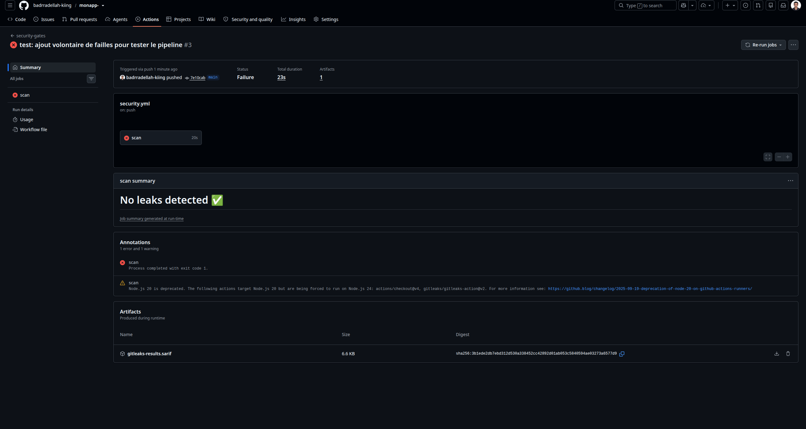

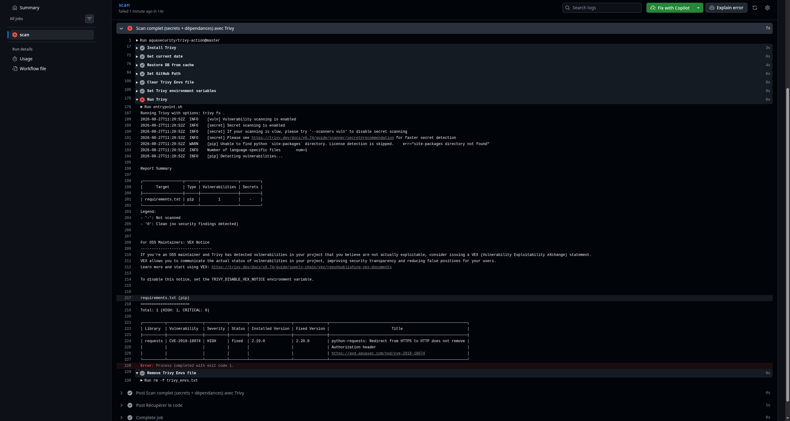

Puis on répare (secret retiré, `requests==2.32.3`) → pipeline **vert** ✅.

### ⚠️ La leçon la plus importante de toute la partie

**Un pipeline rouge ne garantit PAS que tout a été détecté.** J'ai vécu ça en vrai : le pipeline était rouge (Trivy avait trouvé la CVE), mais **gitleaks ratait la clé AWS**. Si la dépendance avait été saine, le pipeline serait passé vert **avec le secret dedans**.

→ Toujours vérifier **CE QUI** a bloqué, pas juste **SI** ça a bloqué. Un scanner qui donne une fausse confiance est le pire des scénarios.

---

<a name="s3"></a>
## 3. Les pièges rencontrés (tous instructifs)

### ⚠️ Piège 1 : version d'action invalide
`aquasecurity/trivy-action@0.28.0` → n'existe pas. Le pipeline ne démarrait même pas. **Distinguer** : rouge « le scan a trouvé une faille » ≠ rouge « le pipeline lui-même est cassé ». Correction : `@master`.

### ⚠️ Piège 2 : gitleaks-action rate les secrets
L'action gitleaks disait « No leaks detected ✅ » alors que la clé était dans le code. Cause : elle scanne l'historique Git entre commits et rate parfois le diff. Correction : lancer gitleaks **directement** via Docker, en mode `detect --source /repo --no-git` (scanne les *fichiers*, pas l'historique).

### ⚠️ Piège 3 : faux positifs (59 secrets !)
En scannant tout le répertoire, gitleaks a trouvé 59 « secrets »… tous dans **`.cache/trivy/db/trivy.db`** (la base de Trivy contient des exemples de secrets dans les CVE). **Un scanner noyé de faux positifs est inutilisable.** Correction : `.gitleaks.toml` avec une allowlist :
```toml
[extend]
useDefault = true
[allowlist]
description = "Ignorer les caches"
paths = ['''\.cache/.*''', '''\.git/.*''']
```
⚠️ **Syntaxe** : `[allowlist]` (crochets simples = un "map"), PAS `[[allowlist]]` (double = une liste). L'erreur `'AllowList' expected a map, got 'slice'` vient de là.

### ⚠️ Piège 4 : nom d'image invalide
`ghcr.io/badrradellah-kiing/monapp-:sha` → `invalid reference format`. Le dépôt s'appelait `monapp-` (tiret final) → interdit dans un nom d'image Docker. Correction : fixer un nom propre en minuscules (`tr '[:upper:]' '[:lower:]'`).

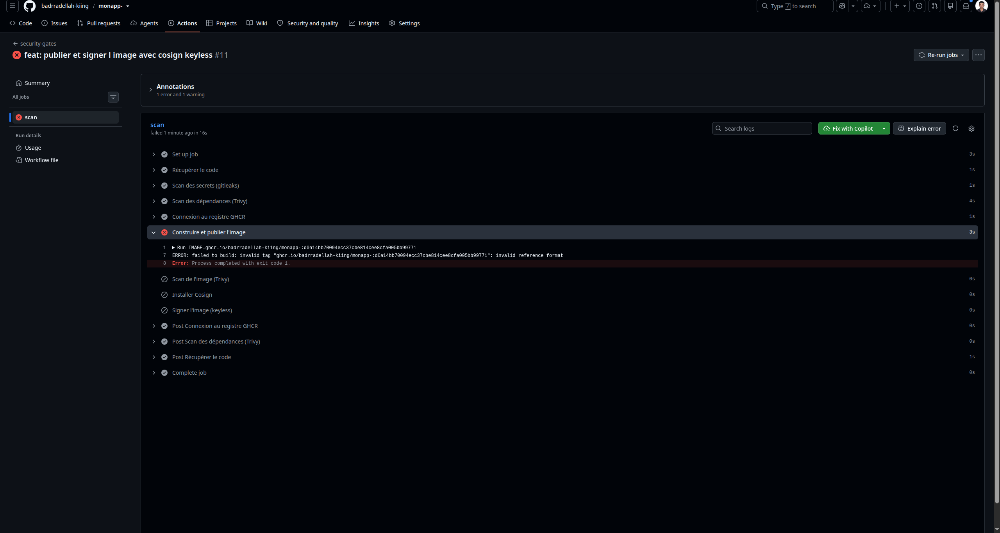

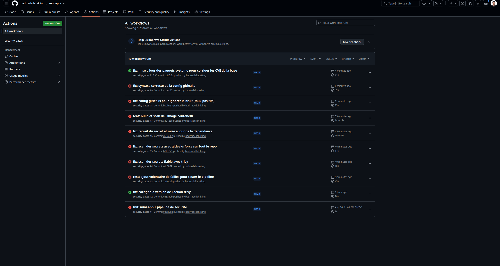

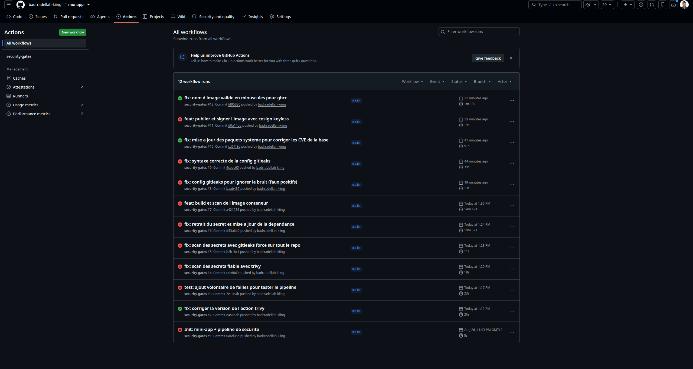

---

<a name="s4"></a>
## 4. Le Dockerfile durci

Le scan d'image analyse **tout** — pas juste mes dépendances, mais aussi l'OS de base et ses paquets système.

```dockerfile
FROM python:3.12-slim

RUN apt-get update && apt-get upgrade -y \
    && rm -rf /var/lib/apt/lists/*

WORKDIR /app
COPY requirements.txt .
RUN pip install --no-cache-dir -r requirements.txt
COPY app.py .

RUN useradd --create-home appuser
USER appuser

CMD ["python", "app.py"]
```

Décorticage sécurité :
- **`python:3.12-slim`** → image allégée = moins de composants = moins de surface d'attaque.
- **`apt-get upgrade`** → met à jour les paquets système de la base (dont openssl). L'image de base accumule des CVE entre deux rebuilds.
- **`useradd appuser` + `USER appuser`** → par défaut un conteneur tourne en **root**. On bascule sur un utilisateur normal. (Le `runAsNonRoot` de la Partie 7, côté image.)
- **Ordre `COPY`** : `requirements.txt` **avant** `app.py` → Docker cache l'install des dépendances (changent rarement), le code (change souvent) vient en dernier.

### ⚠️ Piège 5 : CVE dans l'image de base
Le scan d'image a trouvé 3 CVE HIGH dans **openssl** (`debian 13.6`), héritées de `python:3.12-slim`. C'est tout l'intérêt du scan d'image : il voit ce que les scans de fichiers ne voient pas. Le `apt-get upgrade` dans le Dockerfile les corrige.

---

<a name="s5"></a>
## 5. La signature keyless (Cosign)

### Le pourquoi

Entre le build et le déploiement, **comment prouver que c'est bien MON image, pas une version trafiquée ?** La signature résout ça. C'est le lien avec Kyverno (Partie 7) : le cluster peut n'accepter QUE les images signées.

### Le concept keyless

L'approche moderne (Cosign + Sigstore) évite de gérer une clé privée (qui peut fuiter). Le pipeline s'authentifie par un **jeton OIDC**, obtient un **certificat éphémère** (quelques minutes), et signe. Ce qui est vérifié n'est pas « qui détenait la clé » mais « **quel dépôt / workflow / commit** a produit l'image ». L'identité est liée à la **provenance**, pas à un secret volable.

```yaml
- name: Signer l'image (keyless)
  if: github.ref == 'refs/heads/main'
  run: cosign sign --yes ${{ env.IMAGE }}
```

`if: github.ref == 'refs/heads/main'` → on ne signe **que sur main**, pas sur les branches de test (on ne signe pas du code non validé). `id-token: write` dans les permissions est indispensable.

### Le résultat

Pipeline complet **vert**, à chaque push sur `main` :
1. Scan secrets (gitleaks) · 2. Scan dépendances (Trivy) · 3. Build + publie dans GHCR · 4. Scan image (Trivy) · 5. Signature keyless (Cosign).

---
---

# PARTIE B — LE DÉPLOIEMENT CONTINU (CD, GitOps avec ArgoCD)

<a name="s6"></a>
## 6. Le modèle GitOps

Faire `kubectl apply` soi-même (pousser vers le cluster) pose problème : qui a déployé quoi ? le cluster peut dériver (modif manuelle non tracée) ; il faut distribuer des accès puissants.

ArgoCD inverse : il **vit DANS le cluster et tire depuis Git**. J'écris les manifests dans Git, ArgoCD les surveille en permanence et applique tout changement. **Git = source unique de vérité.**

C'est le même principe que Terraform (état voulu → comparer → appliquer la différence), mais **en continu** et **pour Kubernetes**. Le mot-clé : **réconciliation**.

### L'image du thermostat

ArgoCD = un thermostat. Consigne dans Git (21°C). Quelqu'un ouvre la fenêtre (modif manuelle → 18°C) → le thermostat rallume le chauffage (ArgoCD restaure). Je veux 23°C → je règle le thermostat (je change Git), pas le radiateur.

---

<a name="s7"></a>
## 7. Installer ArgoCD

```bash
kubectl create namespace argocd
kubectl apply -n argocd -f https://raw.githubusercontent.com/argoproj/argo-cd/stable/manifests/install.yaml
kubectl wait --for=condition=available deployment --all -n argocd --timeout=300s
kubectl get pods -n argocd
```

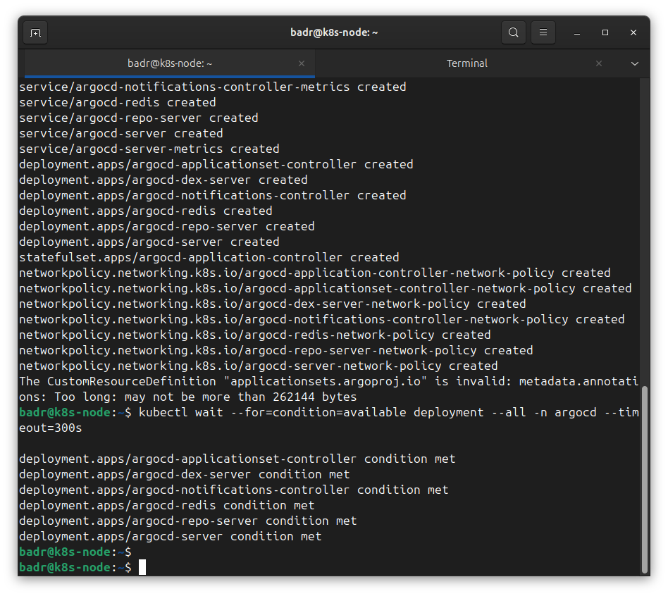

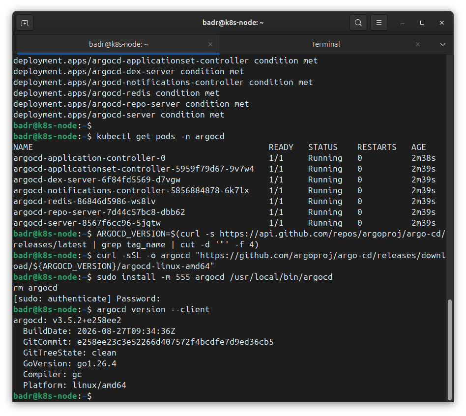

Mot de passe admin (généré aléatoirement, stocké en secret base64 — Partie 7 !) :
```bash
kubectl -n argocd get secret argocd-initial-admin-secret -o jsonpath="{.data.password}" | base64 -d; echo
```

### ⚠️ Piège 6 : CrashLoopBackOff de l'applicationset-controller
Un pod plantait en boucle. Cause : ce composant cherche la CRD `ApplicationSet`, absente de l'install. C'est un composant **optionnel** dont on n'a pas besoin. Solution :
```bash
kubectl scale deployment argocd-applicationset-controller -n argocd --replicas=0
```
`--replicas=0` = 0 copie → plus de bruit, rien de perdu. Ne pas s'encombrer de ce qu'on n'utilise pas.

---

<a name="s8"></a>
## 8. Créer et synchroniser une Application

```bash
kubectl port-forward svc/argocd-server -n argocd 8080:443 >/dev/null 2>&1 &
argocd login localhost:8080 --username admin --password <mdp> --insecure

kubectl create namespace demo-gitops
argocd app create demo-app \
  --repo https://github.com/argoproj/argocd-example-apps.git \
  --path guestbook \
  --dest-server https://kubernetes.default.svc \
  --dest-namespace demo-gitops
```

Une **Application** ArgoCD = un lien entre *un dépôt Git* et *un endroit dans le cluster* :
- `--repo` → le dépôt Git à surveiller.
- `--path guestbook` → le dossier contenant les manifests.
- `--dest-server https://kubernetes.default.svc` → le cluster actuel (adresse interne de l'API server).
- `--dest-namespace` → dans quel namespace.

```bash
argocd app get demo-app     # OutOfSync : ArgoCD sait quoi déployer, pas encore fait
argocd app sync demo-app    # applique ce que dit Git → Synced / Healthy
kubectl get pods -n demo-gitops   # guestbook-ui Running — sans kubectl apply
```

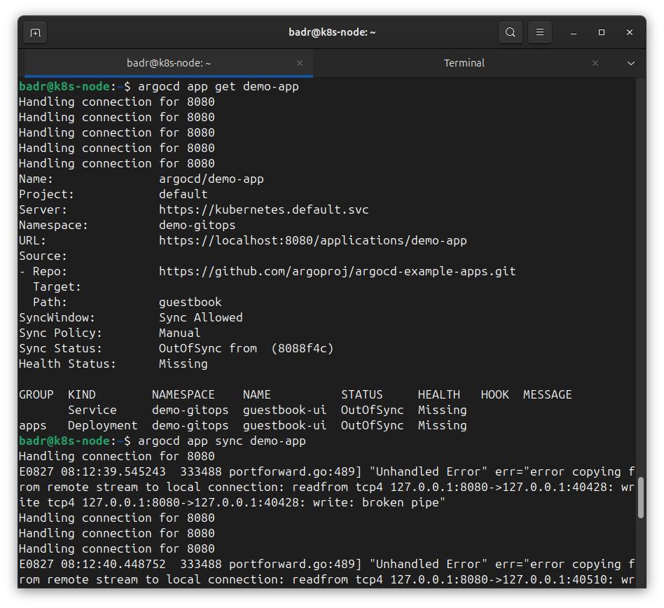

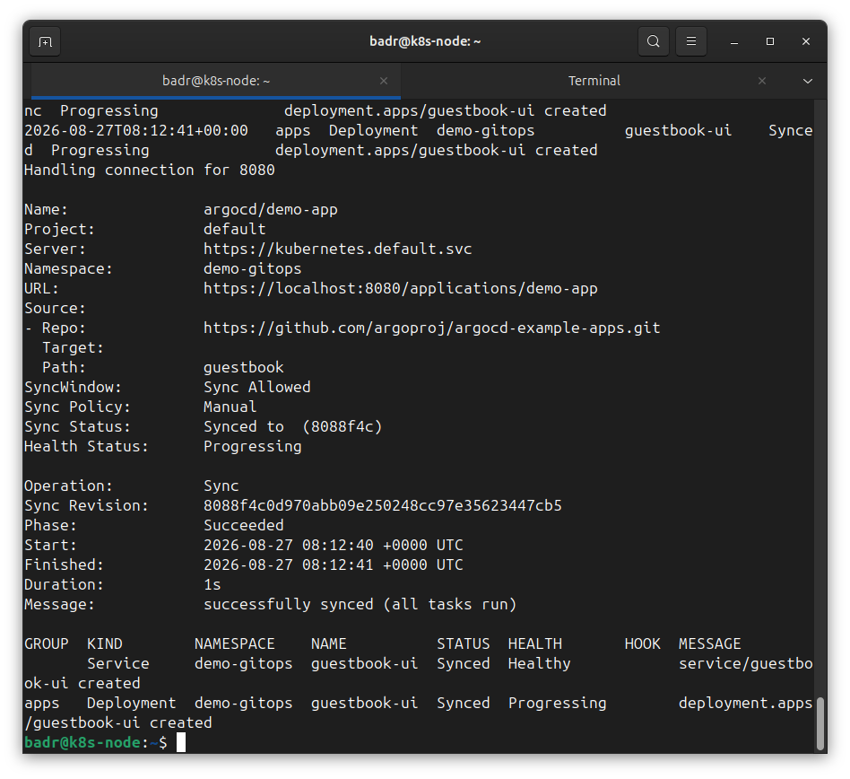

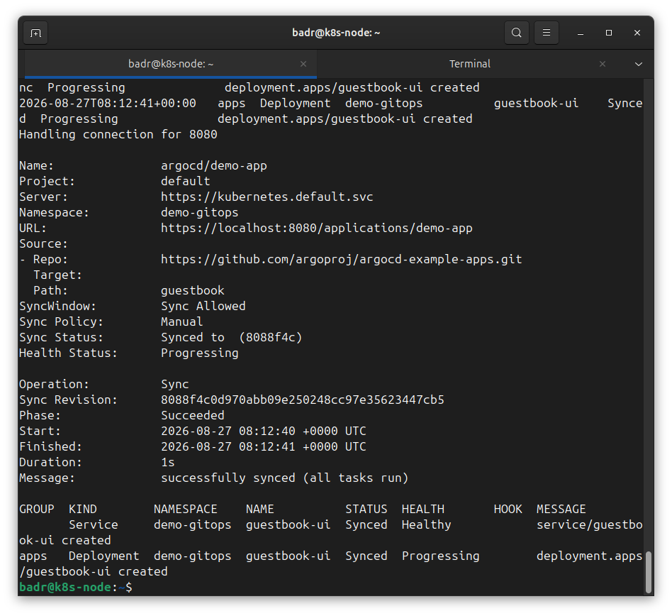

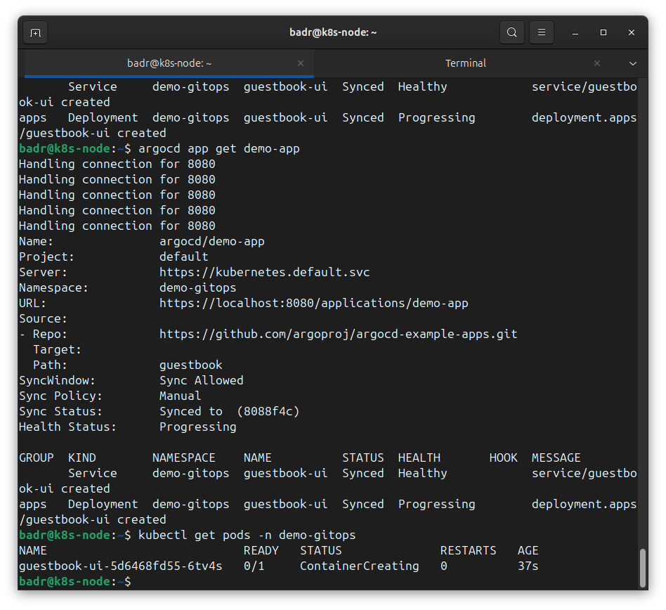

---

<a name="s9"></a>
## 9. La réconciliation vécue (Manual vs Automatic)

### Mode Manual — je supprime à la main, ArgoCD ne corrige qu'au `sync`

```bash
kubectl delete deployment guestbook-ui -n demo-gitops   # l'appli disparaît
kubectl get pods -n demo-gitops                          # No resources found
argocd app sync demo-app                                 # ArgoCD recrée → conforme à Git
kubectl get pods -n demo-gitops                          # le pod est de retour
```

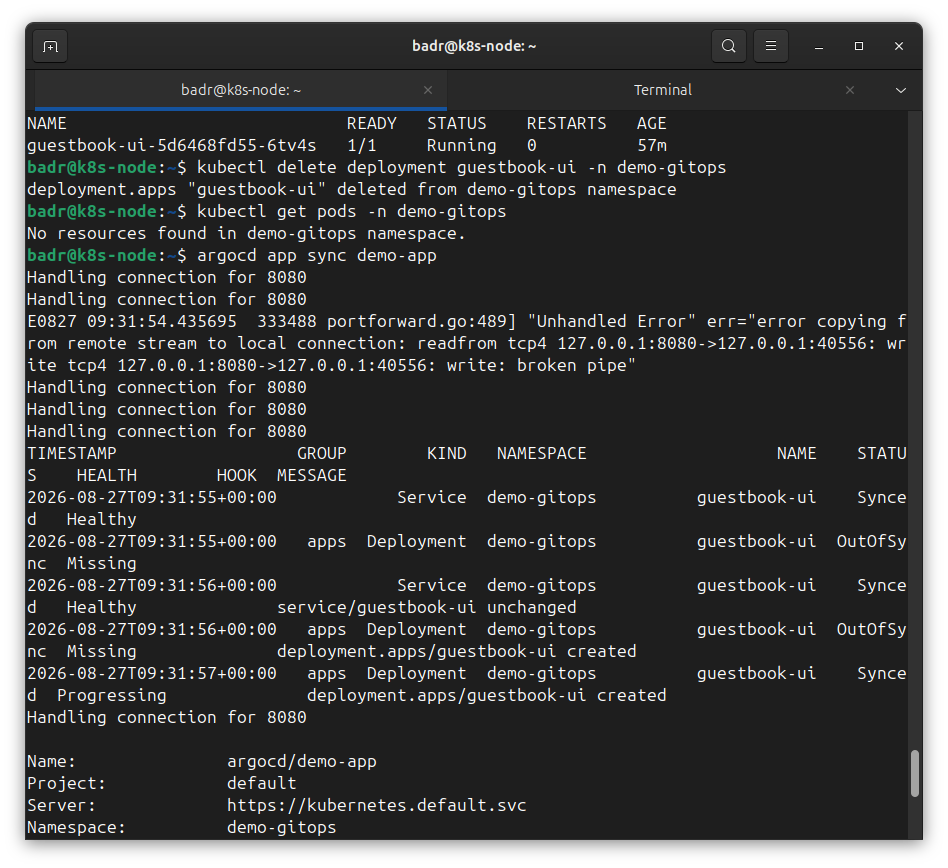

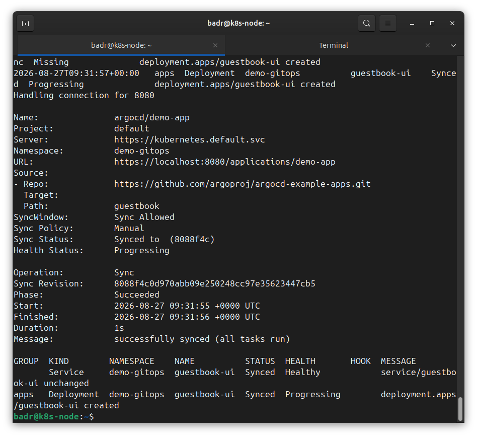

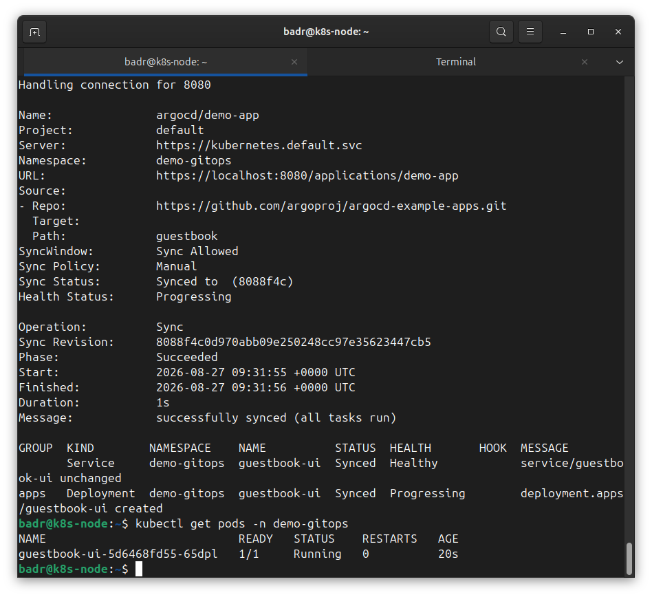

### Mode Automatic — je supprime, ArgoCD corrige TOUT SEUL

```bash
argocd app set demo-app --sync-policy automated
kubectl delete deployment guestbook-ui -n demo-gitops
sleep 10
kubectl get pods -n demo-gitops   # le pod est DÉJÀ revenu, sans que je lance sync
```

Le contraste :
- **Manual** : je supprime → rien ne revient tant que je ne `sync` pas.
- **Automatic** : je supprime → ArgoCD recrée **immédiatement**, sans moi.

→ En prod, le cluster est **physiquement incapable** de rester différent de Git. Toute dérive est effacée en secondes.

---
---

# LA CHAÎNE COMPLÈTE (CI + CD)

```
CI (pipeline)                         Git (pivot)          CD (ArgoCD)
scan secrets + deps                                        détecte le
build + publie image      →  manifest mis à jour  →        changement Git
scan image + signe                                         déploie + corrige la dérive
```

**Git est le seul pont** entre le build et le déploiement. Personne ne touche le cluster à la main.

---
---

# RÉCAPITULATIF — l'état de la Partie 12

**Fait de mes mains :**
- Un **pipeline GitHub Actions** à 5 portes : scan secrets (gitleaks), scan dépendances (Trivy), build + publication (GHCR), scan image (Trivy), signature keyless (Cosign).
- L'exercice **casser/réparer** : failles volontaires (secret + dépendance vulnérable) → pipeline rouge → correction → vert.
- Un **Dockerfile durci** : slim, non-root, paquets système à jour.
- **ArgoCD** installé, connecté à un dépôt Git, déploiement d'une appli **depuis Git**.
- La **réconciliation** vécue en Manual (sync à la demande) puis Automatic (auto-correction de la dérive).
- 6 pièges réels diagnostiqués et corrigés.

**Reste à faire :**
- Connecter mon **vrai pipeline** (qui signe l'image) à **ArgoCD** via un manifest Git (la boucle complète bout-à-bout).
- **Durcissement pipeline** : épingler les actions à un **SHA** (pas `@master`/`@v2` mutables).
- **Kyverno** : refuser les images non signées au niveau du cluster.
- **Exercice supply chain** : dépendance qui contacte un domaine louche → détection.

**Les réflexes à graver :**
1. **Un pipeline rouge ne garantit pas que tout est détecté** — vérifier CE QUI a bloqué, pas juste SI.
2. **Tester ses scanners** — un outil jamais testé « en conditions » peut donner une fausse sécurité.
3. **Un bon scan ne signale QUE ce qui compte** — configurer pour éliminer les faux positifs (allowlist).
4. `exit-code: 1` = le mécanisme qui **bloque** le pipeline sur faille.
5. **Moindre privilège pour le pipeline** — `permissions` au minimum ; un runner CI est une cible.
6. Le **scan d'image** voit les CVE de l'OS de base, invisibles aux scans de fichiers.
7. **Signature keyless** = identité liée à la provenance (dépôt/workflow/commit), pas à une clé volable.
8. **GitOps** : pour changer le cluster, on change **Git**, jamais le cluster.
9. Distinguer un composant **optionnel cassé** (à éteindre) d'un vrai problème.
